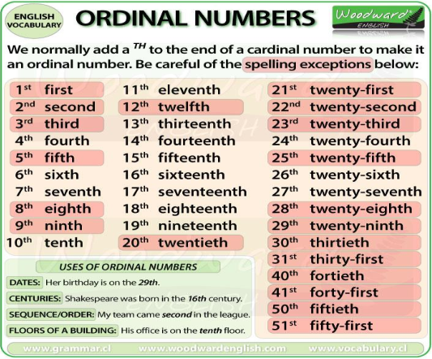

# Time, Date, Day, Year number in English

## Asking The Time: (_How do we ask the time ?_)

We can use some questions for asking the time which are given below;

**Questions:**

- What time is it ?
- What is the time ?
- Do you have the time ?
- Do you know what time is it ?
- Can you tell me what the time, please ?
- Could you tell me the time, please ?
- Do you happen to have the time ?
- Have you got the right time ?
- What time do you make it ?

## There are two common ways of telling the time.

1. Say the hour first and then the minutes. (Hour + Minutes)
   - 6:25 - It's six twenty-five
   - 8:05 - It's eight O-five (the O is said like the letter )
2. Say the minutes first and then the hour. (Minutes + Past / TO + Hour)
   - For minutes 1-30 we use Past after the minutes.
   - For minutes 31-59 we use To after the minutes.
   - 2:35 - It's twenty-five to three
   - 11:20 - It's twenty-five past eleven

- 7:15 - It's (a) quarter past eleven.
  - When it is 15 minutes past the hour we normally say: (a) quarter past
- 12:45 - It's (a) quarter to one
  - When it is 15 minutes before the hour we normally say : a quarter to .
- 3:30 - It's half past three (but we can also say three)
  - When it is 30 minutes past the hour we normally say : a half past to .

## O'clock

- We use o'clock when there are no minutes
- 10:00 - It's then o'clock.
- 5:00 - It's five o'clock.
- 1:00 - It's one o'clock.
- Sometime it is written as 9 o'clock (the number + o'clock)

## 12:00

- For 12:00 there are four expression in English.
- twelve o'clock
- midday / noon
- midnight

## Asking for the Time

The common question forms we use to ask for the time right now are:

- What time is it ?
- What is the time ?

## A more polite ways to ask for the time, especially from a stranger is :

- Could you tell me the time please ?

## The common question forms we use to ask at what time a specific event will happen are:

- What time ... ?
- When ... ?

- What time does the flight to New York leave ?
- When does the bus arrive from London ?
- When does the concert begin ?

## Giving the Time

We use it is or it's to respond to the questions that ask for the time right now.

- it is half past five (5:30) `setengah limo`.
- it's en to twelve (11:50)

### We use the structure AT + time when giving the time of a specific event.

- The bus arrives at midday (12:00)
- The flight leaves at a quarter to two (1:45)
- The concert begins at ten o'clock (10:00)

### We can also use subject pronouns in these responses.

- It arrives at midday (12:00).
- It leaves at a quarter to two (1:45).
- It begins at ten o'clock (10:00).

## AM vs PM

- We don't normally use the 24-hour clock in English
- We use a.m (am) for the morning and p,m (pm) for the afternoon and night.
- 3am = Three o'clock in the morning.
- 3pm = Three o'clock in the afternoon.

## How to say Date, Year and number in English

### The number of the Day

- For dates in spoken English, we always use ordinal numbers, i.e. Fourth of July, Not Four of July.
- Ordinal numbers = Numbers that show the order or sequence.
- Normally a `th` appears at the end of number.
- e.g. seven ... seventh.

- In spoken English we always use ordinal numbers for dates.
- However in written English you way write a normal (cardinal) number without the `th` or `st` etc.
- After it. Even if is not written, the ordinal number is still said in spoken English.
- In United States it is not common to put the -th after the number in written English.

### Order of Days and Month when saying the date There are two ways of giving the date in English:

- Month + Day : December 24 - used in United States.\*
- Day + Month : 25th December - used in the rest of the world.

### Writeing the date in English

- Be careful when writing the dates using only numbers.
  - For example, Christmas day is written:
  - 12/25/17 in United States (the month is frist).
  - 25/12/17 in the rest of the world (the day is first).
- So what day is this ? 3/4/17.
- It depends on the country. It can be:
  - March fourth, twenty seventeen (in The US)
  - The thrid oof April, twenty seventeen (in the rest of the world)

### There's a big difference, isn't there !

- To avoid confusion, when writing an email or any other written from of English, is is best to write the month as its name (January, February, etc) or its abbreviation (Jan, Feb, etc.) and not as its number.
- remember, the months are always written in Capital letters.

- In US English, a comma is put after the day if it is followed by a year.
  - March 17, 2016.
  - December 22, 2012.
- How can you ask for the date in English? The main ways of asking the date are:

  - What day is it today?
    - People will probably respond with a day of the week (It’s Monday) or the number (It’s the 19th).
  - What date is it?
    - People may give you the number (It’s the 19th) or the day/month (It’s 19th May or May 19th). They will not answer with a day of the week
  - What is the date (today)? OR What is today’s date?
    - This is another way where you will get a number as an answer

- The response to your question will most likely start with...
- The date is ...
- The date today is ...
- Today is...
- It is... (most common)
