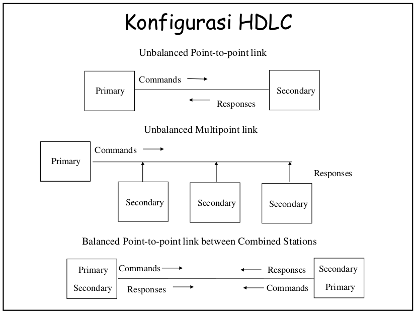
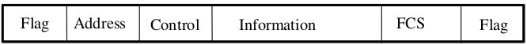
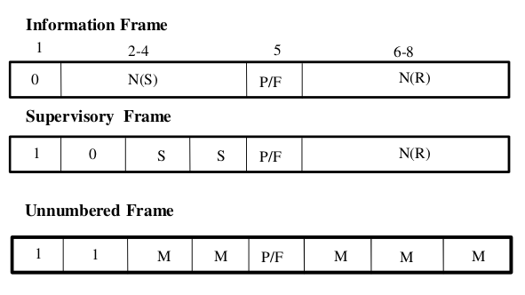
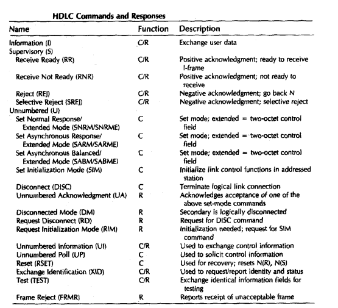
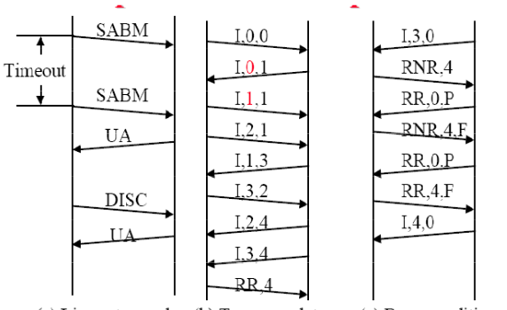
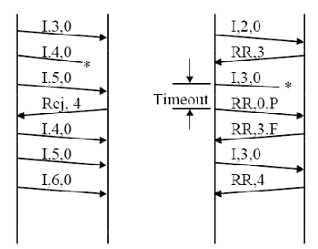
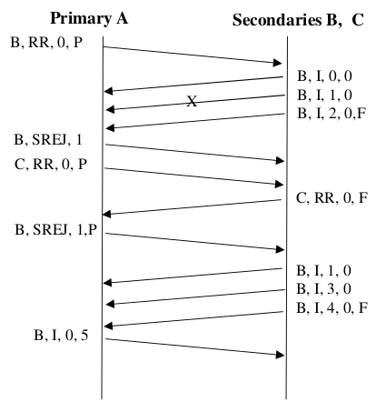
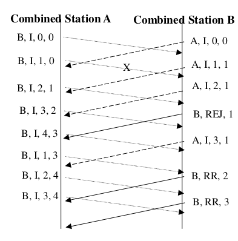
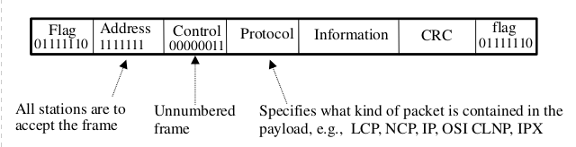
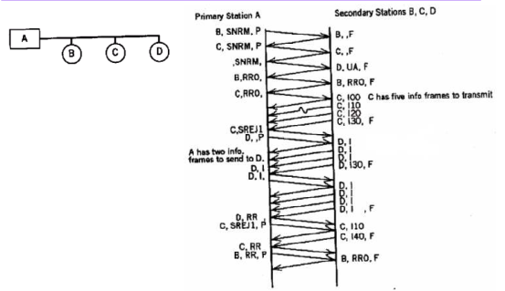

# Data Link Layer : Protocol High Level Data Link Control (HDLC)

## Data Link Services

- Connection-oriented services : memberikan pengiriman paket terurut bebas error
  - Setting-up koneksi : setting up variables dan alokasi buffer.
  - Transfer paket: paket 'dikemas' dalam frame data link.
  - Penutupan koneksi.
- Connectionless service
  - _acknowledged service_.
  - _unacknowledged service_.

## Sejarah DDL Protocols

- **SDLC** - _Synchronous Data Link Control_ (IBM).
- **HDLC** - _High-level Data Link Control_ (ISO & CCITT).
- **ADCCP** - _Advanced Data Communications Control Protocol_ (ANSI).
- **LLC** - _Logical Link Control_ (IEEE 802.2).
- ISO 330099, ISO 4335 Data Link Control.

### Tipe Station HDLC

- Primary Station :
  - Mengontrol operasi link.
  - Frame yang dibangkitkan disebut command.
  - Menjaga link logic terpisah ke masing-masing station secondary.
- Secondary Station :
  - Dibawah kontrol primary station.
  - Frame yang dibangkitkan disebut respons.
- Combined Station :
  - Dapat membangkitkan command dan respons.

### Mode Transfer HDLC

- Normal Response Mode (NRM)
  - Konfigurasi unbalanced.
  - Primary menginitialisasi transfer ke secondary
  - Secondary hanya boleh transmit data sebagai respond terhadap command dari primary.
  - Digunakan pada multi drop lines.
  - Host computer sebagai primary.
  - Terminal Sebagai secondary.
- Asynchronous Balanced Mode (ABM)
  - Konfigurasi balanced.
  - Kedua macam station dapat menginisiasi transmisi tanpa menerima persetujuan.
  - Paling luas digunakan.
  - Tidak ada overhead polling.
- Asynchronous Response Mode (ARM)
  - Konfigurasi unbalanced.
  - Secondary dapat menginisiasi transmisi tanpa izin dari primary.
  - Primary bertanggung jawab terhadap saluran.
  - Jarang digunakan.

### Konfigurasi HDLC

### Format Frame HDLC

- Flag (8 bit): 01111110
- Address (8 bit exenable 16 bit) :
  - Konfigurasi unbalanced -> Address secondary
  - Konfigurasi balanced :
    - Frame command -> address receiving station.
    - Frame response -> address dari station pengirim.
- Control field (8 extendable 16 bit)
- Information field (variable): berisi informasi user.
- FCS: CRC 16 bit atau 32 bit dikalkulasi pada field control, address dan informasi.

### Control Field HDLC

### Frame-Frame HDLC

### Proses Komunikasi HDLC

1. Line setup and disconnect.
2. Two-way data exchange.
3. Busy condition.
4. Reject Recovery.
5. Timeout Recovery.

### Operasi pada Normal Response Mode

### Operasi pada Asynchronous Balanced Mode

### Protocol DLC Lainnya

- Link Access Procedure, Balanced (LAPB)
  - Bagian dari X.25 (ITU-T)
  - Subset dari HDLC (ABM)
  - Link point-to-point antara sistem dan node packet switching.
- Link Access Procedure, D-Channel (LAPD)
  - ISDN (ITU-T)
  - ABM
  - Sequence number selalu 7 bit (tidak 3 bit).
  - Field address 16 bit terdiri dari dua sub-addresses.
  - Satu untuk device dan satu lagi untuk user (layer diatas).
- Logical Link Control (LLC): umumnya untuk _Shared medium networks_ (broadcast media)
  - IEEE 802
  - Frame format berbeda.
  - Link control dibagi dua antara medium access layer (MAC) dan LLC (diatas MAC).
  - Tidak ada primary dan secondary (semua station adalah peer).
  - Dua addresses diperlukan:
    - pengirim dan penerima.
- PPP (Point-To-Point Link Protocol)
  - 

## Bit Stuffing

- Bit stuffing digunakan untuk mencegah kemunculan pola flag didalam frame HDLC.
- Pengirim akan menyisipkan extra "0" setiap ditemuai lima deretan "1" yang berurutan.
- Penerima mencari lima deretan biner "1" berurutan, jika diikuti "0" berarti bit stuffing -> bit dihilangkan
- Contoh :
  - Deretan data informasi: 0110111111111100
  - Deretan bit stuffing: 011011111011111000

## In-Class Excersise

Pd gb di bawah, primary station A berkomunikasi dengan secondary station B, C dan D menggunakan protokol data link
standar (misalnya HDLC) pada saluran dua-arah half-duplex. Gambar (b) memperlihatkan urutan transmisi data antara A
dan B, C serta D dengan menggunakan notasi singkat A Y N(S) N(R) P/F (A:Address, Y:Command/Response, N(S):
Sequence number pengirim, N(R):Sequence number penerima, P/F:Poll/Final). Pada gambar isi harga A,YN(S)N(R),P/F

Kejadian (event) berikut terjadi antara primary station A dan dua secondary
station B dan C pada saluran multidrop half-duplex bebas error menggunakan
protokol HDLC. Event e 1 , e 2 , e 3 , e 4 adalah:
e 1 = A mengaktifkan link dg B dan C menggunakan normal response mode
e 2 = A mem-pool B utk trafik, B merespons dg mengirimkan 4 frame I,
kemudian A meng-aknowledge B tanpa memberikan tambahan hak utk
transmit
e 3 = A mem-poll C untuk trafik dan C hanya meng-acknowledge A
e 4 = A mengirimkan 3 frame ke B dan memberikan hak B untuk transmit. B
merespons dg mengirimkan 5 tambahan frame dan A meng-acknowledge
a. Perlihatkan pertukaran frame antara primary station A dan dua secondary
station B dan C.
b. Sekarang asumsikan terjadi transmsisi error pada frame pertama dari 5 frame
yang dikirimkan oleh B ke A pada event e 4 . Perlihatkan dua kemungkinan
prosedur untuk error recovery. Juga asumsikan bahwa ukuran window adalah 7.
(Cat. Gunakan notasi A,YN(S)N(R),P/F)
