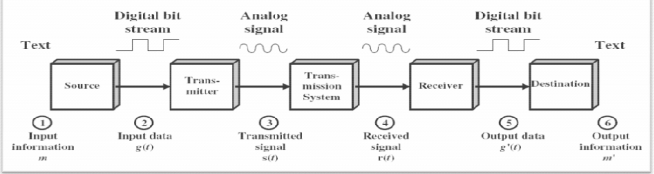

# Network Fundamental

## Model Komunikasi

Elemen Komunikasi Data

1. Source.
2. Transmitter.
3. Sistem Transmisi
4. Receiver.
5. Destination.

## Tugas Siskom

- Penggunaan sistem/fasilitas transmisi secara efisien, agar dapat terjadi sharing antara sejumlah perangkat.
- **Sinkronisasi ->** pihak penerima harus bisa menentukan kapan suatu elemen sinyal dimulai dan kapan sinyal tersebut berakhir.
- **Menajemen pertukaran informasi ->** source dan destinationharus bekersa sama berdasarkan konversi tertentu.
- **Deteksi dan Koreksi Kesalahan ->** proses ini diperlukan pada keadaan dimana error tidak bisa ditoleransi.
- **Flow Control ->** memastikan bahwa source tidak membanjiri destination dengan mengirim data lebih cepat daripada waktu pemrosesan data tersebut di sisi tujuan.
- **Recovery ->** diperlukan jika terjadi kegagalan dalam sistem yang menyebabkan terputusnya process pertukanan informasi.
- **Message formating ->** perjanjian antara kedua user mengenai format data, misalnya penggunaan kode biner yang sama untuk tiap karakter.
- Dan lain-lain.

## Komunikasi Data

- **Contoh : pengirim email**
  - Penggunaa PC ingin mengirimkan pesan m ke pengguna lain.
  - Deretakn big g disimpan dalam memori.
  - Data masukan ditransfer ke transmitter sebagai perbedaan tegangan g(t) yang merepresentasikan nilai bit tertentu.
  - Transmitter mengkonversi g(t) menjadi sinyal s(t) yang sesuai untuk transmisi.
- 

## Jaringan Komputer Data

- Jaringan komunikasi data terdiri dari sekumpulan perangkat komunikasi yang disebut station.
- Tipe Jaringan Komunikasi Data:
  - Local Area Network (LAN) -> skop kecil (1 gedung atau sekelompok gedung), biasanya dimiliki oleh 1 organisasi yang sama dengan pemiliki perangkat statiun, laju data internal jauh lebih besar dibanding WAN.
  - Wireless Network -> dapat diintegrasikan dengan WAN maupun LAN.
  - Wide Area Network (WAN) -> circuit switching, packet switching, frame relay, ATM, ISDN/BISDN.
  - Metropolitan Area Network (MAN).

---

- **Contoh Configuration**
  - Pengguna perumahan terhubung ke penyedia layanan Internet (ISP), contohnya SPTN melalui modem dial-up 56 kbps, DSL melalui model kecepatan tinggi, TV kabel melalui modem kabel.
  - ISP terdiri dari sejumlah server yang terhubung ke Internet.

## Network Devices

## LAN Devices

**LANS are designed to:**

- Operate witin a limited geograpihic area.
- Allow multi-access to high-bandwidth media
- Control the network privately under local administration.
- Provide full-time connectivity to local services.
- Connect physically adjecent devices.
- 

## Network Topology

## Protokol

- **Beberapa hal yang harus diperhatikan dalam pertukaran data**.
  - Sistem sumber harus mengaktifkan path komunikasi langsung atau memberi tahu jaringan komunikasi mengenai identitas sistem tujuan.
  - Sistem Sumber harus memastikan bahwa tujuan siap menerima data.
- **Ada 2 konsep pada jaringan komputer**
  - Protokol -> sekumpulan aturan mengenai pertukaran data/komunikasi antara 2 entitas (program aplikasi, transfer file, fasilitas e-mail, terminal, dll).
  - Arsitektur komunikasi -> sekumpulan modul terstruktur yang mengimplementasikan fungsi-fungsi komunikasi.
- **Protokol terdiri dari 3 elemen kunci:**
  - Sintaks -> meliputi format data dan level sinyal.
  - Semantik -> Koordinasi dan penanganan error.
  - Timing -> penyesuaikan kecepatan dan keterurutan data (_speed matching_ dan _sequencing_)

## Arsitektur Protokol

- Pada contoh berikut digunakan 3 modul untuk transfer file.
- Aplikasi transfer file pada sistem sumber harus memastikan bahwa program manajemen file dituuan siap menerima dan menyimpan file yang akan dikirim.
- Modul layanan komunikasi bertanggung jawab untuk memastikan bahawa perintah dan data pada proses transfer file dipertukaran dengan benar.
- Modul akses jaringan melakukan interaksi dengan jaringan.

## Computer Communication Protocol

## Layer Communications

## OSI & TCP/IP Model

## Data Transmission

## Bandwith Analogy

