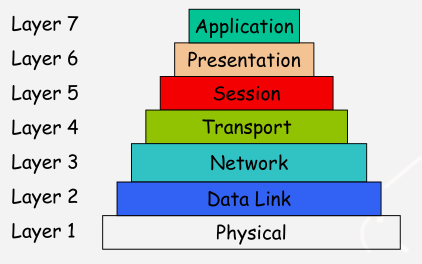
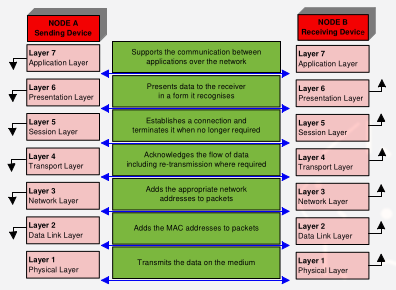
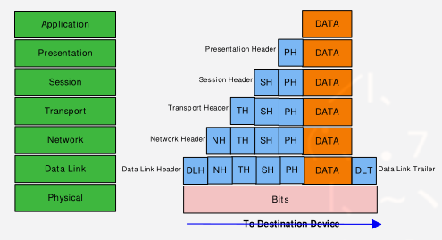
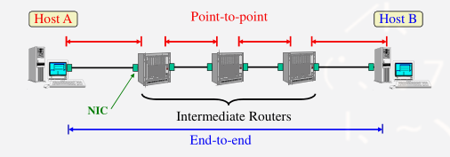
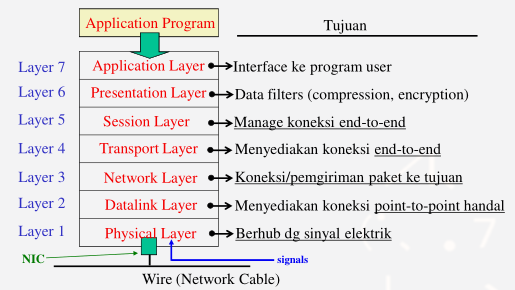
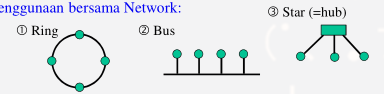
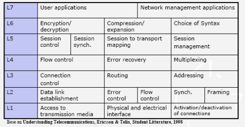

# Protocol & Model Refrensi OSI

## Protokol Komunikasi

**Definisi** Protocol Jaringan

0. Satu set Aturan.
1. Yang mengatur komunikasi antara dua host.
2. Diimplementasikan sebagai software.

**Contoh**

- TCP
- IP
- IPX/SPX
- ICMP
- UDP
- HTTP/HTTPS
- TLS/SSL

## Apakah Model OSI ?

- _Model Open Systems Interconnection_, fundamental untuk semua komunikasi antar device jaringan.
- Dikembangkan tahun 1973 oleh **ISO** setelah DOD Amerika mulai menggunakan protocol suite TCP/IP.
- Akhirnya diadopsi pada tahun 1976. Saat ini merupakan _model teoritis_ menjelaskan bagaimana komunikasi berlangsung antar device jaraingan.

### 6 Layers

### Pengertian Layer

- Dalam hal tujuan dan tanggung jawab, tiap layer terpisah dan independen.
- Masing-masing punya fungsi sendiri, tetapi juga menyediakan service ke layer di atas dan di bawahnya.
- Model sebagai bantuan untuk memahami komunikasii pada jaringan dan berguna dalam memilah kesalahan/troubles yang mungkin terjadi pada jaringan.
- Memungkinkan baik software engineer dan hardware manufactures menjamin produk mereka bisa bekerja sama.

### Kerja Layer

- Saat berkomunikasi, tiap layer OSI berbicara dengan layer yang sama pada device yang lain.
- Mis. Application Layer dari Device A berkomunikasi dengan Application Layer dari Device B, dengan meneruskan data melalui layer-layer lain.
- Application Layer dari tiap device tidak peduli bagaimana layer-layer lain befungsi, tetapi bergantung pada layer-layer tersebut untuk mendapatkan service.

### Bagaimana Data Mengalir ?

Saat data dikirim dari application pada komputer sumber hal berikut terjadi.

- Data dalam bentuk suatu _packet_ "bergerak turun" melalui layer-layer.
- Saat mencapai Physical Layer siap dikirim melalui media.
- Pada Physical Layer bit-bit bisa _analog_ atau _digital_, dalam bentuk _elektrikal_, _cahaya_, atau _gelombang radio_.
- Data ditransmisikan ke device tujuan.
- Bergerak melalui layer-layer dari model OSI, mencapai user.
- Dalam pergerakan melalui layer-layer data di _encapsulated_ - yaitu informasi tambahan ditambahkan sebagai _headers_ atau _trailers_.
- Data di dalam paket tidak berubah.

### Encapsulation

### End-to-End dan Point-to-Point

### Model Seven Layer OSI

#### Layer 1: Physical Layer

Fungsi Utama: Berhubungan dengan sinyal elektrik

**Contoh**

- Manchester Signal Encoding.
- NRZI Signal Encoding.
- Bipolar-AMI Signal Encoding -> Mendefinisikaan sinyal direpresentasikan.
- Interpretasi sinyal elektrik, representasikan sebagai 0 dan 0.

#### Layer 2: Data Link Layer

**Fungsi Utama:**

- Deteksi dan koreksi error sinyal, jika ada.
- Meneruskan/Forward sinyal yang diterima ke network layer.
- Jika error tidak dapat dikoreksi, memberikan _error warning_ ke network layer.
- Menyediakan Media Access Control (MAC).
  - Untuk "shared" network, kontrol siapa yang dapat menggunakan network.

**Contoh penggunaan bersama Network:**

#### Layer 3: Network Layer

**Fungsi Utama:**

- **Best effort delivery service**
  - Meroutekan paket dari sumber ke tujuan.
  - Translasi address.

#### Layer 4: Transport

**Fungsi Utama:**

- Deteksi dan koreksi error paket (error control) untuk E2E.
- Melaksanakan flow control.
  - Jika penerima ingin slow down, mengurang laju transmisi TX.
  - Jika network congesti, mengurang laji transmisi -> _congestion control_.

#### Layer 5: Session Layer

**Fungsi Utama:**

- Establish/Manage/Delete Koneksi (E2E)
- Kontrol Full-Duplex / Half-Duplex.
- QoS (specifikasi toleransi delay maximum).

#### Layer 6: Presentation Layer

**Fungsi Utama:**

- **Encryption**, Raw Data -> Presentation Layer -> Encryption Data.
- **Compression**, Raw Data -> Presentation Layer -> Compression Data.

#### Layer 7: Application Layer

**Fungsi Utama:** Interface ke application programs.

**Contoh:** Network API (Application Program Interface)

### Summary

###
