# Meduim Fisik Jaringan

## Tujuan

**Tujuan yang ingin dicapai dari pembahasan mudul ini adalah :**

1. Faktor-faktor yang mempengaruhi perancangan jaringan.
2. Mahasiswa mampu memahami jenis-jenis medium fisk yang digunakan pada komunikasi data.
3. Mahasiswa mampu memahami sifat/karakteristik dari masing-masing media transmisi.

## Spectrum Electromagnetic

### Faktor Perancangan jaringan

1. Bandwith -> menentukan laju data yang dicapai.
2. Keterbatasan transmisi -> menentukan _coverage_ (cakupan), contohnya :noise, redaman, derau.
3. Interferensi -> gangguan dari sinyal yang pita frekuensinya sama dengan menyembabkan distorsi, bahkan menghancurkan sinyal kirim.
4. Jumlah penerima -> guided media yang digunakan sebagai _shared link_ dapat menyebabkan peningkatan redaman dan distorsi.

### Guided Media

1. Twisted pair (10 Hz - 100 MHz)
2. Coaxial cable (1 KHz - 1GHz)
3. Fiber Optic (100 - 1000 THz)

### Unguide Micro

1. Radio
2. Gelombang Micro

## Media Fisik Jaringan (kabel)

**Terdapat beberapa media yang sering digunakan dalam mentransmisikan data dari node-1 ke node yang lain, diantaranya :**

1. Twisted Pair.
2. Coaxial Cable.
3. Fiber Optic.
4. Wireless

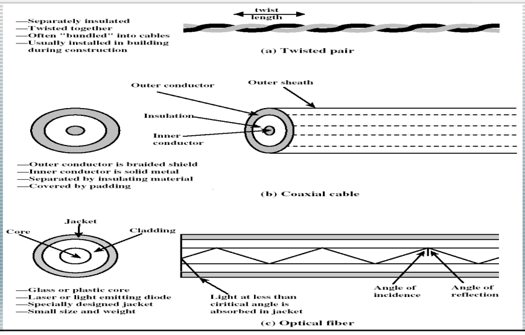

### Twisted Pair

**Karakteristik**

1. Paling murah dan paling banyak digunakan
2. Panjang pilinan 5-15 cm, ketebalan 0,4 - 0,9 mm
3. Laju data 64 kbps untuk PBX digital, 4 Mbps untuk aplikasi jarak jauh, 10 Mbps untuk LAN (jarak 1 km), 100 Mbps-1 Gbps untuk jumlah terminal terbatas (jarak puluhan meter)
4. Jarak amplifier 5-6 km untuk sinyal analog, jarak repeater 2-3 km untuk transmisi digital
5. Redaman sangat sensitif terhadap kenaikan frekuensi

**Twisted Pair, terdiri dari 2 jenis:**

1. Unshielded  merupakan kawat telepon biasa, tipe 100-ohm banyak dijumpai di gedung perkantoran
2. Shielded  memiliki kinerja lebih baik pada laju data yang tinggi, twisted pair dilindungi oleh logam untuk mengurangi interferensi

**EIA-568-A memperkenalkan 3 kategori kabel UTP**

1. Kategori 3: karakteristik transmisi hingga 15 MHz, twist length 7,5-10 cm.
2. Kategori 4: karakteristik hingga 20 MHz.
3. Kategori 5: karakteristik hingga 100 MHz, twist length 0.6-0.85 cm.

**Kabel kategori 3 (voice-grade) dan kategori 5 (data-grade) banyak digunakan untuk aplikasi LAN**

**Redaman Twisted Pair**

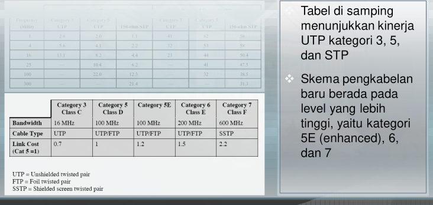

**Alternatif Pengkabelan**

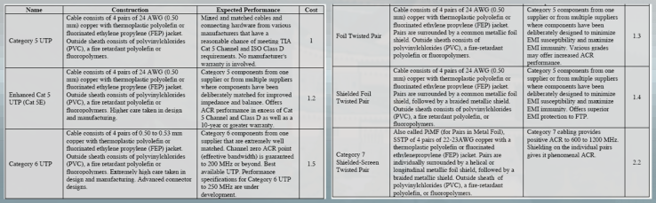

- ACR = Attenuation to Crosstalk Ratio.
- EMI = Electromagnetic Interference.

**Istilah dalam penamaan kabel**

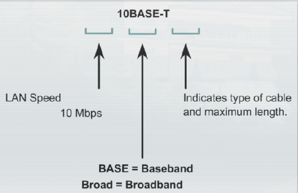

- **BASE = Baseband**
- **BROAD = Broadband**

**Shielded Twisted Pair**

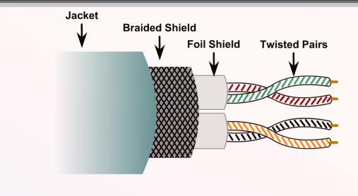

- Speed and throughput: 0 - 100 Mbps
- Cost: Moderate
- Media and connector size: Medium to Large.
- Maximum cable length: 100m.

**Unshielded Twisted Pair**

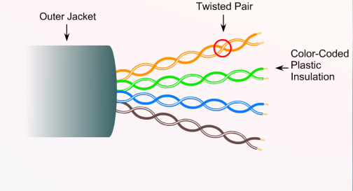

- Speed and throughput: 10 - 100 - 1000 Mbps (depending on the quality/cateogory of cable).
- Cost: least Expensive.
- Media and connector size: Small
- Maximum cable length: 100m.

**UTP Cabling**

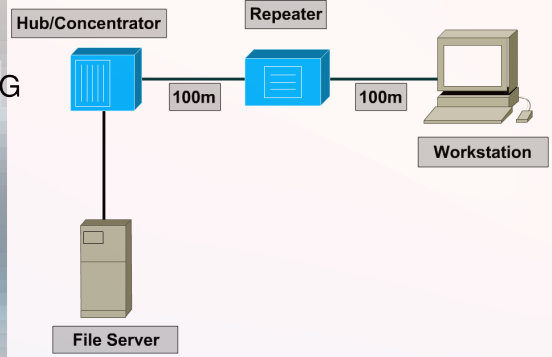

**Straight Cable**

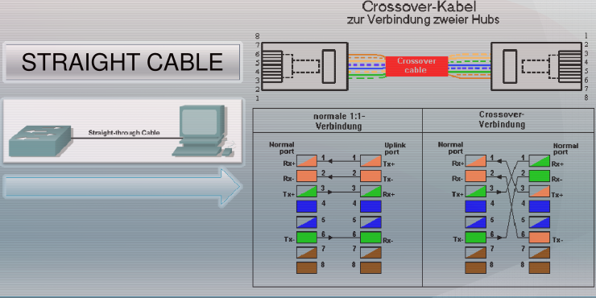

**Cross Cable**

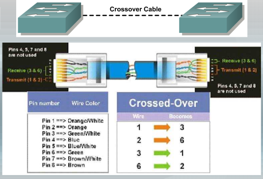

**Rollover Cable**

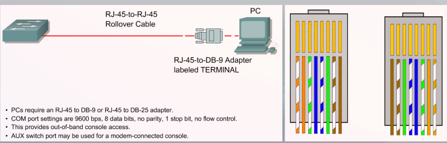

- PCs require an RJ-45 to DB-9 or RJ-45 to DB-25 adapter.
- COM port settings are 96000 bps, 8 data bits, no parity, 1 stop bit, no flow control.
- This provides out-of-band console access.
- AUX switch port may be used for a modem-connected console.

**Lan Tester**

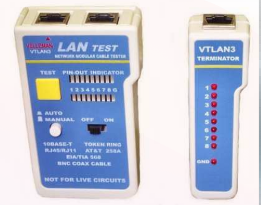

### Coaxial Cable

1. Terdiri dari 2 konduktor dengan konstruksi yang berbeda dengan twisted pair
2. Konduktor dalam ditahan oleh beberapa cincin insulasi atau bahan dielektrik padat, konduktor luar ditutup dengan jaket
3. Diameter 1-2,5 cm, kapasitas 10.000 kanal suara
4. Spektrum dapat mencapai 500 MHz
5. Laju data ratusan Mbps untuk jarak 1 km
6. Jarak antar repeater 1 km
7. Aplikasi: distribusi TV, SLJJ, LAN
8. Lebih tahan terhadap interferensi dan crosstalk dibanding twisted pair, jarak jangkauan lebih jauh

<F49>ZZ
