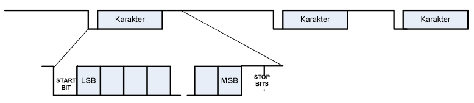
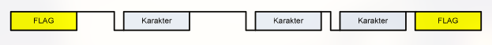
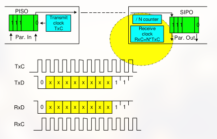
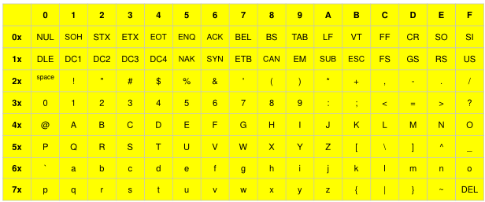
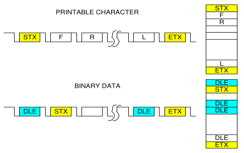
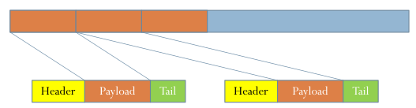
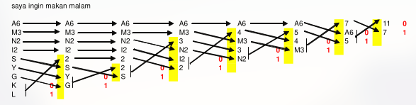

# Lapisan Fisik (Sinkronisasi dan Kompresi)

## Jenis Sinkronisasi

Pada transmisi data dilapis fisik, selain modulasi diperlukan kemampuan untuk sinkronisasi, yaitu teknik mendapatkan bit di suatu sinyal yang melibatkan masalah waktu pengambilan sampel dari sinyal, format suatu karakter dan format paket. kemampuan untuk sinkronisasi, yaitu teknik mendapatkan bit di suatu sinyal yang melibatkan masalah waktu pengambilan sampel dari sinyal, format suatu karakter dan format paket.

Terdapat 3 jenis terhadap sinkronisasi data :

- Asynchronous.
- Synchronous.
- Isochronous.

### Asynchronous

- Data dikirim karakter demi karakter.
- Diawali start bit dan diakhiri stop bit.
- Jarak antara karakter bebas (tidak diatur).
- Panjang antara karakter bisa : 5, 6, 7, 8 bit.
- Panjang stop bit bisa : 1, 1.5 dan 2 bit.
- Bisa dibubuhkan pariti genap atau ganjil.
- Contoh : standar RS-232 (port serial di hampir semua komputer).
- Umum digunakan untuk kondisi saluran berkualitas sedang.
- Asumsi stop bit diabaikan \
  41h -> 010000011011 \
   = 5 bit -> 0 10000 = 01h (SOH)\
   = 6 bit -> 0 100000 = 01h (SOH) \
   = 7 bit -> 0 10000001 = 41h (A) \
   = 8 bit -> 0 100000011 = C1h(...)
- Stop bit diperhatikan, asumsi 1 bit \
  41h -> 010000011011 \
   = 5 bit -> 0 10000 0 = 01h (SOH)\
   = 6 bit -> 0 100000 1 = 01h (SOH) \
   = 7 bit -> 0 10000001 1 = 41h (A) \
   = 8 bit -> 0 100000011 0

### Synchrinius

- Diawali dan diakhiri dengan karakter flag.
- Panjang karakter tetap dan berurutan.
- Tanpa pariti.
- Menurut kualitas saluran sangat baik (error minmal, tidak terjadi pergeseran waktu dll).
- Sangat efisient (rasio payload tinggi).
- Contoh : X.25
- Misal format pengirim start-7bit data-pariti genap-2stop bit.
- 1010101011.

### Isochronous

- Gabungan dari asinkron dan snkron.
- Diawali dengan karakter flag.
- Setiap karakter data diawali dengan start bit dan diakhiri dengan stop bit.
- Sudah jarang digunakan dikarenakan paling tidak efisien.

## Teknik Transmisi di Lapis Fisik

- Jika masalah pengkodean saluran sudah bisa dianggap selesai, maka urusan selanjutnya adalah bagaimana penerima mendapatkan data yang ditujukan kepadanya dari sinyal yang dikirim.
- PAda dasarnya lapis fisik harus mampu memisahkan bit-demi-bit yang terkodekan disinyal yang diterima.
- Proses ini disebut sinkronisasi bit.

## Sinkronisasi Bit

- Untuk mendapatkan bit yang terdapat pada sinyal yang berubah-ubah dengan cepat, dilakukan teknik sampling sinyal dengan jumlah sample beberapa kali dari lau data.
- Semakin banyak jumlah sample, maka akan semakin akurat prediksi bit yang didapat apakah bit '0' atau bit '1' dengan konsep sederhana 'mayoritas menentukan hasil', jika mayoritas bit disuatu perioda sampling (sepanjang slot pada laju it pengirim) cenderung ke bit tertentu, maka dianggap bit tersebut maka dianggap bit tersebut yang diterima.
- Pada sistem RS-232, umum dilakukan sampling sebesar 8x, 16x atau 64x dari laju data pengirim.

## Sinkronisasi Karakter

- Setelah mendapatkan bit-bit informasi, maka tugas selanjuttnya adalah mendapatkan set bit yang membentuk karakternya.
- Tugas ini sangat penting dikarenakan salah memiliki possisi bit dalam karakter akan memeberikan karakter lain yang berbeda artinya sama sekali.
- Contoh : diterima 0011000101
  - Jika dibaca sebagai MSB mulai dari bit paling kiri, maka akan didapatkan karakter ASCII 31h (angka 1).
  - Jika dibaca sebagai MSB mulai dari bit kedua dari kiri, maka akan didapatkan karakter ASCII 62h (huruf b).
- Digunakan karakter SYN sebagai penanda mulainya bit dari suatu karakter
- Cara kerjanya relatif sederhana:
  - Penerima akan mencari (hunting) karakter SYN dalam urutan bit yang diterimanya
  - Akan dicocokkan 8 bit pertama yang dimulai dari bit \u20180\u2019 (kondisi ini disebut memasuki mode hunting)
  - Jika cocok, maka 8 bit tersebut ditetapkan sebagai karakter pertama
  - Jika tidak cocok, maka akan mencari bit \u20180\u2019 berikutnya untuk selanjutnya melakukan hunting lagi
- Disediakan 2 atau 3 karakter SYN untuk berjaga-jaga jika terlewat menerima karakter SYN pertama

### Contoh 8N2

0001 010**1 1010 000**1 1010 0010 0000 10**01 0000 10**11 0000 1000 1000 1010 1000 1010 1010 0101 0100 1010 0101 001 = 0B 42 = VT B

001011111111111110101010101111111111111111111111011110000111111110111000110011001111111

Format asinkron start-data-stop memperlukan penyempurnaan agar tidak salah baca yaitu dengan menambahkan bit pariti sehingga menjadi start-data-parti-stop.

Misal digunakan aturan pariti genap, maka deretan bit menjadi 0010**11111111**011

**Don't send human to do machine job**

### Table ASCII

SYN NULL NULL <u>STX</u>    <b style="color:red;">R J G H K L I Y H K L S J H F U Y U W I E</b> <u>ETX</u> NULL NULL NULL _SYN SYN SYN_ 16 00 00 00 02 <b style="color:red;">52 4A 47 48 4B 4C 53 ... 45</b> 03 00 00 00 16 16

## Sinkronisasi Frame

- Setelah mendapatkan karakter-karakter didapat masalah baru, yaitu karakter mana yang merupakan informasi (frame data) dan mana yang merupakan karakter random yang ditambahkan sisitem transmisi (pada komunikasi sinkron) atau noise yang kebetulan memenuhi syarat untuk dibaca sebagai suatu karakter (pada komunikasi asinkron).
- Pada prinsip, suatu deretan karakter yang mengandung informasi diapit oleh karakter-karakter khusus sebagai penada, karakter-karakter khusus sebagai penanda, karakter tersebut adalah STX sebagai tanda awal frame dan ETX sebagai tanda akhir frame.
- Mekanisme ini disebut sinkronisasi frame.
- Terdapat dua jenis sinkronisasi frame
  - Untuk data dapat dibaca (teks), mengandung informasi yang hanya terdiri dari karakter- karakter huruf, angka dan karakter lain (umumnya merupakan karakter ASCII 00h s/d 7Fh) -> cukup digunakan karakter STX dan EiTX
  - Untuk data biner, mengandung informasi yang menggunakan semua kombinasi ASCII (data gambar, suara dan data-data lain yang dikodekan dari 00h s/d FFh) -> menggunakan karakter DLE STX dan DLE ETX

### Format Paket Data

- Umumnya data akan dipecah menjadi potongan-potongan dengan panjang tertentu sesuai dengan kemampuan lapis dibawahnya (menjadi payload), kebanyakan sistem paket data membolehkan ukuran payload bervariasi.
- Potongan tersebut akan diberi Header sesuai dengan fungsi lapis dibawahnya tersebut, dan ada lapis yang juga menambahkanTail di belakang data tersebut.

## Kompresi

### Lossless

- Teknik kompresi yang hasilnya bisa dikembangkan utuh (~=100%) seperti aslinya.
- Teknik umum adalah korelasi dan dependensi antar data (statistik).
- Rasio kompresi umumnya relatif kecil (1:2 sd 1:10) demi mengejar kecepatan kompresi dan dekompresi
- Digunakan untuk kompresi data (text dan binary).

### Lossy

- Teknik kompresi yang akan menurunkan/menghilangkan kualitas data (hasil dekompresi << 100%)
- Teknik umum menggunakan algoritma DSP
- Rasio kompresi besar.
- Digunakan untuk gambar, suara, dan video.
- Tujuan dari sistem komunikasi data adalah ingin mengirimkan data secara benar dan (kalau bisa) sesedikit mungkin.
- Teknik-teknik yang dikenal untuk bisa mengirim sesedikit mungkin (kompresi) adalah:
  - Menggunakan modulasi yang seefisien mungkin  pendekatan yang sulit, dibatasi kemampuan riset
  - Menggunakan kode-kode pengganti karakter  terbatas untuk data teks atau apapun yang kombinasi simbolnya sedikit dan terdapat banyak pengulangan, memerlukan tabel pengganti simbol yang sama di sisi kirim dan sisi terima
  - Menggunakan kemampuan manipulasi matematik digital  pendekatan yang meminta kemampuan komputasi
  - Kombinasi antara ketiganya
  - dll

### Kompresi lossless

- Subtitusi : \
  yang = @ \
  dan = % \
  kan = & \
  kita = ^
  - Sesuatu yang kita inginkan dan yang kita dambakan -> sesuatu @ ^ ingin& % @ ^ damba& (sms coding).
- Statistik -> Huffman.

> Teknik manipulasi matematik saat lalu hanya bisa dilakukan dilapis
> aplikasi yang mempunyai kemampuan komputasi dan bisa diprogram,
> tetapi saat ini teknik ini sudah bisa diterapkan kedalam sebuah chip
> sehingga bisa diterapkan di lapis fisik

> Salah satu tenik dasar manipulasi matematik adalah pengkodean
> Huffman, menggunakan konsep karakter yang paling sering muncul
> dikodekan dengan jumlah bit yang paling sedikit sedangkan karakter yang
> paling jarang dikodekan dengan bit yang paling banyak -> teknik
> pengkodean karakter panjang bit tidak seragam

### Langkah Pengkodean Huffman

- **Pertama** karakter diurutkan berdasarkan banyaknya kemunculan dari yang paling sering ke yang paling jarang dan diberi tanda bobot (jumlah kemunculan)
- **Kedua** gabungkan dua karakter terbawah dan jumlahkan bobotnya
- **Ketiga** hasil gabungan diletakkan di urutan sesuai dengan bobot yang baru
- **Keempat** ulangi langkah 2 dan 3 sampai tinggal hanya 2 bobot
- **Kelima** kodekan kedua bobot tersebut dengan bit \u20180\u2019 dan \u20181\u2019, juga untuk setiap penggabungan bobot secara konsisten
- **Keenam** kodekan karakter dengan menelusuri bit\u20190\u2019 dan \u20181\u2019 yang cocok dengan karakter tersebut dimulai dari kanan ke kiri

### Contoh Pengkodean Huffman

- A = 00, M = 11, N = 011, I = 100, S = 0101 ,Y = 01000, G = 01001, K = 1010, L= 1011
- SAYA INGIN MAKN MALAM = 0101000100000100011010011000111100101000011110010110011

### Entropi

- Nilai yang menyatakan kepadatan suatu kompresi, atau
  kepadatan informasi
- Nilai rata-rata bit/karakter
- Misal ADAAPA -> A = 1 D=01 P=00 \
  = {(4x1) + (1x2) + (1x2)}/6 \
  = 8/6 \
  = 1.33
- Nilai Entropi > 1

### Komunikasi berbasis bit

- Pengkodean Huffman membawa peluang komunikasi di bawa sebagai deretan bit yang bukan n\*8 bit, sehingga diperlukan teknik komunikasi lain yang disebut komunikasi berbasis bit
- Data : <b style="color:red;">101010111111011011100000001111111111000001</b>
- Perlu tanda (flag) sebagai awal dan akhir : <b style="color:blue;">01111110</b>
- Dikirim 0110100<b style="color:blue;">01111110</b>10101011111<b style="color:red;">0</b>10110111000000011111<b style="color:red;">0</b>11111<b style="color:red;">0</b>000001<b style="color:blue;">011111100</b>101100011

##
