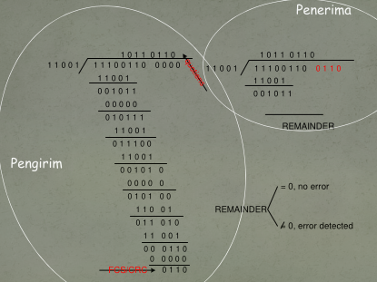

# Jaringan Kopmuter

## Terminologi Fisik Jaringan

- Node
- Link
- Terminal
- Jaringan

### Link

- Jalur yang menghubungkan antar 2 elemen jaringan (node-node atau terminal-node)
- Kumpulan link (+ node-node) = jaringan
- Fungsi link sangat vital, maka OSI menetapkan protokol lapis 2 (datalink)
- Datalink = mengatur agar komunikasi di link tersebut berjalan **_beanr_** dan **_lancar_**
- Tidak ada keharusan jenis link dalam jaringan sama = boleh memilih teknologi link (fisik maupun protokol) untuk setiap link
- Terdapat 2 macam link : link fisik dan link logik (contoh: virtual path yang terdiri atas virtual channel)

### Tugas Datalink

- Pembukaan hubungan dan penutupan hubungan.
- Melakukan kendali atas kesalahan yang mungkin terjadi : `tool -> pariti, crc, dll`.
- Melakukan pengendalian banyaknya data yang dikirim -> untuk menghindari kemacetan (kongesti): Tool -> sliding windows dll.
- Dan lainnya (optional: tambahan untuk protokol datalink tertentu)!

### Proses hubungan di link

- Ada 2 jenis proses hubungan dilink:
  - Memperlukan connection setup
  - Hubungan langsung
- Connection setup
  - Ada banyak path yang bisa dipilih
  - Untuk hubungan yang sangat handal
  - Tersedia berbagai pilihan kecepatan komunikasi.
- Hubungan langsung
  - Tanpa pilihan jalur dan kecepatan komunikasi.
  - Point-to-point connection.

## Metoda Deteksi Kesalahan

- Agar bisa melakukan kendali kesalahan, syarat mutlak yang harus adal adalah adanya mekanisme deteksi kesalahan.
- Beberapa metoda yang umum digunakan :
  - Pariti -> Paling sederhana.
  - CRC -> lebih sulit, meminta kemampuan komputasi.
  - Checksum -> operasi word.

### Pariti

- Penambahan 1 bit sebagai bit deteksi kesalahan.
- Terdapat 2 jenis pariti : genap dan ganjil
  - Pariti genap = jumlah bit 1 dalam kode adalah genap
  - Pariti genap = d1 xor d2 xor .... Dn
  - Pariti ganjil = Jumlah bit 1 dalam kode adalah ganjil.
  - Pariti ganjil = (d1 xor d2 .... Dn) xor 1
- Sistem sederhana dan mudah dibuat hardwarenya (di PC digunakan IC 74LS280)
- Tidak mampu mendeteksi kesalahan bit genap -> peluang benar deteksi kesalahan hanya 25% (peluang salah mutlak 50% + peluang salah deteksi 25%)

### Cyclic Redudancy Check: Sisi Pengirim

- Merupakan hasil operasi pembagian biner dengan suatu pembagi tertentu (generator polinomial)
  - Pembagi : Dn Dn-1 ... D1
  - Deretan bit : b1 b2 bd3 ... bn
  - Operasi :
    - (b1 b2 b3 ... bn) n-1 / Dn ... D1 -> sisa (Rn-1 ... R1)
  - Dikirim b1 b2 b3 ... bn Rn-1 ... R1

### Cyclic Redudancy Check: Sisi Penerima

- Oleh penedima dilakukan operasi yang sama.
  - b1 b2 b3 ... bn Rn-1 ... R1 / Dn ... D1 -> Sisa (rn01 ... r1)
  - Data benar jika Rn-1 ... R1 = 0
  - Data salah jika Rn-1 ... R1 != 0
- Pembagi standar internasional
  - CRC-16 -> 11000000000101
  - CRC-ITU -> 10001000000100001
  - CRC-32 -> 100000100100000010001110110110111
- Jika diperlukan pembagi boleh tidak menggunakan standar ini asal memenuhi :
  - Diawali dan diakhiri dengan bit 1 (1xxxxxxxx1)
  - Jumlah minimum bit "1" : 3 bit.
  - Agar bisa mendeteksi jumlah bit kesalahan ganjil : harus habis dibagi oleh (11 = X + 1)

### Contoh Perhitungan CRC

### Penggunaan : Pada Paket LAN (MAC)

|            x            |
| :---------------------: |
| Destination MAC Address |
|   Source MAC Address    |
|    Protocol / Length    |
|   Data (46 0 1500 B)    |
|         CRC-32          |

### Checksum

- CRC memerlukan perhitungan xor sebanyak jumlah bit data -> memerlukan kemampuan komputasi yang cukup besar.
- Diciptakan metoda checksum (untuk mengurangi perhitungan) pada beberapa jenis transmisi tidak perlu kecanggihan CRC atau sudah melakukan CRC di lapis lain.
- Cara perhitungan checksum:
  - Data dibagi menjadi kelompok-kelompok 16 bit (word).
  - Word pertama di xor dengan word kedua.
  - Hasil di xor dengan word ketiga, keempat, ... sampai word terakhir (jika bit-bit terakhir tidak cukup untuk menjadi word, ditambahkan padding bit '0' sampai membentuk word)
  - Hasil akhir (16 bit) = checksum

##
