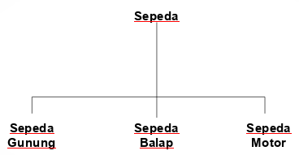
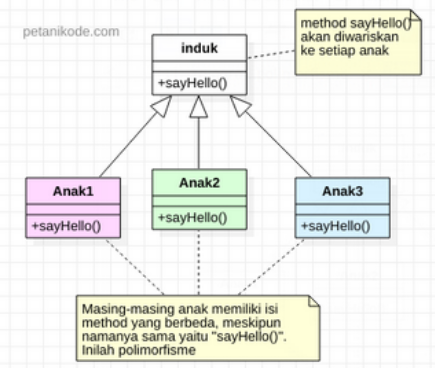

# Enkapsulasi, Pewarisan dan Polimorfisme

## Konsep Dasar OOP

- Enkapsulasi (_Encapsulation_).
- Pewarisan (_Inheritance_).
- Polimorfisme (_Polymorphism_).

## Enkapsulasi (_Encapsulation_)

- Definisi enkapsulasi : Pembungkusan variable dan method dalam sebuah obyek yang terlindungi serta menyediakan interface untuk mengakses variable tersebut.
- Variable dan method yang dipunyai suatu obyek, bisa ditentukan hak aksesnya.
- Contoh : Jam tangan
  - Penting sekali untuk mengetahui waktu.
  - Cara jam mencatat waktu dengan baik antara jam bertenaga baterai atau bertenaga gerak tidaklah penting kita ketahui.
- Dalam OOP, konsep enkapsulasi sebenarnya merupakan perluasan dari struktur dalam bahasa C.

## Pewarisan (_Inheritance_)

- Definisi : merupakan pewarisan atribut dan method dari sebuah class ke class lainnya.
- Class yang mewarisi superclass.
- Class yang diwarisi subclass.
- Subclass bisa berlalu sebagai superclass bagi class lainnya _multilevel inheritance_.
- Contoh : terdapat class sepeda dan sepeda gunung :
  - Sepeda superclass.
  - Sepeda gunung subclass.
  - Sepeda gunung memiliki variable dan method yang dimiliki oleh sepeda.
- Prinsip : Persamaan-persamaan yang dimiliki oleh beberapa kelas dapat digabungkan dalam sebuah class induk sehingga setiap kelass yang diturunkannya memebuat hal-hal yang spesifik untuk kelas yang bersangkutan.



### Keuntungan Pewarisan

- Subclass menyediakan state/behaviour yang spesifik yan membedakan dengan superclass memungkinkan programmer untuk menggunakan ulang source code dari superclass yang telah ada.
- Programmer dapat mendefinisikan superclass khusus yang bersifat generik, yang disebut abstract class, untuk mendefinisikan class dengan tingkah laku dan state secara umum.

### Single & Multiple inheritance

- C++ _multiple inheritance_
  - Suatu class diperbolehkan untuk mempunyai lebih dari satu superclass.
  - Variable dan method yang diwariskan merupakan kombinasi dari superclsas-nya.
- Java _single inheritance_
  - Suatu class hanya boleh mempunyai satu superclass.

### Multiple Inheritance

- Suatu subclass bisa menjadi superclass bisa menjadi superclass bagi class yang lain.

## Polimorfisme (_Polymorphism_)

- Polimorfisme (_Polymorphism_)
  - adalah sebuah prinsip dalam biologi dimana organisme atau spesialis dapat memiliki banyak bentuk atau tahapan (_stages_).
- Polimorfisme dalam OOP adalah sebuah prinsip dimana class dapat memiliki "bentuk" method yang berbeda-beda meskipun namanya sama.
  - "Bentuk" disini dapat diartikan: isinya berbeda, parameternya berbeda, dan tipe datanya berbeda.

### Jenis Polimorfisme

- Static Polymorphism (Polimorfisme statis).
- Dynamic Polymorphism (Polimorfisme dinamis).

#### Static Polymorphism

- Polimorfisme statis menggunakan method overloading, method overloading terjadi pada sebuah class yang memiliki nama method yang sama tapi memiliki parameter dan tipe data yang berbeda.
- Kata kunci yang perlu kamu ingat :
  - "Dalam satu class".
  - "Nama metod yaang sama".
  - "Tipe data dan parameter beda".

**Contoh Static Polymorphism**

- Contohnya misalkan kita memiliki class `Lingkaran.java` pada class ini terdapat method _loas()_.
- Nah, si metod `luas()` ini bisa saja memiliki parameter yang berbeda.
- Misalnya kita ingin menghitung luas berdasarkan jari-jari (radius) atau diameter.

**Kode Implementasi**

```java
public class Lingkaran {
  // method menghitung luas dengan jari-jari.
  float luas(float r) {
    return (float) (Math.PI * r * r);
  }

  double luas(double d) {
    return (double) (1/4 * Math.PI * d);
  }
}
```

**Penjelasan**

- Class `Lingkaran` memiliki dua method namanya sama, yakni `luas()`.
- Tapi parameter dan tipe datanya berbeda dan juga isi atau rumus didalamnya berbeda.
- Inilah yang disebut _Polymorphism satatis_.

#### Dynamic Polymorphism

- Polimorfisme dinamis biasanya terjadi saat kita menggunakan pewarisan (_inheritance_) dan implementasi interface.
- Seperti yang sudah kita ketahui : Pada pewarisan, kita bisa mewarisi _attributes_ dan _method_ dari _class_ induk ke class anak.
  - Class anak akan memiliki nama _method_ yang sama dengan class induk dan anak yang lainnya.

**Contoh Dynamic Polymorphism**



**Penjelasan**

- _Class anak_ akan memiliki nama _method_ yang sama, tapi nanti _isi_ dan _parameternya_ bisa berbeda dari _class induk_.
- Karena si _class anak_ melakukan _method overriding_ (menindih method) yang diwariskannya.
- Polimorfisme dinamis juga bisa terjadi saat menggunakan interface.
