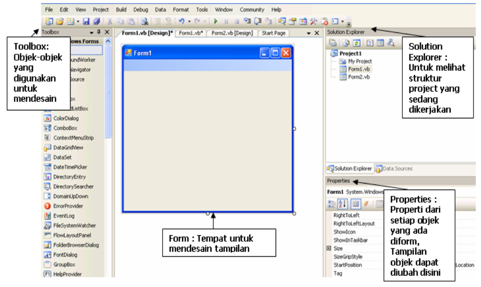
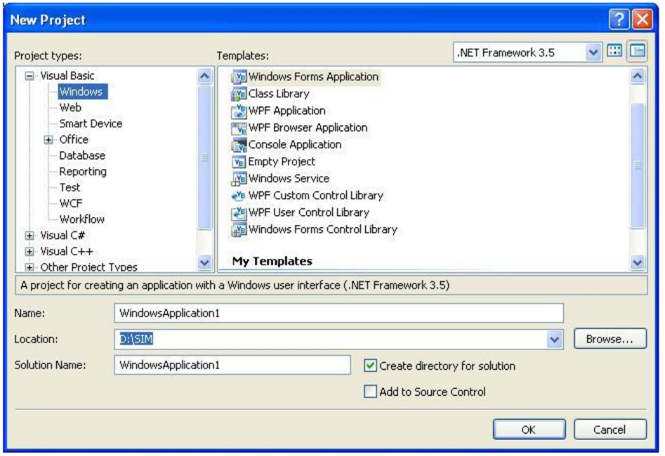
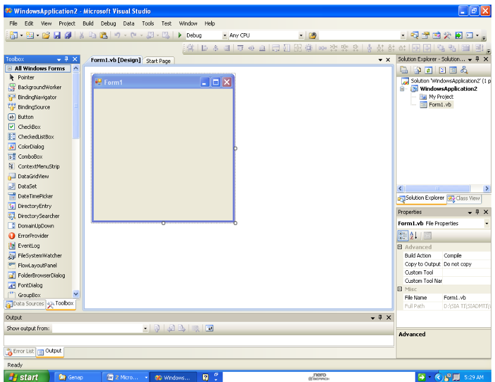

# Pemrograman Visual

## Pengenalan Visual Basic

### Tujuan

- Memahami platform Microsoft .NET
- Mengenal Integrated Development Environment (IDE) Visual Basic .NET
- Memahami struktur project Visual Basic .NET
- Memahami jenis-jenis aplikasi .NET
- Mampu membangun Graphical User Interface (GUI) menggunakan Visual Basic .NET

### Perangkat Lunak (Software)

- Microsoft Visual Basic 2008.

### Dasar Teori

**Platform .NET Framework**

- Microsoft .NET yang awalnya disebut Next Generation Windows Services (NGWS) adalah platform untuk membangun dan menjalankan generasi penerus aplikasi-aplikasi terdistribusi.
- Microsoft .NET merupakan _framework_ (kerangka) pengembangan yang menyediakan antarmuka pemrograman baru untuk layanan Windows dan **API** (_Application Programing Interface_).
- Microsoft .NET merupakan strategi Microsoft untuk menghubungkan sistem, informasi, dan alat (_device_), sehingga orang data berkomunikasi serta berkolaborasi dengan lebih efektif.
- Teknologi .NET terintegrasi penuh melalui produk-produk Microsoft solusi dengan menggunakan Web service.
- Platform Microsoft .NET terdiri dari lima komponen utama yang tersusun dalam tiga lapisan (layer).
- Lapisan paling bawah adalah sistem operasi.
- Lapisan kedua terdiri dari tiga komponen.
- Lapisan teratas adalah Visual Studio .NET

**Visual Studio .NET**

- Microsoft Visual Studio .NET merupakan kumpulan lengkapan tools pengembangan untuk membangun aplikasi Web ASP.NET, XML Web Services, aplikasi dekstop, dan aplikasi mobile.
- Di dalam Visual Studio inilah bahasa-bahasa pemrograman .NET seperti Visual Basic, Visual C++, Visual C# (CSharp), dan Visual J# (JSharp).
- Semuanya menggunakan lingkungan pengembangan terintegrasi atau IDE yang sama sehingga memungkinkan untuk saling berbagi tools dan fasilitas.

**Visual Basic .NET**

- Visual Basic .NET (atau VB.NET) merupakan salah satu bahasa pemrograman yang bisa digunakan untuk membangun aplikasi-aplikasi .NET di platform Microsoft .NET
- Tidak seperti generasi sebelumnya Visual Basic 6.0 ke bawah yang lebih difokuskan untuk pengembang membangun bermacam aplikasi, baik dekstop maupun aplikasi web.
- Sering dengan perkembangan aplikasi perangkat lunak yang semakin kompleks, saat ini Visual Basic .NET terbaru (Visual Basic 2008).

- Untuk menginstall Microsoft VB.NET sama seperti menginstall aplikasi produk Microsoft lain pada umumnya.
- Dalam hal ini tinggal hidupkan komputer, kemudian CD instalan VB.NET kedalam CD-ROM, kemudian tunggu proses selesai
- Untuk menjalankan Microsoft VB.NET diperlukan perangkat keras yang sesuai dengan kebutuhan.
- Namun apabila komputer sudah terpasang Microsoft Windows 2000 atau yang lebih tinggi misalnya Windows XP, maka sudah dipastikan bahwa anda bisa menjalankan Microsoft VB.NET

- Untuk menginstall VB.NET Anda harus mempersiapkan perangkat keras dan perangkat lunak sebagai berikut :
  - Komputer dengan spesifikasi Minimal Pentium IV.
  - Memori atau RAM yang disesuaikan dengan sistem operasi yang digunakan.
  - Monitor Super VGS (1024x768) atau yang lebih tinggi.
  - Space harddisk minimal 5 GB.
  - Mouse Standar.
  - Sistem operasi Windows 2000 atau yang lebih tinggi.

**IDE Visual Basic**

- **IDE** (_Integrated Development Environment_), atau juga disebut sebagai _Integrated Design_ / _Debugging Environment_, adalah perangkat lunak komputer yang berfungsi untuk membantu pemrogram dalam mengembangkan perangkat lunak.
- Singkatnya, IDE merupakan suatu lingkungan pengembangan aplikasi yang terinteegrasi lengkap dengan beragam tools atau utilitas pendukung.

## Instalasi VB.NET

### Proses Instalasi VB.NET

- Untuk menginstall Microsoft VB.NET sama seperti menginstall aplikasi produk Microsoft lain pada umumnya.
- Dalam hal ini tinggal hidupkan komputer, kemudian masukkan CD instalan VB.NET kedalam CD-ROM.
- Kemudian tunggu hingga proses selesai.

- Untuk menjalankan Microsoft VB.NET diperlukan perangkat yang sesuai dengan kebutuhan.
- Namun apabila koputer sudah terpasang Microsoft Windows 2000 atau yang lebih tinggi misalnya Windows XP, maka sudah dipastikan bahwa Anda bisa menjalankan Microsoft VB.NET.

- Untuk menginstall VB.NET Anda harus mempersiapkan perangkat keras dan perangkat lunak sebagai berikut :
  - Komputer dengan spesifikasi minimal Pentium II 450 MHz
  - Memori atau RAM yang disesuaikan dengan sistem operasi yang digunakan.
  - Monitor Super VGS (1024x768) atau yang lebih tinggi.
  - Hardisk minimal 10 GB.
  - Mouse
  - Sistem Operasi Windows 2000 atau yang lebih tinggi.

## Sekilas tentang VB.NET

- Hampir sebagaian besar pengguna komputer di dunia sudah mengenal produk-produk Microsoft, salah satunya adalah Microsoft Visual Basic .NET.
- VB.NET merupakan pengembangan dari Microsoft Visual Basic versi sebelumnya.

- Membangun suatu program aplikasi dengan VB.NET lebih mudah dan menyenangkan, karena selain dilengkapi fitur-fitur baru juga tersedia bermacam-bermacam toolbar, komponen, class, object dan sebagainya.
- Jika Anda sudah terbiasa dengan Visual Basic kemungkinan besar untuk migrasi ke VB.NET tidak akan mengalami kesulitan, karena hampir semua komponen di Visual Basic sebelumnya masih bisa digunakan.
- Sebagai contoh untuk membuat suatu Project VB.NET Anda tinggal klik Menu File, kemudian pilih Project dan akan keluar kotak dialog.
- Setelah itu pilih Windows Application, kemudian beri nama Project tersebut.

### Membuat Project Baru

Project merupakan kerangka dasar aplikasi yang sangat menentukan jenis aplikasi yang akan dibuat. Untuk memulai pembuatan project ikuti langkah-langkah berikut :

1. Jalankan **Visual Basic 2008 Express Edition**.
2. Klik menu **File > New Project**, atau melalui ikon **New Project**, atau melalui kombinasi tombol **Ctrl+N**.
3. Pada kotak dialog **New Project**, pilih template **Windows Application**, kemudian klik **OK**.

- 
- **Windows** (Windows Form, console, Class Library, WPF dll)
- **Web** (ASP Web Application, ASP.NET Services dll)
- **Smart Device** (Smart Device Project)
- **Database** (Access dan SQL Server)
- **Report** (_Report Application_ dan _Crystal Report_)
- **WCF** (Windows Communication Foundation) dll.
- **Windows Application** Untuk menciptakan aplikasi-aplikasi Windows yang berjalan secara lokal di komputer user.
- **Class Library** Untuk menciptakan kelas-kelas atau komponen-komponen yang dapat di-share dengan project lainnya.
- **Console Application** Untuk membuat aplikasi-aplikasi command line.

### Mengenal IDE Visual Basic 2008

Dalam upaya memudahkan penggunaan IDE, maka diperlukan pemahaman yang baik mengenai IDE Visual Basic 2008.

|   **Interface**   |                                 **Keterangan**                                 |
| :---------------: | :----------------------------------------------------------------------------: |
|     Menu Bar      |                         Menu standar pada Visual Basic                         |
|      Toolbar      |  Daftar tool yang digunakan untuk menjalankan perintah yang sering digunakan   |
|      Toolbox      |        Daftar control yang tambahkan ke dalam program sebagai Interface        |
|    Form Design    | Digunakan untuk mengedit tampilan form serta mengatur posisi control pada form |
| Solution Explorer |                   Digunakan untuk mengolah file dan project                    |
|    Properties     |  Digunakan untuk mengedit property dari form dan control yang sedaing diedit   |
|    Error List     |         Digunakan untuk menampilkan pesan error jika terjadi kesalahan         |
