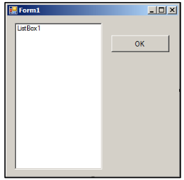

# Tugas Fungsi Perulangan

Buat tampilan sebagai berikut ini :



klik 2x pada tombol ok lalu ketikan kode program berikut ini :

```visualbasic
Dim Bil1, Bil2 As Byte
ListBox1.Items.Clear()
For Bil1 = 1 To 5
    ListBox1.Items.Add(Bil1 & ".")
    For Bil2 = 1 To 5
        ListBox1.Items.Add(Bil1 & "." & Bil2)
    Next
Next
```

Amati alur dari program, cobalah ubah angka "5" dengan angka yang lain dan lihat hasilnya.

## Tugas

Dengan hasil program diatas buatlah dengan menggunaakan perulangan `do while loop` dan `do loop until`
