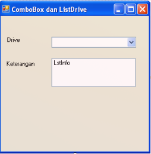
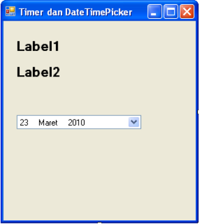
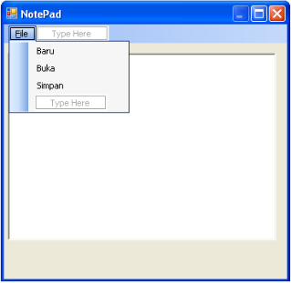

# Form Dan Object Control

## Tujuan

- Mamahami dan mengenal Form dan Object Control.
- Dapat membuat aplikasi sederhana dengan menggunakan form dan object control.

## Perangkat Lunak (Software)

- Microsoft Visual Basic 2010

## Dasar Teori

**Object Control**

- `MenuStrip` adalah merupakan object conrol yang berfungsi untuk membuat menu pilihan drop down.
- `ContextMenuStrip` adalah merupakan object conrol yang berfungsi untuk membuat menu pilihan yang akan tampil pada saat tombol kanan mouse di klik.
- `RichTextBox` adalah merupakan object conrol yang fungsinya hampir sama seperti text box hanya saja di object control ini lebih banyak menampung karakter dan bisa manipulasi karakter seperti menggaris bawahi sdb.
- `OpenFileDialog` adalah merupakan object control yang berfungsi untuk membuka kotak dialog open.
- `SaveFileDialog` berfungsi untuk membuka kotak dialog save yang dimiliki windows.
- `ToolStrip` adalah merupakan objek control yang berfungsi hampir sama dengan tombol pada umumunya hanya saja pada objek control ini setiap tombol memiliki gambar dan digunakan untuk mengakses gambar dengan cepat.
- `StatusStrip` digunakan untuk menampilkan informasi seperti nama aplikasi, jam, tanggal, dll. Pada umumnya object control ini

## Praktikum

### `ComboBox` dan `ListBox`

1. Tambahkan Form baru, dengan cara klik kanan pada **Prak2**. Klik Add, pilih Windows Form ... Beri nama **Form2**.
2. Buatlah desain Tampilan form seperti gambar berikut ini:
   - 
3. Tambahkan kontrol ke form seperti pada gambar diatas dan atur propertinya seperti tabel berikut :
   - | **Object** |       **Properties**       |                **Nilai**                 |
     | :--------: | :------------------------: | :--------------------------------------: |
     |   Form2    | Name, Text, Start Position | Form2, ComboBox dan ListBox CenterScreen |
     |   Label1   |            Text            |                  Drive                   |
     |   Label2   |            Text            |                Keternagan                |
     | Combobox1  |            Name            |                Cmb_Drive                 |
     |  ListBox1  |            Name            |                 LstInfo                  |
4. Klik icon view code pada solution Explorer, di atas Public Class Form1, ketikan kode program berikut ini:
   - ```
     Imports System.IO
     Public Class Form2
     ```
5. Klik ganda pada form, kemudian ketikan kode program berikut ini:
   - ```
     Private Sub Form2_load(ByVal Sender As System.Object, ByVal e As System.EventArgs) Handles
     MyBase.Load
       Cmb_Drive.Items.AddRange(IO.DriveInfo.GetDrives)
     End Sub
     ```
6. Klik ganda pada ComboBox, Kemudian ketik kode program berikut ini:
   - ```
     Private Sub Cmb_Drive_SelectedIndexChanged(ByVal sender As System.Object, ByVal e As System.EventArgs) Handles Cmb_Drive.SelectedIndexChanged
       LstInfo.Items.Clear()
       LstInfo.Items.Add("Nama Drive :" & Dir("" & _
       Cmb_Drive.Text & "", FileAttribute.Volume) & "")
       LstInfo.Items.Add("System :" & Dir("" & _
       Cmb_Drive.Text & "", FileAttribute.System) & "")
       Dim dvr As New DriveInfo(Cmb_Drive.Text)
       Dim kapasitas = CStr(dvr.TotalSize / 1000000) & " MB"
       Dim sisa = CStr(dvr.TotalFreeSpace / 1000000) & " MB"
       Dim Terpakai = CStr(Val(kapasitas) - Val(sisa)) & " MB"
       LstInfo.Items.Add("Kapasitas : " & kapasitas)
       LstInfo.Items.Add("Terpakai  : " & Terpakai)
       LstInfo.Items.Add("Sisa      : " & sisa)
     End Sub
     ```
7. Jalankan Aplikasi dengan menekan tombol **F5** (dikeyboard), atau melalui icon Start Debugging di toolbar, atau melalui menu **Debug > Start Debugging**.
8. Simpan aplikasi **Anda**.

### `Timer` dan `DateTimePicker`

1. Tambahkan Form baru, dengan cara klik kanan pada **Prak2**. Klik Add, pilih Windows Form ... Beri nama **Form3**
2. Buatlah desain Tampilan form seperti gambar berikut ini:
   - 
3. Tambahkan kontrol ke form seperti pada gambar diatas dan atur propertinya seperti tabel berikut:
   - | **Object**      | **Properties**            | **Nilai**                                   |
     | --------------- | ------------------------- | ------------------------------------------- |
     | Form3           | Name, Text, Start Postion | Form3, Time & DateTimePicker, Center Screen |
     | Label1          | name                      | Lbl12jam                                    |
     | Label2          | Name                      | Lbl24jam                                    |
     | DateTimePicker1 | Name                      | Dtanggal                                    |
     | Timer1          | Enable Interval           | True 1000                                   |
4. Klick ganda pada form, ketikkan kode program berikut ini:
   - ```
     Private Sub Form3_Load(ByVal sender As System.Object, ByVal e As System.EventArgs)
     Handless MyBase.Load
      DTanggal.Format = DateTimePickerFormat.Custom
      DTanggal.CustomFormat = "dddd,dd/MM/yyyy"
      DTanggal.Value = Format(Now)
     End Sub
     ```
5. Klik ganda pada Timer1, ketikkan kode program berikut ini:
   - ```
     Private Sub Timer1_Tick(ByVal sender As System.Object, ByVal e As System.EventArgs)
     Handless Timer1.Tick
      Lbl12Jam.Text = Format(Now, "h:mm:ss tt")
      Lbl24Jam.Text = Format(Now, "hh:mm:ss")
     End Sub
     ```
6. Jalankan aplikasi dengan menekan tombol **F5** (dikeyboard), atau melalui icon Start Debugging di toolbar, atau melalui menu **Debug > Start Debugging**.
7. Simpan aplikasi **Anda**.

### `MenuStrip`, `ContextMenuStrip` dan `RichTextBox`

1. Tambahkan Form baru, dengna cara klik kanan pada **Prak2**. Klik Add, pilih Windows Form ... Beri nama **Form4**.
2. Buatlah desain Tampilan form seperti gambar berikut ini:
   - 
3. Tambahkan `menuStrip` seperti pada form diatas.
4. Tambahkan kontrol ke form seperti pada gambar diatas dan atur propertinya seperti tabel berikut :
   - |    **Object**     |       **Proprties**        |          **Nilai**           |
     | :---------------: | :------------------------: | :--------------------------: |
     |       Form1       | Name, Text, Start Position | Form1, NotePad, CenterScreen |
     |    MenuStrip1     |            name            |          MenuStrip1          |
     |   RichTextBox1    |   Name, ContextMenuStrip   |  RchTeks, ContextMenuStrip1  |
     | ContextMenuStrip1 |            Name            |      ContextMenuStrip1       |
5. Klik ganda pada menu buka, ketikan kode program berikut ini:
   - ```
     Private Sub BukaToolStripMenuItem_Click(ByVal sender As System.Object, ByVal e As System.EventArgs)
     Handles BukaToolStripMenuItem.Click
      Dim kotak_dialog As OpenFileDialog = New OpenFileDialog
      kotak_dialog.Filter = "File Text (*.txt) | *.txt"
      kotak_dialog.ShowDialog()
      Dim fileText As String = My.Computer.FileSystem.ReadAllText(kotak_dialog.FileName)
     End Sub
     ```
6. Klik ganda pada menu simpan, ketikan kode program berikut ini:
   - ```
     Private Sub SimpanToolStripMenuItem_Click(ByVal sender As System.Object, ByVal e As System.EventArgs)
     Handles SimpanToolStripMenuItem.Click
       Dim kotak_dialog As SaveFileDialog = New SaveFileDialog
       kotak_dialog.Filter = "File Text (*.txt) | *.txt"
       kotak_dialog.ShowDialog()
       My.Computer.FileSystem.WriteAllText("" & kotak_dialog.FileName & "",RchTeks.Text, False)
     End Sub
     ```
7. Klik ganda pada menu Baru, ketikan kode program berikut ini:
   - ```
     Private Sub BaruToolStripMenuItem_Click(ByVal sender As System.Object, ByVal e As System.EventArgs)
     Handles BaruToolStripMenuItem.Click
      RchTeks.Text = ""
     End Sub
     ```
8. Klik ganda pada menu ContextMenuStrip dengan menu regular, kemudian ketik kode program berikut ini :
   - ```
        Private Sub RegularToolStripMenuItem_Click(ByVal sender As System.Object, ByVal e As
     System.EventArgs) Handles RegularToolStripMenuItem.Click
     RchTeks.SelectionFont = New Font(RchTeks.SelectionFont, FontStyle.Regular)
     End Sub
     ```
9. Klik ganda pada menu ContextMenuStrip dengan menu Bold, kemudian ketik kode program berikut ini :
   - ```
      Private Sub BoldToolStripMenuItem_Click(ByVal sender As System.Object, ByVal e As System.EventArgs)
      Handles BoldToolStripMenuItem.Click
       RchTeks.SelectionFont = New Font(RchTeks.SelectionFont, FontStyle.Bold)
     End Sub
     ```
10. Jalankan aplikasi dengan menekan tombol **F5** (dikeyboard), atau melalui icon Start Debugging di toolbar, atau melalui menu **Debug > Start Debugging**.
11. Simpan aplikasi **Anda**.

###
