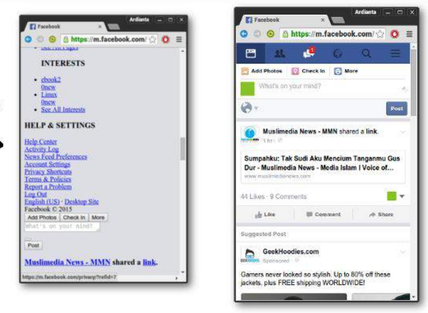
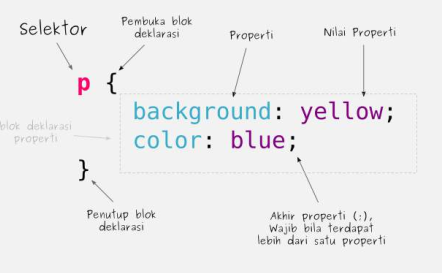
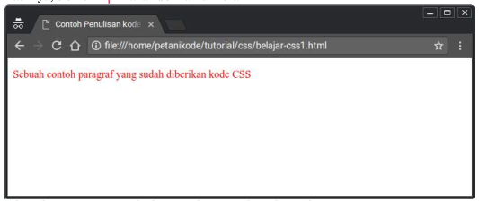

# Pengenalan Dasar CSS

CSS adalah bahasa kedua setelah HTML yang harus dipelajari seorang _web developer_.

- Pengatura tentang CSS sangatlah penting bagi seorang _web developer_, karena dengan CSS bisa membuat :
  - Halaman _landing page_ yang menarik.
  - Template atau tema blog.
  - Mengubah PSD (Desain web) HTMl.
  - dan sebagainya.

Contohnya, bagaimana tampilan facebook tanpa CSS ?
mungkin bisa seperti ini



---

- Pada artikel ini, akan membahas pengenalan dasar CSS, seperti:
  - Apa itu CSS ?
  - Struktur dasar CSS.
  - Cara menuliskan CSS di HTML.
  - Tips Belajar CSS.

## Apa itu CSS ?

**CSS** _Cascade Style Sheet_ merupakan sebuah bahasa untuk mengatur tampilan web sheingga terlihat lebih menarik dan indah.

Dengan **CSS**, dapat mengatur _layout_ (tata letak), warna, font, garis, dan lain-lain.

CSS pertama kali diperkenalkan oleh Hakon Wium Lie pada tahun 1994.

## Variasi atau Versi CSS

- Sejak awal diperkenalkan CSS memiliki beberapa variasi :
  1. CSS versi 1 (17 Desember 1996).
  2. CSS versi 2.0 (Mei 1998)
  3. CSS versi 2.1 (7 juni 2011)
  4. CSS versi 3 (2012)
  5. CSS versi 4 masih dalam pengembangan.
- Apa bedanya dari setiap versi tersebut ?
- Tentunya ada penambahan dan pengurangan.

## Struktur Kode atau Sintaks Dasar CSS

- Struktur kode CSS terdiri dari tiga bagian :
  1. Selektor.
  2. Blok Deklarasi.
  3. Properti dan nilainya.

Contoh:



### Selektor

Selektor adalah kata kunci untuk memilih elemen HTML yang akan diatur.
Contohnya :

```css
h1 {
	color: red;
}
```

Artinya: kita memilih semua elemen `<h1>`, lalu diberikan warna teks <font color="red">RED</font> (merah).
Selektor dapat berupa nama tag, class, id, dan attribute.
Contohnya :

```css
/* Selektor dengan nama tag */
h2 {
	color: blue;
}

/* Selektor dengan class */
.bg-yellow {
	background: grey;
}

/* Selektor dengan Attribute */
input[type='text'] {
	background: yellow;
}
```

### Blok Deklarasi

Blok deklarasi adalah tempat menuliskan atribut-atribut CSS yang akan diberikan ke pada selektor.
Contoh :

```css
p {
	font-size: 18px;
}
```

Artnya, akan mengatur ukuran font dari tag <font color="red">`<p>`</font> sebesar <font color="red">18px</font>.

Blok deklarasi dimulai atau dibuka dengan tanda kurung `{` lalu ditutup dengan `}`.

### Properti dan Nilainya

Properti merupakan atribut atau sekumpulan aturan yang akan diberikan kepada elemen yang dipilih.

```css
properti: 'nilai';
```

Setiap properti harus diakhihri dengan titik koma (`;`).
Apablia hanya terdapat satu properti, boleh tidak menggunakan titik koma. \
Properti harus ditulis di dalam blok deklarasi.\
Contoh :

```css
blockquote {
	background: pink;
}
```

## Cara Menulis Kode CSS dalam HTML

Penulisan kode CSS di HTML, dapat dilakukan di dalam tag `<style>`.\
Tag tersebut dapat ditulis di dalam tag `<head>` atau `<body>`.\
Kebanyakan orang menulisnya di dalam tag `<head>`. \
Perhatikan contoh berikut ini :

```html
<!DOCTYPE html>
<html>
	<head>
		<title>Contoh Penulisan kode CSS</title>
		<style type="text/css">
			p {
				color: red;
			}
		</style>
	</head>
	<body>
		<p>Sebuah contoh paragraf yang sudh diberikan oleh kode CSS</p>
	</body>
</html>
```

Hasilnya, elemen `<p>` akan berwarna merah



Selain dengan cara ini, ada cara lagi yang bisa digunakan :

1. inline CSS
2. External CSS

## Tips Belajar CSS

Ada beberapa tips untuk membantuk belajar CSS

### Cara menghafal kode dan properti CSS

Ada ratusa properti CSS yang harus diingat.\
Apakah kita akan mampu menghafal semuanya ?\
Tergantung.

Jika sering mengetik kode CSS tanpa _copas_, bisa jadi ingatan terhadap kode atau properti CSS akan semakin kuat.

### Gunakan Inspect Elemen

Inspect elemen ada di setiap browser. Bisa dibuka dengan Klik kanan, lalu pilih Inspect Element. \
Di inspect elemen, kita bisa menulis kode CSS secara langsung dan hasilnya pun akan langsung kita ketahui.

##
