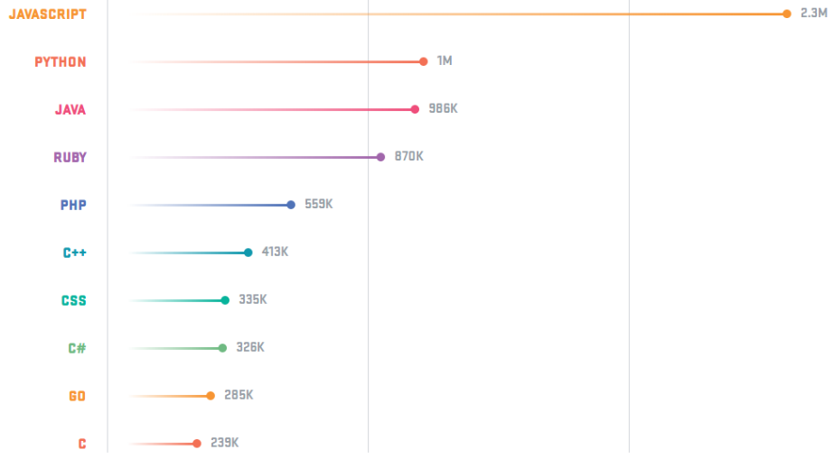
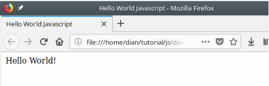
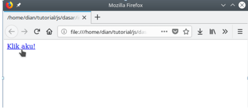
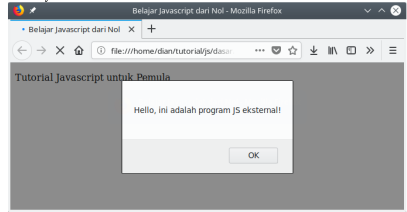

# Pemrograman JavaScript

JavaScript adalah bahasa pemrograman yang wajib dipelajari ingin mengdalami dunia **web development**.

Saat ini javascript tidak hanya digunakan di sisi _client (browser)_ saja.
JavaScript juga digunakan pada server, console, program desktop, mobile, IoT, game, dan lain-lain .

Hal ini membuat javascript semakin populer dan menjadi salah satu bahasa yang paling banyak digunakan.



## Apa itu JavaScript ?

JavaScript adalah bahasa pemrograman yang awalnya dirancang untuk berjalan diatas browser.

JavaScript awalnya bernama **Mocha**, lalu berubah menjadi **LiveScript** saat browser Netscape Navigator 2.0 rilis versi beta (September 1995).
Namun, setelah itu dinamai ulang menjadi **JavaScript**.

Terinspirasi dari kesuksesan Javascript, Microsoft mengadopsi teknologi serupa.
Microsoft membuat 'JavaScript' versi merekka sendiri bernama **JScript**.
Lalu ditanam pada Internet Explorer 3.0.
Hal ini mengakibatkan 'perang browser', karena JScript milik Microsoft berbeda dengan Javascript rincikan Netscape.

Akhirnya pada tahun 1996, Netscape mengirimkan standarisasi ECMA-262 Ke ECMA Internasional.
Sehingga lahirlah standarisasi kode Javascript bernama ECMAScript atau ES. Saat ini ECMAScript sudah mencapai versi 2022

| Versi ECMAScript |  Tahun Rilis  |
| :--------------: | :-----------: |
|       ES 1       |   Juni 1997   |
|       ES 2       |   Juni 1998   |
|       ES 3       | Desember 1999 |
|       ES 4       | Terbengkalai  |
|       ES 5       | Desember 2009 |
|      ES 5.1      |   Juni 2011   |
|       ES 6       |   Juni 2015   |
|       ES 7       |   Juni 2016   |
|       ES 8       |   Juni 2017   |

## Peralatan untuk Belajar Javascript

Apa saja peralatan yang harus disiapkan untuk belajar Javascript ?

1. Web Browser (Google Chrome, Firefox, Opera, dll).
2. Teks Editor.

## Membuat Program Javascript Pertama

Silahkan buka teks editor, kemudian buat file baru bernama `hello_world.html` dan isi dengan kode berikut :

```html
<!DOCTYPE html>
<html>
	<head>
		<title>Hello World Javascript</title>
	</head>
	<body>
		<script lang="javascript">
			document.write("Hello World!");
		</script>
	</body>
</html>
```

Silahkan disimpan dengan nama `hello_world.html`, kemudian buka file tersebut dengan web browser.

Maka hasilnya :



## Cara Menulis kode Javascript

Pada contoh di atas, sudah menulis kode javascript di dalam HTML.
Cara tersebut merupakan cara penulisan _embeded_ (ditempel).

Masih ada beberapa cara lagi yang perlu diketahui :

1. _Embed_ (Kode Javascript ditempel langsung pada HTML).
2. _Inline_ (Kode Javascript ditulis pada attribute HTML).
3. _External_ (Kode Javascript ditulis terpisah dengan file HTML).

### Penulisan Kode Javascript dengan Embed

Pada cara ini, menggunakan tag `<script>` untuk menempelkan _(embed)_ kode Javascript pada HTML.
Tag ini dapat ditulis di dalam tag `<head>` dan `<body>`.

Contoh :

```html
<!DOCTYPE html>
<html>
	<head>
		<title>Hello World Javascript</title>
		<script lang="javascript">
			         // ini adalah penulisan kode Javascript
			         // di dalam tag <head>
			document.write("Hello Javascript dari Head!");
		</script>
	</head>
	<body>
		<script lang="javascript">
			         // ini adalah penulisan kode Javascript
			         // di dalam tag <body>
			document.write("Hello Javascript dari body!");
		</script>
	</body>
</html>
```

Mana yang lebih bagus, ditulis di dalam `<head>` atau `<body>` ? \
Banyak yang merekomdasikan menuliskannya di dalam `<body>`, karena akan membuat web di-load lebih cepat.

### Penulisan Kode Javascript Inline

Pada cara ini, menulis kode javascript di dalam attribut HTML.
Cara ini biasanya digunakan untuk memangil suatu fungsi pada _event_ tertentu.

Misal: saat link diklik.
ZZ
Contoh :

```html
<a href="#" onclick="alert('Yey!')">Klick Me!</a>
```

atau bisa juga seperti ini :

```html
<a href="javascript:alert('Yey!')">Klick Me!</a>
```

hasilnya :



Perhatikan ... \
Pada atribut `onclick` dan `href` fungsi javascript dituliskan di sana. \
Atribut `onclick` merupakan atribut HTML untuk menyatakan fungsi yang akan dieksekusi saat elemen itu diklik. \
Pada contoh di atas, di jalankan fungsi `alert()`. Fungsi ini merupakan fungsi untuk menampilkan dialog. \
Lalu pada atribut `href`, jika memanggil fungsi `alert()` dengan didahului `javascript:`. \
Atribut `href` sebenarnya digunakan untuk mengisi alamat link atau URL. \

Karena ingin memanggil kode javascript di sana, maka alamat link tersebut diubah menjadi `javascript:` lalu diikuti dengan fungsi yang akan dipanggil.

### Penulisan Kode JavaScript External

Pada cara ini, akan menulis kode javascript secara terpisah dengan file HTML.

Cara ini biasanya digunakan pada proyek-proyek besar, karena diyakini dengan cara ini, dapat lebih mudah mengelola kode project.

```
src/
|--- script.js
|--- index.html
```

Isi dari file `script.js` :

```javascript
alert('Hello, ini adalah program JS external');
```

isi dari file `index.html` :

```html
<!DOCTYPE html>
<html>
	<head>
		<title>Belajar Javascript dari Nol</title>
	</head>
	<body>
		<p>Tutorial Javascript untuk Pemula</p>

		<!-- Menyisipkan kode js external -->
		<script src="script.js"></script>
	</body>
</html>
```

hasilnya :



Pada contoh di atas, menulis kode javascript terpisah dengan kode HTML. \
Lalu, pada kode HTML ... \
Kita menyisipkan dengan memberikan atribut `src` pada tag `<script>`.

```html
<!-- Menyisipkan kode js external -->
<script src="script.js"></script>
```

Maka, apapun yang ada di dalam file `script.js` akan dapat dibaca dari file `index.html`.

Baaimana kalau file javascriptnya berada di folder yang berbeda ?

Contoh : Misal punya struktur folder seperti ini :

```
src/
|--- asset/
|    |--- script.js
|
|--- index.html
```

maka untuk menyisipkan file `script.js` ke dalam HTML, bisa menuliskannya seperti ini :

```html
<script src="asset/script.js"></script>
```

karena file `script.js` berada di dalam direktori `asset`.

Bisa juga menyisipkan javascript yang ada di internet dengan memberikan alamat URL lengkapnya.

Contoh :

```html
<script src="https://www.petanikode.com/asset/script.js"></script>
```

## Komentar

Sama seperti bahasa pemrograman lain. Javascript juga menyediakan fasilitas untuk Menuliskan komentar, komentar ini berguna bila nantinya anda atau orang lain membaca program. \
Pemberian komentar dalam Javascript dapat dilakukan dengan dua cara yaitu :

```javascript
// Ini komentar
```

atau

```javascript
/* Ini juga Komentar */
```

##
