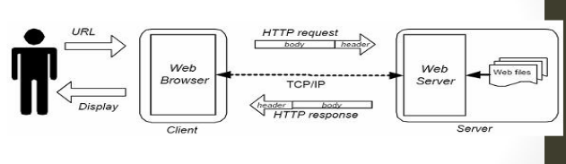

# Pertemuan 2

## Sekilas Mengenai Web

> **WWW** _World Wide Web_ atau biasa disebut dengan Web, merupakan salah satu sumber daya Internet yang berkembang pesat.

> Dengan pendekatan _hypertext_ ini seseorang dapat memperoleh informasi dengan meloncat dari suatu dokumen ke dokumen yang lain.

## Sejarah Web

sejarah web dimulai pada bulan maret 1989 ketika Tim Berner Lee yang bekerja di Laboratorium Fisika Partikel Eropa atau yang dikenal dengan nama CERN _Conseil Europeene pour la Recherche Nucleaire_ yang beada di Genewa, Swiss.

Protokol inilah yang selanjutnya dikenal sebagai protokol _world wide web_ dan dikembangkan oleh **W3C**.

W3C adalah konsorium yang sejumlah organisasi yang berkepentingan dengan pengembangan berbagai standar yang berkaitan dengan Web.

## Aplikasi Web

Aplikasi Web sendiri dapat dibagi menjadi 2 :

- Web Statis
  - Web yang menampilkan informasi-informasi yang sifanya statis (tetap)
- Web Dinasmis
  - Web yang menampilkan informasi serta dapat berinteraksi dengan user yang sifatnya dinamis

## Cara Kerja Web

## Skill/kemampuan dalam web

- Desain Web.
- Development Web.
- Internet dan Jaringan.

## Teknologi Web

Dari sisi teknologi yang digunakan untuk membentuk Web Dinamis, terdapat dua macam pengelompokan yaitu :

- **Client Side Scripting**
  - Kode Program di proses pada komputer client Contoh : VBScript, JavaScript.
- **Server Side Scripting**
  - Kode program di proses pada komputer server Contoh : ASP, PHP, Perl, ColdFusion, Python, Golang, Rust

## Syarat Berlajar

- HTML.
- Editor (Editplus, Dreamweaver).
- Browser.

## Teknologi Pada Sisi server

Teknologi Web pada sisi server memungkinkan pemrosesan kode di dalam server sehingga kode yang sampai pada pemakai berbeda dengan kode asli pada server.

Keuntungan penggunaan teknologi pada sisi server adalah :

- Mengurangi lalu-lintas jaringan dengan cara menghindari percakapan bolak-balik antara klien dan server.
- Mengurangi waktu pemuatan kode, mengingat klien hanya mengambil kode HTML saja.
- Mencegah masalah ketidak kompatibelan browser.
- Mencegah klien mengetahui rahasisa kode (mengingat kode yang diberikan ke klien berada dengan kode asli pada server).

---

Beberapa contoh teknologi yang berjalan di server adalah :

1. Common Gateway Interface (CGI).
2. Proprietary Web Server API.
3. Active Server Page (ASP).
4. Server-Side JavaScript.
5. Java Sevlets dab JavaServer Page (JSP).
6. PHP

##
