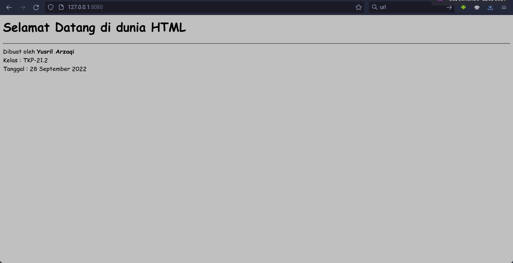

# HTML (HyperText Markup Language)

## World Wide Web

- **Internet** merupakan penghubung jaringan di seluruh jaringan di seluruh dunia.
- Agar antar jaringan yang beraneka ragam di seluruh dunisa bisa berkomunikasi diperlukan **protocol**.
- WWW Merupakan bagian internet yang sangat berkembang.
- Tiga Prinsip kerja WWW:
  - **HTTP** (Hypertext Transfer Protocol): Protocol untuk WWW
  - **URL** (Unifrom Resouce Locator): Standard alamat internet
  - **HTML** (Hypertext Mark Language): Dokumen yang bisa diakes melalui web.

### HTML

- HTML (Hypertext Mark Language)
  - Adalah suatu format data yang digunakan untuk membuat dokumen hypertext yang dapat dibaca dari suatu platform komputer ke platform komputer lain tanpa perlu melakukan perubahan apapun.
- Disebut markup language karena mengandung tanda-tanda tertentu yang digunakan untuk menentukan tampilan suatu teks dan tingkatan suatu text dan tingkat kepentingan dari text tersbut suatu dokumen.
- Dengan HTML dapat menentukan baris mana yang merupakan judul, menentukan tampilan gambar dan format teks lain.

### Fungsi HTMl

- Mengontrol tampilan dan isi Web Page.
- Mempulikasikan dokumen ke internet.
- Membuat online form.
- Menambah object image, audio dan video.

### Apa yang dibutuhkan ?

- Browser
  - Software untuk menerjembahkan tag HTML menjadi Web Page.
  - Mis - Internet Exproler, Opera, Mozila Firefox, Netspace Navigator.
- Editor
  - Software untuk membuat dokumen HTML.
  - Mis : Notepad, Ms. Front Page, Dreamweaver, Visual Studio Code.

### Struktur Dokumen HTML

```html
<html>
	<head>
		<!-- Bagian Head -->
	</head>
	<body>
		<!-- bagian Body -->
	</body>
</html>
```

---

**Bagian Head**

Berisi informasi yang menjalaskan tetang dokumen HTML, seperti judul dokumen, basis URL, hubungan antar dokumen, dan indeks suatu dokumen.

---

**Bagian Body**

- Tubuh atau isi dokumen HTML
- Sebagaian besar dokumen HMTL berada pada bagian ini.

### Elemen HTML

Suatu elemen HMTL terdiri tag-tag dan attributnya.

**TAG**

- Sewaktu browser menampilkan halaman web, browser akan membaca teks pada dokumen HTML dan mencari kode khusus yang disebut tag.
- Tag biasanya merupakan suatu pasangan tag awal `<...>` tag akhir `</...>`
- Format umum `<nama tag>` teks yang ditampilkan `</nama tag>`
  - contoh : `<html></html>`

---

**Attribute**

- Tag awal biasanya memiliki beberapa attribut yang menyatakan karakteristik tag tersebut.
  - Misalnya : `<p align="center">lorem</p>`
  - Digunakan untuk membuat paragram rata tengah.
  - `<p>` = tag.
  - `align` = attribute.
  - `center` = nilai dari attribute yang dipakai.

### Contoh 1

```html
<html>
	<head>
		<title>Contoh Dokumen HTML</title>
	</head>
	<body bgcolor="silver">
		<!-- Text -->
		<h1>Selamat Datang di dunia HTML</h1>

		<!-- Horizontal Line -->
		<hr />

		Dibuat oleh
		<b>Yusril Arzaqi</b> <br />
		Kelas : TKP-21.2 <br />
		Tanggal : 28 September 2022 <br />
	</body>
</html>
```


### Contoh 2

```html
<html>
	<head>
		<title>Contoh Sederhana Dokumen HTML</title>
	</head>
	<body bgcolor="mediumspringgreen">
		<h1>Selamat Datang di dunia HTML</h1>

		<hr />
		<p align="center">
			The <i>HyperText Markup Language</i> or <b>HTML</b> is the standard markup
			language for documents designed to be displayed in a web browser. It can
			be assisted by technologies such as <i>Cascading Style Sheets</i> and
			scripting languages such as <i>JavaScript</i>. Web browsers receive HTML
			documents from a web server or from local storage and render the documents
			into multimedia web pages.
		</p>

		<p>
			Lorem ipsum dolor sit amet consectetur, adipisicing elit. Reiciendis
			asperiores tenetur, odit alias officiis cum impedit! Reiciendis, veniam.
			Eaque laboriosam veritatis sunt nam numquam iure, similique, eum tempora
			iure?
		</p>
	</body>
</html>
```



### Heading

- Heading adalah sekumpulan kata atau frasa yang menjadi judul atau subjudul dalam suatu dokumen HTML.
- HTML menyediakan 6 tingkat heading.
- Untuk menyatakan heading digunakan tag `<hx>` dimana x adalah nomor level heading dari 1 – 6.
- Pemakaian heading diawali dengan tag `<hx>` dan diakhiri dengan tag `</hx>`

Buka lembar kerja baru ( File – New ) dan ketikkan dokumen dibawah ini

```html
<html>
	<head>
		<title>Contoh Hasil Heading</title>
	</head>

	<body>
		<h1>Heading 1</h1>
		<h2>Heading 2</h2>
		<h3>Heading 3</h3>
		<h4>Heading 4</h4>
		<h5>Heading 5</h5>
		<h6>Heading 6</h6>
	</body>
</html>
```


