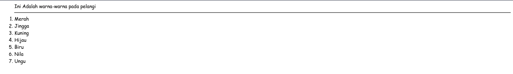
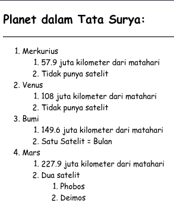
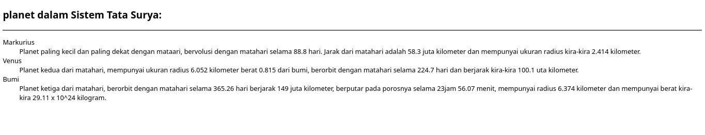

# List / Daftar

## Macam-macam List

- Ordered List / Numbered List (Daftar berurutan / Daftar dengan Nomor)
- Unordered List / Bulleted list (Daftar tak berurut / Daftar dengan titik)
- Menu List (Daftar Menu)
- Directory List
- Definition List (Daftar istilah)

## Ordered List

- Ordered List atau Numbered List adalah suatu daftar dimana item-item yang ada didalam daftar memiliki nomor secara urut.
- Ordered list dimulai dengan tag awal `<ol>` dan diakhiri dengan tag akhir `</ol>`.
- Diantara kedua tag tersebut terdapat tag `<li>` yang menyataan list item.

---

```html
<html>
	<head>
		<title>Mencoba membuat Daftar dengan Ordered List</title>
	</head>
	<body>
		<ol>
			Ini Adalah warna-warna pada pelangi
			<hr />
			<li>Merah</li>
			<li>Jingga</li>
			<li>Kuning</li>
			<li>Hijau</li>
			<li>Biru</li>
			<li>Nila</li>
			<li>Ungu</li>
		</ol>
	</body>
</html>
```

[Ordered List](./src/ordered-list.html)



---

**Membuat Daftar dalam Daftar (Nested Ordered List)**

```html
<!DOCTYPE html>
<html lang="en">
	<head>
		<meta charset="UTF-8" />
		<meta http-equiv="X-UA-Compatible" content="IE=edge" />
		<meta name="viewport" content="width=device-width, initial-scale=1.0" />
		<title>Mencoba Membuat Daftar dengan Nasted Ordered List</title>
	</head>
	<body>
		<h2>Planet dalam Tata Surya:</h2>
		<hr />
		<ol>
			<li>
				Merkurius
				<ol>
					<li>57.9 juta kilometer dari matahari</li>
					<li>Tidak punya satelit</li>
				</ol>
			</li>
			<li>
				Venus
				<ol>
					<li>108 juta kilometer dari matahari</li>
					<li>Tidak punya satelit</li>
				</ol>
			</li>
			<li>
				Bumi
				<ol>
					<li>149.6 juta kilometer dari matahari</li>
					<li>Satu Satelit = Bulan</li>
				</ol>
			</li>
			<li>
				Mars
				<ol>
					<li>227.9 juta kilometer dari matahari</li>
					<li>Dua satelit</li>
					<ol>
						<li>Phobos</li>
						<li>Deimos</li>
					</ol>
				</ol>
			</li>
		</ol>
	</body>
</html>
```

[Nested Ordered List](./src/ordered-list-nasted.html)



---

**Attribute Pada** `<ol>`

| Attribute |                           Function                            |
| :-------: | :-----------------------------------------------------------: |
| `type=A`  |      Membuat daftar berurut dengan huruf besar (A, B, C)      |
| `type=a`  |      Membuat daftar berurut dengan huruf besar (a, b, c)      |
| `type=I`  | Membuat daftar berurut dengan huruf romawi besar (I, II, III) |
| `type=i`  |    Membuat daftar berurut dengan huruf kecil (i, ii, iii)     |
| `type=1`  |         Membuat daftar berurut dengan angka (1, 2, 3)         |
| `start=n` |  Menentukan nilai awal dari item dalam daftar, n=nilai awal   |

**Contoh Modifikasi Daftar1.html (lihat baris 11)**

```html
<li>
	Merkurius
	<ol type="A">
		<li>57.9 juta kilometer dari matahari</li>
		<li>Tidak punya satelit</li>
	</ol>
</li>
```

_Hasil :_

1. Merkurius
   1. 57.9 juta kilometer dari matahari
   2. Tidak punya satelit

> <u>**TUGAS!**</u> > _Modifikasilah dokumen daftar1.html sehingga tampil seperti berikut (**Simpan ulang dengan nama daftar2.html**)_

## Unordered List

- Ordered List atau Bulleted List adalah suatu daftar dimana urutan item-item tidak diutamakan. Item-tem ditampilkan dalam semabarng urutan.
- Setiap item dalam Unordered list biasanya ditandai dengan bulatan, kotak atau lingkaran.
- Ordered List dimulai dengan tag awal `<ol>` dan diakhiri dengan tag akhir `</ol>`
- Diantara kedua tag tersebut terdapat tag `<li>` yang menyatakan list item.

---

**Contoh penggalan dokumen Daftar3.html (_modifikasi dari Daftar1.html_)**

```html
<!DOCTYPE html>
<html lang="en">
	<head>
		<meta charset="UTF-8" />
		<meta http-equiv="X-UA-Compatible" content="IE=edge" />
		<meta name="viewport" content="width=device-width, initial-scale=1.0" />
		<title>Unordered List</title>
	</head>
	<body>
		<h2>Planet Dalam Tata Surya:</h2>
		<hr />
		<ul>
			<li>Merkurius</li>
			<ul>
				<li>57.9Juta kilometer dari matahari</li>
				<li>Tidak punya satelit</li>
			</ul>
			<li>
				Venus
				<ul>
					<li>108 juta kilometer dari matahari</li>
					<li>Tidak punya satelit</li>
				</ul>
			</li>
			<li>
				Bumi
				<ul>
					<li>149.6 juta kilometer dari matahari</li>
					<li>Satu satelit = Bulan</li>
				</ul>
			</li>
		</ul>
	</body>
</html>
```

---

**Attribute pada <ul>**

|   Attribute   |        Function         |
| :-----------: | :---------------------: |
| `type=circle` | Membuat tanda lingkaran |
| `type=squere` |   Membuat tanda kotak   |
|  `type=disc`  |  Membuat tanda cakram   |

```html
<!DOCTYPE html>
<html lang="en">
	<head>
		<meta charset="UTF-8" />
		<meta http-equiv="X-UA-Compatible" content="IE=edge" />
		<meta name="viewport" content="width=device-width, initial-scale=1.0" />
		<title>Unordered List</title>
	</head>
	<body>
		<h2>Planet Dalam Tata Surya:</h2>
		<hr />
		<ul>
			<li>Merkurius</li>
			<ul type="circle">
				<li>57.9Juta kilometer dari matahari</li>
				<li>Tidak punya satelit</li>
			</ul>
			<li>
				Venus
				<ul type="square">
					<li>108 juta kilometer dari matahari</li>
					<li>Tidak punya satelit</li>
				</ul>
			</li>
			<li>
				Bumi
				<ul type="disc">
					<li>149.6 juta kilometer dari matahari</li>
					<li>Satu satelit = Bulan</li>
				</ul>
			</li>
		</ul>
	</body>
</html>
```

## Definition List

- Definition List adalah jenis daftar khusus yang berbeda jauh dengan daftar-daftar sebelumnya.
- Definition List digunakan untuk mendefinisikan atau menjelaskan istilah- istilah yang disebut Glosarry List (Daftar Istilah)
- Definition List dinyatakan dengan tag awal `<dl>` dan tag akhir `</dl>`. Dalam tag tersebut ada dua bagian yaitu :
  - Istilah yang akan didefinisikan, dinyatakan dengan tag tunggal `<dt>` atau Definition Term
  - Definisi dari istilah tersebut dinyatakan dengan tag tunggal `<dd>` atau Definition Data
- Browser akan menampilkan istilah yang didefinisikan pada baris tersendiri, Kemudian definisinya ditampilkan pada baris berikutnya dengan suatu indentasi.

---

```html
<!DOCTYPE html>
<html lang="en">
	<head>
		<meta charset="UTF-8" />
		<meta http-equiv="X-UA-Compatible" content="IE=edge" />
		<meta name="viewport" content="width=device-width, initial-scale=1.0" />
		<title>Definition List</title>
	</head>
	<body>
		<h2>planet dalam Sistem Tata Surya:</h2>
		<hr />
		<dl>
			<dt>Markurius</dt>
			<dd>
				Planet paling kecil dan paling dekat dengan mataari, bervolusi dengan
				matahari selama 88.8 hari. Jarak dari matahari adalah 58.3 juta
				kilometer dan mempunyai ukuran radius kira-kira 2.414 kilometer.
			</dd>
			<dt>Venus</dt>
			<dd>
				Planet kedua dari matahari, mempunyai ukuran radius 6.052 kilometer
				berat 0.815 dari bumi, berorbit dengan matahari selama 224.7 hari dan
				berjarak kira-kira 100.1 uta kilometer.
			</dd>
			<dt>Bumi</dt>
			<dd>
				Planet ketiga dari matahari, berorbit dengan matahari selama 365.26 hari
				berjarak 149 juta kilometer, berputar pada porosnya selama 23jam 56.07
				menit, mempunyai radius 6.374 kilometer dan mempunyai berat kira-kira
				29.11 x 10^24 kilogram.
			</dd>
		</dl>
	</body>
</html>
```

**Hasil**


