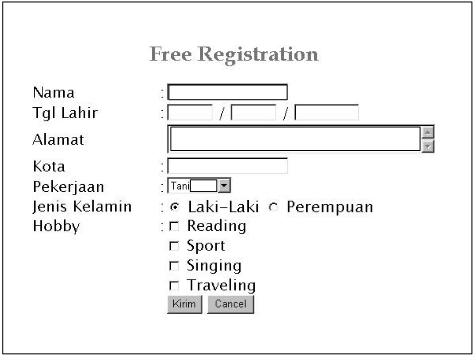

# Pemrograman HTML

## MATERI

- Frame
- Form
- Cascading Style Sheet

### Frame

- Frame HTML dapat digunakan untuk membuat tampilan halaman HTML yang terbagi-bagi menjadi beberapa bagian.
- Setiap bagian merupakan satu halaman HTML yang terpisah.
- Ini dilakukan untuk membuat tampilan halaman HTML yang salah satu atau beberapa bagian berganti-ganti isinya
- Dapat menghemat bandwith internet.

### Form

- Metoda pengiriman data dengan `GET` dan `POST`.
- Metoda ini dinyatakan dengan atribute `method` di dalam element `from`.
- Metoda `GET` merupakan default pengiriman suatu data form.
- Metoda `POST` bisa menyimpan data input dalam jumlah banyak.
- Tag `form` digunakan untuk membuat form dalam document HTML.
- Pada saat membuat form anda bisa meletakkan control-control pada form untuk memperbolehkan inputan dari user.
- Semua control form biasanya diletakkan diantara tag `<form></form>` tapi anda juga bisa meletakkan control diluar tag tersebut.
- Untuk menambahkan control gunakan tag `<input>`.



#### Text

- Untuk membuat single line text control.
- Attribute `size` digunakan untuk menentukan jumlah character yang bisa ditampilkan, sementara `maxlength` attribute digunakan untuk menentukan maximum character yang bisa dimasukkan.
- _Contoh Syntax :_
  - `<input type="text" name="textbox" value="" size="20" />`

### Text Area

- Untuk membuat textarea gunakan tag `<textarea></textarea>`

| Attribute |     Description      |
| :-------: | :------------------: |
|   cols    | Lebar dari text area |
|   rows    |     Jumlah Baris     |
|   Name    |  Nama dari control   |
|   Size    |    Ukuran Control    |

```html
<html>
<p>
<textarea name="text1" cols="20" rows="5">
</html>
```

### Conbo Box / List Box (Selection)

| **Attribute** |           **Description**           |
| :-----------: | :---------------------------------: |
|    Checked    |     Untuk memberi default check     |
|     Name      |          Nama dari control          |
|     Size      |         **Ukuran Control**          |
|     Type      |      `<input type="checkbox">`      |
|     Value     | **Untuk memberikan value ke input** |

- `<input name="cekReading" type="checkbox" id="cekReading" value="1" /> Reading <br />`.
- `<input name="cekSport" type="checkbox" id="cekSport" value="2" /> Sport <br />`.
- `<input name="cekSing" type="checkbox" id="cekSing" value="3" /> Singing <br />`.

### Radio Button

- Setiap radio button control harus memiliki nama yang sama, sehingga user hanya bisa memiliki satu option saja.
- Radio button juga harus secara explisit memberikan nilai ke atribut value.

| **Attribute** |         **Description**         |
| :-----------: | :-----------------------------: |
|    Checked    | Untuk memberikan default check  |
|     Name      |        nama dari control        |
|     Size      |          Untuk control          |
|     Type      |    `<input type="radio" />`     |
|     Value     | Untuk memberikan value ke input |

- `<input name="radJk" type="radio" value="1" checked /> Laki-Laki`
- `<input name="radJk" type="radio" value="2" checked /> Perempuan`

### Button

| **Attribute** |         **Description**         |
| :-----------: | :-----------------------------: |
|     Name      |        Nama dari control        |
|     Size      |         Ukuran control          |
|     Type      |    `<input type="button" />`    |
|     Value     | Untuk memberikan value ke input |

## Style Sheet

- Style Sheet adalah template yang mengontrol performatan tag HTML pada halaman web anda.
- **Keuntungan penggunaan Style Sheet** :
  - Performatan tambahan.
  - Kontrol yang lebih baik.
  - Perubahan yang lebih mudah.
- Style Sheet relatif baru pada web.
- Internet Explorer 3.0 Keluaran Microsoft adalah web browser pertama yang mendukung Style Sheet.
- Implementasi Style Sheet pada IE 3.0 berdasarkan pada draft World Web consortium (W3C) yang berjudul "Cascading Style Sheet, Level 1" (Mei 1996, lihat [CSS](http://www.w3.org/pub/WWW/TR/WD-css1.html) )
- Netscape juga telah mengindikasikan bahwa mereka akan mendukung Style Sheet pada versi-versi terbaru browsernya.
- Browser yang tidak mendukung Style Sheet menampilkan halaman web berdasarkan spesifikasi default browser tersebut.
