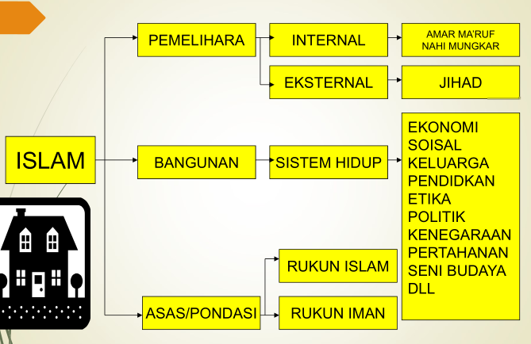

# Hakikat Martabat dan Tanggung Jawab Manusia

## Apakah Hakikat Manusia ?

- Teori Barat (kaum materialisme) menyamakan manusia seperti hewan.
- Darwin (1809-1882): Manusia adalah bentuk akhir daripada evolusi hayat, sedang hewan bersell satu sebagai awal evolusi-Manusia adalah hasil evolusi dari kera.
- Thomas Hobbes (1588-1679): Sifat dan tabiat manusia sama dengan binatang dalam teori sosiologinya: _homo homni lupus_ (manusia yang satu adalah srigala buat manusia lainnya).

## Manusia Dalam perspektif al-Quran

- Manusia adalah makhluk Allah yang paling mulia dan diciptakan untuk memimpin kehidupan di bumi ini (QS, Al-Anaam:165)
  - 
- Allah menjadikan manusia dalam bentuk yang sebaik-baiknya (QS. At-Tin:4 dan QS.Al-Isra:70)
  - 
  - 

## Persamaan dan Perbedaan Manusia dan Hewan

|                   Persamaan                   |                                              Perbedaan                                              |
| :-------------------------------------------: | :-------------------------------------------------------------------------------------------------: |
|            Mempunyai penginderaan             | Faktor volume, manusia mampu mengembangkan dan mengerahkan naluri-naluri itu. Sedangkan hewan tidak |
|            Melakukan penginderaan             |                                                Akal                                                 |
| Mempunyai perasaan dan kemauan serta berfikir |                             **Norma dan etika** (perbedaan funcamental)                             |
|            Naluri makan dam minum             |                                                                                                     |
|          Naluri mempertahankan diri           |                                                                                                     |
|               Naluri keturunan                |                                                                                                     |
|          Naluri takut dan dan benci           |                                                                                                     |

## Manusia Dalam Pandangan Agama-agama

- **Hindu**: Manusia terlahir dalam kasta-kasta :
  - Brahmana (pendeta)
  - Ksatria (pemerintah)
  - Waisya (tani)
  - Sudra (budak)
- **Buddha**: Meniadakan kesenangan dan kenikmatan duniawi untuk mencapai nirwana.
- **Syinto**: Raja sebagai wakil Tuhan di bumi.
- **Nasrani**: Manusia lahir dalam keadaan dose. Yesus sebagai tebusan terhadap tergantung atas iman pada penyaliban Yesus.
- **Yahudi**: Menggangap bangsa selainnya ghyum (budak).

**Bagaimana Dengan Islam ?**

- Manusia dilahirkan dalam keadaan suci (tidak berdosa) (al-hadist).
- Kedudukan manusia sama, yang membedakan adalah taqwanya (QS. Al-Hujurot 49:13)
- Manusia sama-sama mempunyai tugas sebagai khalifah untuk memakmurkan bumi (QS. Hud 11:61)
- "Dengarlah dan taatilah walaupun yang diangkat menjadi pimpinan atas kamu itu seorang hamba bangsa Habsyi (ethiopia) yang kepalanya bagaikan buah anggur kering, selama dia menegakkan kitab Allah padamu" (HR: Bukhori).
- Sesungguhnya kami telah menciptakan manusia itu dari pada kejadian yang paling baik. Kemudaian kami kembalikan dia pada derajat yang paling rendah. Kecuali orang-orang yang beriman dan beramal shalih, maka bagi mereka adalah ganjaran yang tidak terhingga (QS. At-Tin 95:4-6)

## Unsur-unsur Pada Manusia

**Al-Ghazali**:

Hati bagai raja yang memutuskan keputusan Akal bagai mentri yang memberikan masukan dan informasi Jasad/Fisik bagai tentara yang melaksanakan titah perintah

**Rusulullah saw**:

Ketahuilah, bahwa di dalam tubuh ada segumpal darah. Bila ia baik, maka baiklah seluruh tubuh. Jika ia buruk, maka buruklah seluruh tubuh. Ketahuilah; dia adalah HATI

## Keseimbangan Kebutuhan

> Firman Allah SWT
> _"Dan Dia-lah yang telah meletakkan **keseimbangan**. Janganlah kalian melampui batas keseimbangan (QS Ar-Rahman:6-7)"_

## Potensi Dasar Manusia

## Integrasi Ilmu Pengetahuan Dalam Agama Islam

- "**Bacalah** dengan nama Tuhan-Mu yang telah menciptakan. Yang telah menciptakan manusia dari segumpal darah. Bacalah dan Tuhan-mu yang maha mulia yang telah mengajarkan manusia dengan pena. Yang mengajarkan manusia sesuatu yang tidak diketahuinya" (_QS. Al-Alaq:1-5_)
- "Allah meninggikan orang-orang yang beriman dan berilmu pengetahuan itu beberapa derajat" (_QS. Al-Mujadalah:11_)
- "Dan mereka berakata, jika kami dahulu mendengar dan menggunakan akal kami, niscaya tidaklah kami menjadi penghuni neraka” (_QS. Al- Mulk 67:10_)
- Sabda Rasulullah saw: “Menuntut ilmu itu wajib bagi muslim laki-laki dan perempuan” (_HR: Muslim_)

## Metodologi Mempelajari Islam

1. Islam harus dipalajari dari sumbernya yang asli (al-Qur’an dan as- Sunnah)
   - Jika dipelajari dari buku kuno dan tidak dipertanggungjawabkan, maka akan terjadi khurofat dan bid’ah (penyimpangan)
2. Islam perlu dipelajari dari kepustakaan yang ditulis oleh ulama besar dan sarjana Islam yang umumnya mereka memahami Islam secara baik.
   - Bukan dari para orientalis, karena akan mengaburkan pemahaman
3. Islam harus dipelajari sebagai mana utuhnya, bukan dari kenyataan ummat islam an sich.
   - Karena kenyataan umat islam sekarang tidak/belum mencerminkan Islam yang sesungguhnya
4. Islam harus dipelajari secara integral dan komprehensif, tidak parsial.
   - Jika Islam dipelajari secara parsial (separo-paro) seperti orang buta mengenal gajah (tidak utuh
5. Mempelajari Islam harus dibarengi dengan mengamalkan semampu yang di dapat Jika Islam dipelajari tanpa diamalkan maka akan menjadi khazanah tanpa memberikan arti bagi kehidupan
6. Islam harus dipelajari secara realita Jika Islam dipelajari teks book saja, tanpa membumikan dengan realita, maka akan sia- sia dan tidak memberi kontribusi
7. Mempelajari Islam harus dikaitkan dengan kemajuan ilmu pengetahuan. Jika tidak, maka islam tidak mendukung ilmu pengetahuan

## Definisi Agama

- Kata “agama” berasal dari bahasa sangsekerta. “a” berarti tidak dan “gama” berarti kacau
- Kata religion/religi berarti : “belief in God as creator and controller of universe” (Kepercayaan pada Tuhan sebagai pencipta dan pengawas alam)
- Atau System of faith and worship based on such belief” (sistem kepercayaan dan penyembahan didasarkan atas keyakinan tertentu)
- Ad-din adalah agama atau aturan
- Islam adalah agama yang diturunkan Allah SWT di dalam al-Qur’an dan yang tersebut dalam sunnah yang shahih, berupa perintah, larangan dan petunjuk untuk kesejahteraan dan kebahagiaan hidup manusia di dunia dan di akhirat.

## Mengenal Islam

**Mengapa Dinamakan Islam ?**

Tiap-tiap agama diberi nama sesuai dengan nama pembawanya atau tempat lahirnya agama tersebut.

1. Agama Zoroaster (di Persi) diambil dari nama pendirinya Zoroaster wafat th 583 SM
2. Agama Buddha (Buddhisme) berasal dari nama Sidharta Gautama Buddha lahir th 560 SM di India
3. Agama Yahudi (Judaisme) agama yang dianut oleh orang-orang Yahudi (Jews) asal nama dari Juda (Judea) atau Yahuda
4. Agama Hindu (Hinduisme) adalah nama dari kumpulan macam- macam agama dari orang-orang India
5. Agama tao (Taoisme) mulanya hanya jaran filsafat kemudian menjadi ajaran agama dalam dinasti Han (206 SM-220 SM)
6. Agama Kristen, adalah nama dari pengajarnya “jesus Christ, atau Nasrani diambil dari daerah Jesus yaitu Nazareth (Jesus of Nazareth)
7. Oleh karena itu Orang Barat menyebut Islam sebagai “Mohammadinisme” Pengertian ini tentu saja salah !!!

---

**Mengapa Dinamakan Islam ?**

- Nama Islam mempunyai perbedaan yang luar biasa dgn nama agama lainnya.
- Kata Islam tidak mempunyai hubungan dengan orang tertentu atau dari golongan manusia atau negeri. Hikmahnya karena Islam adalah agama wahyu dari Allah SWT.
- “Sesungguhnya agama di sisi Allah hanyalah Islam” (_QS. Ali Imron 3:19_)
- “Barangsiapa yang mencari agama selain Islam, tidak akan diterima daripadanya dan dia di akhirat termasuk orang yang merugi” (_QS Al-Imran 3:85_)
- “Pada hari ini telah Ku sempurnakan bagimu agamamu dan telah Ku cukupkan kepadamu nikmatKu, dan telah Ku ridhoi islam menjadi agamamu” (_QS. Al-Maidah 5:3_)
- Sesungguhnya Ibrahim bukanlah seorang Yahudi, tidak pula seorang Nasrani ), akan tetapi dia adalah seorang muslim yang benar-benar, dan diapun bukan seorang musyrik” (_QS. Ali Imran 3:67_)

## Sumber Pokok Ajaran Islam

- Al-Qur’an
- Al-Sunnah/Al-Hadits (Ucapan, perbuatan dan keputusan Rasul saw)
- Al-Ijma’ / Konsensus para alim ulama
- Al-Qiyas / Analogi

## Bangunan Islam

**Rasulullah SAW bersabda :**

> Islam dibangun di atas lima pondasi: Bersaksi bahwa tiada Tuhan selain Allah dan Muhammad utusan Allah, mendirikan shalat, menunaikan zakat, berpuasa di bulan ramadhan, Berhaji bagi yang mampu (HR: Muslim)

**Firman Allah SWT:**

> "Masuklah ke dalam agama Islam secara kaffah (keseluruhan)"

## Pokok-ajaran Ajaran Islam

**Umar bin Khattab berkata:**

> Suatu hari, kami duduk dekat Rasulullah saw, tiba-tiba muncul
> seorang laki-laki mengenakan pakaian yang sangat putih
> dan rambutnya hitam legam. Tak terlihat tanda-tanda bekas
> perjalanan jauh, dan tak seorang pun di antara kami yang
> mengenalnya. Ia duduk di depan Nabi, lututnya ditempelkan
> ke lutut beliau, dan kedua tangannya diletakkan di paha
> beliau, lalu berkata, “Hai Muhammad! Beritahu aku tentang
> Islam.” Rasulullah menjawab, “Islam itu engkau bersaksi…dst.”

> Ia bertanya lagi, “Beritahu aku tentang iman”. Nabi menjawab,
> “Iman itu engkau percaya kepada Allah…dst”
> Laki-laki itu berkata lagi, “beritahu aku tentang ihsan!”. Nabi
> menjawab, Hendaklah engkau beribadah kepada Allah
> seakan-akan engkau melihatNya, kalaupun engkau tidak
> melihatNya, sesungguhnya Dia melihatmu….dst

> Setelah itu, Nabi bertanya kepadaku, “Hai Umar, tahukah kamu
> siapa yang bertanya tadi?. Aku menjawab, “Allah dan
> RasulNya lebih mengetahui”. Beliau bersabda, “Dia itu Jibril,
> datang untuk mengajarkan Islam kepada kalian” (HR: Muslim)

## Rukun Iman

1. Rukun Iman.
2. Percaya Pada Allah -> Allah Tujuan Kita.
3. Percaya Pada Malaikat -> Kita Selalu diawasi.
4. Percaya Pada Kitab2 -> Al-Quran sbg Pedoman.
5. Percaya Pada Rasul2 -> Rasulullah sbg Tauladan.
6. Percaya Pada Hari -> Dunia sebagai tabungan Qiyamat.
7. Percaya pada takdir -> Tidak lupa diri ketika mendapat nikmat, dan tidak putus asa ketika gagal.

- Iman secara bahasa adalah percaya
- Iman secara definisi adalah membenarkan dengan hati, diucapkan dengan lidah dan diamalkan dengan anggota tubuh

| **Hati** | **Ucapan** | **Perbuatan** | **Manusia** |
| :------: | :--------: | :-----------: | :---------: |
|    Ya    |     Ya     |      Ya       |   Mu'min    |
|  Tidak   |     Ya     |      Ya       |   Munafiq   |
|    Ya    |     Ya     |     Tidak     |    Fasiq    |
|  Tidak   |   Tidak    |     Tidak     |    Kafir    |

## MAKNA IHSAN

Nabi menjawab, Hendaklah engkau beribadah kepada Allah seakan-akan engkau melihatNya, kalaupun engkau tidak melihatNya, sesungguhnya Dia melihatmu

### Ihsan Dalam Aplikasi Kehidupan

- Cerita Rudi yang membersihkan wastafel saat sedang melamar pekerjaan
- Cerita budak yang tidak mau menjual ternaknya kepada kholifahUmar meskipun tuannya tidak tahu
- Cerita anak wanita yang melarang ibunya mencampur susu dengan air untuk dijual pada zaman Umar bin Khattab
- Cerita Umar bin Abdul Aziz yang meniup lamp kantornya karena menerima tamu dari kerabatnya
- Karyawan bekerja bukan karena takut diawasi atasannya, tapi takut dilihat Allah SWT.
