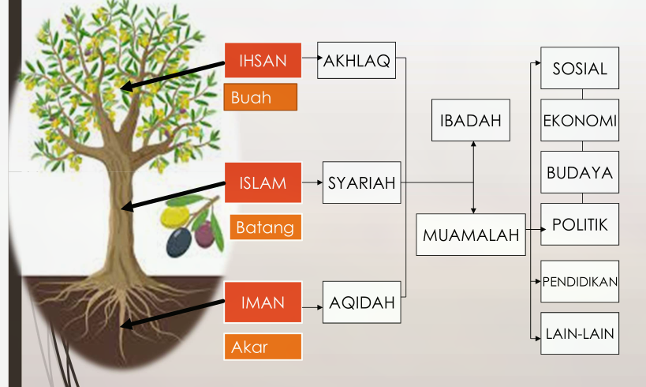
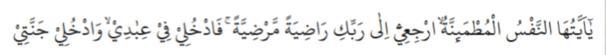

# Mengintegrasikan Islam, Iman, dan Ihsan dalam membentuk Isan Kamil

## Pembahasan

1. Pengertian islam, iman, dan ihsan & insan kamil.
2. Syarat memperoleh predikat insan kamil.
3. Karakter insan kamil.
4. Methode mancapai kamil.
5. Mendeladani insan Kamil.

## Islam, Iman, dan Ihsan serta insan kamil

**Umar bin Khattab berkata:**

> Suatu hari, kami duduk dekat Rasulullah saw, tiba-tiba muncuk seorang laki-laki mengenakan pakaian yang sangat putih dan rambutnya hitam legam.
> Tak terlihat tanda-tanda bekas perjalanan jauh, dan tak seorang pun di antara kami yang mengenalnya. Ia duduk di depan Nabi lututnya ditempelkan ke lutut beliau, dan kedua tangannya diletakkan di paha beliau, lalu berkata, "Hai Muhammad! Beritau aku tentang Islam." Rasulullah menjawab, "Islam itu engkau bersaksi ... dst"

> Ia bertanya lagi, "Beritau aku tentang iman". Nabi menjawab, "Iman itu engkau percaya kepada Allah ... dst"

> Laki-laki itu berkata lagi, "Beritau aku tentang ihsan!". Nabi menjawab, Hendaklah engkau beribadah kepada Allah seakan-akan engkau melihatNya, kalaupun engkau tidak melihatNya, sesungguhnya Dia melihatmu .. dst.

> Setelah ini, Nabi bertanya kepadaku, "Hai Umar, taukah kamu siapa yang bertanya tadi?". Aku menjawab, "Allah dan RasulNya lebih mengetahui". Beliau bersabda, "Dia itu Jibril, datang untuk mengajarkan Islam kepada kalian"
> (HR:Muslim)

### Apa yang kita peroleh ?

1. "Islam adalah engkau bersaksi bahwa tiada sesembahan yang berhak disembah selain Allah dan sesungguhnya Muhammad adalah utusan Allah, engkau mendirikan sholat, menunaikan zakat, berpuasa pada bulan Ramadhan, dan mengerjakan haji ke Baitullah jika engkau mampu melakukannya". (Rukun Islam)
2. "Hendaklah engkau beriman kepada Allah, malaikat-malaikatNya, kitab-kitabNya, utusan-utusanNya (Rasul-RasulNya), hari kiamat, dan kepada takdir yang baik dan buruk". (Rukun Islam)
3. "Engkau beribadah kepada Allah seakan-akan engkau melihatnya, namun jika engkau tidak bisa melihatnya, yakinlah bahwa Dia melihatmu!". (ihsan)

Lalu apa hubungan islam, iman, dan ihsan dalam membentuk insan kamil?

Sebelum mengetahui hubungan ketiganya, perlu kita ketahui apa itu <u style="color:red;">insan kamil</u> <b style="color:red">Insan kamil merupakan manusia sempurna tanpa cacat dan keburukan dimata Allah SWT.</b>

Adapun yang dimaksudkan dengan sempurna adalah sempurna dalam ibadah dan penghidupannya. Dan seorang dapat dianggap sempurna jika ia memiliki kriteria tertentu.

1. Kriteria tersebut dimiliki oleh <i style="color:brown">manusia-manusia biasa yang mau berusaha untuk menjadi 'luar biasa' di hadapan Tuhannya</i>. Mereka (terlepas dari para sufi, dai, ustaz, kai, atau orang bisa sekalipun) pada hakikatnya mampu meneladani segala teladan Rasulullah, jika ia <i style="color:blue;">Menyakini Allah sebagai Rabb-nya, Alquran sebagai pedoman hidupnya, dan menjadikan Muhammad SAW sebagai sebaik-baiknya insan yang patut diteladani.</i>
2. Jika alam ibadah itu sudah pindah pada amal ibadah yang bersifat hati maka, orang itu berada pada tingkat mu'min. \
   <i style="color:red">Rasul (Muhammad) beriman kepada apa yng diturunkan kepadanya (al-Quran) dari Tuhan-nya, demilikan pula orang-orang yang beriman. Semua beriman kepada Allah, malaikat-malaikatNya, kitab-kitabNya dan Rasul-RasulNya. (Mereka berkata), "Kami tidak membeda-bedakan seorang pun dari Rasul-RasulNya." Dan mereka berkata, "Kami dengar dan kami taat. Ampunilah kami Ya Tuhan kami, dan kepadaMu tempat (kami) kembali"</i> \
   (Q.S. Al-Baqarah 285)
3. Ketika amal ibadah itu berpindah dari ibadah hisyiyah ke hati kemudian berlabuh di ruh. Maka, ia berada dalam tingkatan muhsin. \
   Allah SWT. berfirman dalam Q.S. Al-Baqarah 177 \
   "<i style="color:blue"><u style="color:blue">Kebajikan</u>  itu bukanlah menghadapkan wajahmu ke arah timur dan ke barat, tetapi kebajikan itu ialah (kebajikan) orang yang beriman kepada Allah, hari akhir, malaikat-malaikat, kitab-kitab, dan nabi-nabi dan memberikan harta yang dicintainya kepada kerabat, anak yatim, orang-orang miskin, orang-orang yang dalam perjalanan (musafir), peminta-minta, dan untuk memredekakan hamba sahaya, yang melaksanakan sholat dan menunaikan zakat, orang-orang yang menepati janji apabila berjanji, dan orang yang sabar dalam kemelaratan, penderitaan dan pada masa peperangan. Merka itulah orang-orang yang benar, dan mereka itulah orang-orang yang bertakwa</i>".

## Syarat memperoleh predikat insan Kamil

> Tentunya dengan mengintegrasikan ketiga aspek fundamental dalam
> beragama diatas merupakan upaya yang dapat kita lakukan untuk
> mengejar predikat insan kamil dari Allah SWT.

Mengapa islam, iman, dan ihsan yang dijadikan sebagai penentu seseorang menjadi insan kamil ?

1. Karena, islam, iman dan ihsan merupakan aspek fundamental dalam beragama.
2. Islam, iman, dan ihsan merupakan tingkatan seorang hamba dalam mengabdikan diri kepada Allah SWT.

Saat ini, kaum muslimin Indonesia lebih familiar dengan istilah
<b style="color:red;">syari’ah</b>, <b style="color:red;">akidah</b>, <b style="color:red;">serta akhlak</b>. Pada dasarnya, ketiga aspek
yang terkenal dikalangan masyarkat ini telah tercangkup dan
memiliki hubungan dengan islam, iman, dan ihsan. Hubungan
ketiganya dapat diperhatikan dalam tabel berikut :

| No  | Unsur |  Ilmu   | Object kajian                                               |
| :-: | :---: | :-----: | ----------------------------------------------------------- |
| 1.  | Islam | Syariah | 5 rukun islam                                               |
| 2.  | Iman  | Aqidah  | 6 rukun iman                                                |
| 3.  | Ihsan | Akhlaq  | Bagusnya akhlaq sebagai buah dari keimanan dan peribadatan. |

## Karakter Insan Kamil

Untuk mencapai derajat insan kamil, kita harus dapat
menundukkan nafsu dan syahwat hingga mencapai tangga nafsu
muthmainnah, sebagaimana firman-Nya :

> Wahai jiwa yang tenang! Kembalilah kepada Tuhanmu dengan hati yang riba dan diridaiNya. Maka masuklah ke dalam golongan hamba-hambaKu, dam masuklah ke dalam surgaKu. [Q.S. Al-Fajr 27-30]

Ayat di atas dengan jelas menegaskan bahwa nafsu
muthma’inah merupakan titik berangkat untuk kembali
kepada tuhan. Akan tetapi, dengan modal nafsu
muthama’inah pun masih di perintah lagi oleh Allah
untuk menaiki tangga nafsu diatasnya.

Menurut imam ghazali ada 7 macam nafsu sebagai proses tingkatan tangga nafsu yaitu :

1. Nafsu ammarah : yaitu nafsu yang bertindak yang jelek baik terhadap Allah SWT maupun sesama manusia
2. Nafsu Lawwamah : yaitu nafsu yang mengerti atas tindakan baik dan buruk tetapi terkadang masih berbuat buruk dan terkadang berbuat baik tetapi bisa berbuat hal buruk kembali
3. Nafsu mulhamah : yaitu nafsu yang mulai takut dengan Allah bila akan melakukan sesuatu yang buruk
4. Nafsu muthma’inah : yaitu nafsu yang memberikan ketenangan dalam jiwa, jika melakukan amalan kebajikan
5. Nafsu radhiyah : yaitu nafsu yang menganggap makruh itu haram dan sunah adalah diwajibkan dan sudah tidak menghiraukan duniawi
6. Nafsu mardiyyah : yaitu nafsu yang sudah sangat mencintai Allah SWT dan melaksanakan sunah dan tidak melakukan dosa walau sekecil jarum
7. Nafsu kamilah : yaitu nafsu yang sempurna tingkatan nabi dan rasul-Nya

## Method Mencapai insan kamil

Pertama, mendengarkan, membaca, dan merenungkan ayat-ayat serta hadis-hadis yang menegaskan kebesaran dan kekuasaan Allah.

Selain itu, juga teks-teks agama yang
mengisyaratkan secara jelas perihal kebenaran
dakwah yang disampaikan para rasul dengan segala
konsekuensi yang didapat, baik dari ketaatan
maupun sanksi yang diperoleh akibat pelanggaran
apabila mengingkari risalah ilahiah tersebut. Cara
ini sesuai firman Allah:

"Dan, apakah tidak cukup bagi mereka bahwasanya Kami telah
menurunkan kepadamu Al-Kitab (Al-Quran) sedang dia
dibacakan kepada mereka." [QS Al-Ankabut 51]

---

Kedua, merenungkan keajaiban penciptaan alam semesta,
hamparan langit nan luas, bumi tempat berpijak, serta
pesona unsur-unsur yang menjadi pelengkap dan kebutuhan
kelangsungan hidup.

Sebagaimana firman-Nya, "Kami akan memperlihatkan
kepada mereka tanda-tanda (kekuasaan) Kami di segenap
ufuk dan pada diri mereka sendiri." [QS Fusilat 53]

---

Ketiga, keyakinan yang telah didapat mesti
diterapkan baik secara lahir maupun batin dan
berupaya sebisa mungkin menjalankan perintah
dan menjauhi larangan-Nya. Karena, dengan
keteguhan iman dan keyakinanlah, Allah akan
senantiasa membimbing dan mencurahkan kasih
sayang-Nya kepada umat manusia.

Allah berfirman, “Dan, orang-orang yang berjihad (mencari keridhaan) Kami benar-benar akan Kami tunjukkan kepada mereka jalan-jalan Kami.” [QS Al-Ankabut 69]

## Meneladani Insan Kamil

Jejak hidup Rasulullah SAW pun sudah terhimpun menjadi sebuah bacaan dari beragam sudut pandang. Tak terhitung berapa banyak sudah sirah nabawiyah yang mengulas lebih dalam baik kesahajaan, kehebatan, kesempurnaan, maupun keseharian beliau yang memang jauh dari kemewahan, namun menempati posisi mewah di hadapan Rabb-nya.

Selama hayatnya, segenap perikehidupan beliau menjadi tumpuan perhatian masyarakat. Karena segala sifat terpuji yang terhimpun dalam dirinya merupakan lautan budi pekerti yang tak pernah kering. Itulah cerminan abadi yang patut diteladani umat Islam, untuk meraih insan kamil.

<b style="color:red">Tiada manusia yang sempurna</b>. Begitu ungkapan yang sering kita dengar. Betul bahwa tiada manusia yang sempurna. Kita dianugerahi kekurangan agar dapat saling melengkapi antarmanusia lainnya.

Namun hakikatnya, semua manusia mampu berusaha untuk tidak menempatkan dunia sebagai tujuan, namun sebagai pemenuhan totalitas amalan ukhrawi yang nantinya akan dipertanggungjawabkan di hadapan Tuhan. Menyisihkan kepentingan dunia bukan berarti mengabaikan apalagi ‘meninggalkan’ kewajiban duniawi. Namun lebih dari itu, <b style="color:red">meneladani potret insan kamil ialah dengan menyeimbangkan kehidupan dunia, tempat kita beramal shaleh sebagai bekal akhirat.</b>

“Dan carilah pada apa yang telah dianugerahkan Allah kepadamu (kebahagiaan) negeri akhirat, dan janganlah kamu melupakan bahagianmu dari (kenikmatan) duniawi dan berbuat baiklah (kepada orang lain) sebagaimana Allah telah berbuat baik, kepadamu, dan janganlah kamu berbuat kerusakan di (muka) bumi. Sesungguhnya Allah tidak menyukai orang-orang yang berbuat kerusakan. [QS Qashash 77]

###

