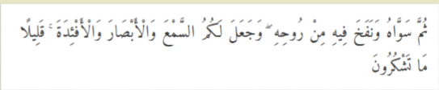

# Nilai-nilai moral dan norma-norma agama sebagai satu determinan dalam membangun karakter bangsa.

## Materi Pembelejaran

1. Menelusuri Konsep Spiritualitas Sebagai Landasan Kebertuhanan.
2. Menyanyakan Alasan Mengapa Manusia Memerlukan Spiritualitas.
3. Menggali Sumber Psikologis, Sosiologis, Filosofis dan Teologis Tentang Konsep Ketuhanan
4. Membangun Argumen Tentang cara Manusia Menyakini dan Mengimani Tuhan.
5. Mendeskripsikan Esensi dan Urgensi Visi Ilahi Untuk Membangun Dunia Yang Damai.

## Pengertian etimologis kata _spirituality_

Kamus Besar Bahasa Indonesia pada tema "spirit", "spiritual", dan
sejenisnya. spiritual berhubungan dengan atau bersifat _kejiwaan
(rohani, batin) spiritualisasi dan pembentukan jiwa_; Penjiwaan
spiritualisme aliran filsafat yang mengutamakan kerohanian: ia
menumpahkan perhatian pada **ilmu-ilmu gaib**, seperti mistik dan
kepercayaan untuk memanggil roh orang yang sudah meninggal/
spiritisme.

Pengertian etimologis kata spirituality dalam kamus bahasa
Inggris atau kata ar-rūḫānī. Bandingkan juga dengan informasi kamus Webster yang merunut
asal kata spiritual dari kata benda bahasa Latin "spiritus" yang
berarti "napas".

Kata **spiritual** Menurut Oxford English Dictionary,
untuk memahami makna kata spiritual dapat diketahui
dari arti kata-kata berikut ini : persembahan, dimensi
supranatural, berbeda dengan dimensi fisik, perasaan
atu pernyataan jiwa, kekudusan, sesuatu yang suci,
pemikiran yang intelektual dan berkualitas, adanya
perkembanga pemikiran danperasaan, adanya
perasaan humor, ada perubahan hidup, dan
berhubngan dengan organisasi keagamaan.

Sedangkan berdasarkan **etimologinya**, **spiritual**
berarti sesuatu yang mendasar, penting, dan mampu
menggerakkan serta memimpin cara berpikir dan
bertingkah laku seseorang.

## Pertanyaannya, mengapa pemahaman kita tentang masalah ini begitu penting?

## A. Konsep Spiritualitas Sebagai Landasan Kebertuhanan

Doe (dalam Muntohar, 2010: 36) mengartikan bahwa **Spiritualitas** adalah ** dasar bagi tumbhnya harga diri, Nilai-nilai, moral dan rasa memiliki.** Spiritualitas memberi arah dan
arti pada kehidupan. Spiritualitas adalah
kepercayaan akan adanya kekuatan non-fisik
yang lebih besar daripada kekuatan diri kita;
suatu kesadaran yang menghubungkan kita
langsung kepada Tuhan: atau sesuatu unsur yang kita
namakan sebagai sumber keberadaan kita.

Sebagaimana Firman Allah SWT dalam surat As Sajadah Ayat: 9 yang artinya:

"Kemudian dia menyempurnakan dan meniupkan ke dalamnya roh (ciptaan)-Nya dan dia menjadikan bagi kamu pendengaran, penglihatan dan (perasaan) hati; (tetapi) kamu sedikit sekali bersyukur".

**Roh manusia** menurut Islam adalah **suci**, karena ia adalah karunia Ilahi yang
dipancarkan dari Zat Tuhan. Roh bersemayam di dalam **hati (qalb)** sehingga
dari hati terpancar kecerdasan, keinginan, kemampuan, dan perasaan. Ketika hati ditempati roh, maka hati menjadi
**bersinar dan memancarkan cahaya kebaikan Tuhan.**
Hati yang terpancari oleh kebaikan Tuhan disebut dengan hati nurani.
