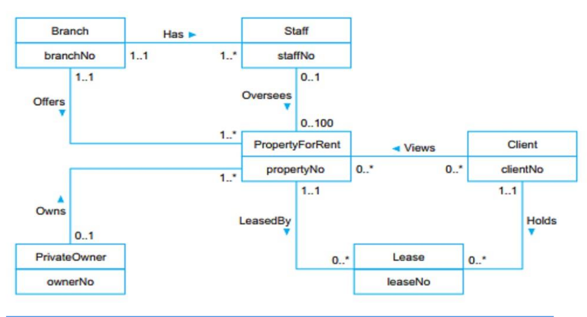

# Introduction to Databse & Environment

## Learning Outcomes

1. Introduction.
2. File-based Approach.
3. Database Approach.
4. Advantage and Disavangate of DBMS.
5. Three Level ANSI SPARC achitecture.
6. Data Models and Conceptual Modeling

## Introduction

Teknologi basis data (database) telah menjadi bidang yang menarik untuk dikerjakan,
sejak kemunculannya, telah menjadi katalisator bagi banyak perkembangan penting dalam
rekayasa perangkat lunak. Riset basis data (database) belum berakhir dan masih banyak
masalah yang perlu diatasi. Selain itu, karena sistem basis data (database) aplikasi menjadi
semakin kompleks, kita harus memikirkan kembali algoritma yang banyak digunakan saat ini,
seperti algoritme untuk penyimpanan file, akses file, dan pengoptimalan kueri. Algoritma query
ini telah membuat kontribusi signifikan dalam rekayasa perangkat lunak dan, kepastian dalam
penggunaan serta pengembangan algoritma baru yang akan memiliki efek yang serupa.

## Fielbased Approach

Sisteb berbasis file (_fileb-based systems_) adalah kumpulan program aplikasi yang melakukan layanan untuk pengguna akhir, seperti pembuatan laporan.
Setiap program mendefinisikan dan mengelola datanya sendiri.
Sistem berbasis file adalah upaya awal untuk mengkomputerisasi sistem pengarsipan manual yang kita semua kenal.
Misalnya, organisasasi mungkin memiliki file fisik yang diatur untuk menampung semua korespondensi external dan internal yang berkaitan dengan proyek, produk, tugas, klien, atau karyawan.
Biasanya, ada banyak file seperti intu, dan untuk keselamatannya diberi label dan disimpan dalam satu atau lebih kabinet.

---

Deskripsi singkat tentang sistem berbasis file tradisional ini harus cukup untuk membahas keterbatasan pendekatan ini.
Ada lima jenis permasalahan atau batasan dari sistem berbasis file ini yaitu:

1. **Pemisahan dan isolasi data**

- Ketika data diisolasi dalam file yang terpisah, lebih sulit untuk mengakses data yang seharusnya tersedia.
- Dengan sistem file, pemrosesan seperti itu sulit.
- Pengembangan aplikasi harus menyinkronkan pemrosesan dua file untuk memastikan data dari lebih dari dua file.

2. **Duplikasi Data**

- Karena pendekatan desentralisasi yang diambil oleh masing-masing departemen, pendekatan berbasis file mendorong, jika tidak diperlukan, duplikasi data yang tidak terkendali.
- Duplikasi data yang tidak terkendali tidak diinginkan karena beberapa alasan, termasuk :
  1. Duplikasi sia-sia. Membutuhkan waktu dan uang untuk memasukkan data lebih dari sekali.
  2. Membutuhkan ruang penyimpanan tambahan, sekali lagi dengan biaya terkait. Seringkali, duplikasi data dapat dihindari dengan berbagai file data.
  3. Mungkin yang lebih penting, duplikasi dapat menyebabkan hilang integritas data; dengan kata lain, data tidak lagi konsisten.

3. **Ketergantungan data**

- Struktur fisik dan penyimpanan file data dan catatan didefinisikan dalam kode aplikasi.
- Ini berati bahwa perubahan pada struktur yang ada sulit dilakukan.
- Jelas, proses ini bisa sangat memakan waktu dan dapat terjadi kesalahan.
- Karakteristik sistem berbasis file ini dikenal sebagai ketergantungan program-data.

4. **Format file yang tidak kompatibel**

- Karena struktur file tertanam dalam program aplikasi, strukturnya tergantung pada bahasa pemrograman aplikasi.
- Sebagai contoh, struktur file yang dihasilkan oleh program **COBOL** mungkin berbeda dari struktur file yang dihasilkan oleh program **C**.
- Ketidakcocokan langsung file-file tersebut membuat sulit untuk diproses bersama.

5. **Memperbaiki kueri / proliferasi program aplikasi**

- Bagaimanapun, sistem berbasis file sangat tergantung pada pengembang aplikasi, yang harus menulis pertanyaan atau laporan apa pun yang diperlukan.

## Database Approach

Semua keterbatasan yang disebutkan sebelumnya dari pendekatan berbasis file dapat dikatikan dengan dua faktor:

1. Definisi data tertanam dalam program aplikasi, daripada disimpan secara terpisah dan mandiri.
2. Tidak ada kontrol atas akses dan manipulasi data di luar yang diberlakukan oleh program aplikasi.

Untuk menjadi lebih efektif, diperlukan pendekatan baru.
Yang muncul adalah database dan Sistem Managemen Database (**DBMS**).
Dibagian ini, kami memberikan definisi yang lebih formal tentang istilah-istikah ini, dan memeriksa komponen yang mungkin kita harapkan dalam lingkungan DBMS.

### The Database

Database adalah satu (tunggal), namun memiliki media penyimpanan data yang besar, dapat digunakan secara bersamaan oleh banyak departemen dan pengguna.
Alih-alih file terputus dengan data yang berlebihan, semua item data terintergrasi dengan jumlah minimun duplikasi.
Database tidak lagi dimiliki oleh satu departemen tetapi merupakan sumber daya perusahaan bersama.
Databse tidak hanya menimpan data operasional organisasi, tetapi juga deskripsi data.
Karena alasan ini, database juga didefinisikan sebagai kumpulan catatan terpadu yang menggambarkan diri sendiri.
Deskripsi data dikenal sebagai katalog sistem (atau kamus data atau metadata - "_data tentang data_").
Ini adalah sifat yang menggambarkan diri dari database yang menyediakan independensi program-data.

Dengan kata lain, database menyimpan data yang terkait secara logis.
Sebagai contoh, Gambar 1.6 menjunjukan diagaram Entity-Relationship (ER) untuk bagian dari studi kasus DreamHome.
Ini terdiri dari:

1. Enam entitas (seegi empat): _Branch_, _Staff_, _PropertyForRent_, _Client_, _PrivateOwner, and \_Lease_.
2. Tujuh hubungan (nama-nama yang berdekatan dengan garis): _Has_, _Offers_, _Oversees_, _Views_, _Owns_, _LeasedBy_, and _Holds_.
3. Enam atribut, satu untuk setiap entitas: _branchNo_, _staffNo_, _propertyNo_, _clientNo_, _ownerNo_, dan _leaseNo_.

### Database Management System (DBMS)

**BDMS** adalah perangkat lunak yang berinteraksi dengan program aplikasi pengguna dan basis data.
Biasanya, **BDMS** menyediakan fasilitas berikut:

- **BDMS** memungkinkan pengguna untuk mendefinisikan database, biasanya melalui Data Definition Language (DDL).
  - **DDL** memungkinkan pengguna untuk menentukan tipe data dan struktur dan kendala pada data yang akan disimpan dalam database.
- **DBMS** memungkinkan pengguna untuk memasukkan, memperbarui, menghapus, dan mengambil data dari database, biasanya melalui _Data Manipulation Language_ (**DML**.
  - Memiliki repository pusat untuk semua data dan deskripsi dan memungkinkan **DML** untuk menyediakan fasilitas penyelidikan umum untuk data ini, yang disebut bahasa query.
  - Bahasa query yang paling umum adalah _Structured Query Language_ (**SQL**, dicucapkan "**S-Q-L**", atau kadang-kadang "**See-Quel**"), yang sekarang menjadi bahasa standar formal dan _de facto_ untuk **DBMS** relasional.
- **DBMS** menyediakan akses terkontrol ke database. Seperti menyediakan:
  - Sistem keamanan, yang mencegah pengguna yang tidak sah mengakses database.
  - Sistem integritas, yang menjaga konsistensi data yang disimpan.
  - Sistem kontrol konkuernsi, yang memungkinkan akses bersama dari database.
  - Sistem kontrol pemulihan, yang mengembalikan database ke status konsisten sebelumnya karena kegagalan perangkat keras atau perangkat lunak.
  - Katalog, yang dapat diakses pengguna, yang berisi deskripsi data dalam database.

### Application Program

Pengguna berinteraksi dengan database melalui sejumlah program aplikasi yang digunakan untuk membuat dan memelihara database dan untuk menghasilkan informasi.
Program-program ini dapat berupa aplikasi _batch konvensional_ atau lebih khusus saat ini, aplikasi online.
Program aplikasi dapat ditulis dalam Bahasa pemrograman atau dalam Bahasa generasi keempat yang lebih tinggi.
pemrosesan database dapat dilihat pada gambar 1.7 sebagai berikut :

- **PropertyForRent** (_propertyNo_, _street_ _city_, _postcode_, _type_, _rooms_, _rent_, _ownerNo_ )
- **PrivateOwner** (_ownerNo_, _fName_, _lName_, _address_, _telNo_)
- **Client** (_clientNo_, _fName_, _lName_, _address_, _telNo_, _prefType_, _maxRent_ )
- **Lease** (_leaseNo_, _propertyNo_, _clientNo_, _paymentMethod_, _deposit_, _paid_, _rentStart_, _rentFinish_)

Departemen Penjualan dan Kontrak menggunakan program aplikasi mereka untuk
mengakses database melalui DBMS. Setiap set program aplikasi departemen menangani entri
data, pemeliharaan data, dan pembuatan laporan. Namun, dibandingkan dengan pendekatan
berbasis file, struktur fisik dan penyimpanan data sekarang dikelola oleh DBMS.

### Components of the DBMS Environment

Lima komponen lingkungan di dalam DBMS:

- **Hardware**
  - **DBMS** dan aplikasi membutuhkan perangkat keras untuk dijalankan.
  - Perangkat keras dapat berkisar dari satu komputer pribadi ke satu mainframe atau jaringan komputer.
  - Konfigurasi perangkat keras yang disederhanakan dan diilustrasikan pada Gambar 1.9.
  - 
- **Software**-
  - Komponen perangkat lunak terdiri dari perangkat lunak DBMS itu sendiri dan program aplikasi, bersama dengan sistem operasi, termasuk perangkat lunak jaringan jika DBMS digunakan melalui jaringan.
  - Biasanya, program aplikasi ditulis dalam bahasa pemrograman generasi ketiga (3GL), seperti C, C ++, C #, Java, Visual Basic, COBOL, Fortran, Ada, atau Pascal, atau bahasa generasi keempat (4GL), seperti sebagai SQL, tertanam dalam bahasa generasi ketiga.
- **Data**
  - Mungkin komponen terpenting dari lingkungan DBMS — tentu dari sudut pandang pengguna akhir — adalah datanya.
- **Prosedur**
  - Prosedur mengacu pada instruksi dan aturan yang mengatur desain dan penggunaan database.
  - Pengguna sistem dan staf ang mengelola basis data memerlukan prosedur terdokumentasi tentang cara menggunakan atau menjalankan sistem.
  - Ini mungkin berisi instruksi tentang cara melakukannya:
    - Log on ke DBMS.
    - menggunakan fasilitas atau program aplikasi DBMS tertentu.
    - Mulai dan mengakhiri DBMS.
    - Membuat backup database.
    - Menangani kegagalan perangkat keras atau perangkat lunak.
    - mengubah struktur tabel, atur ulang basis data ke banyak disk, tingkatkan kinerja, atau arsipkan data ke penyimpanan sekunder.
- **Pengguna**
  - Komponen terakhir adalah orang-orang yang terlibar dengan system.

## Advantage and Dissadvantage of DBMS

Sistem manajemen basis data memiliki potensi keuntungan yang menjanjikan.
Sayangnya, ada juga kekurangannya.
Dibagian ini, kita akan memeriksa kelebihan dan kekurangan ini.

### Kelebihan DBMS

| NO  |                   Advantage                   |
| --- | :-------------------------------------------: |
| 1.  |          Control of data redundancy           |
| 2.  |               Data consistency                |
| 3.  | More information from the same amount of data |
| 4.  |                Sharing of data                |
| 5.  |            Improved data integrity            |
| 6.  |               Improved security               |
| 7.  |           Enforcement of standards            |
| 8.  |               Economy of scale                |
| 9.  |      Balance of conflicting requirments       |
| 10. | Improved data accessbility and responsiveness |
| 11. |            INcreased productivity             |
| 12. | Improved maintance through data independence  |
| 13. |             Increased concurrency             |
| 14. |     Improved backup and recovery services     |

| NO  |                       Kelebihan                       |
| --- | :---------------------------------------------------: |
| 1.  |              **Kontrol redudansi data**               |
| 2.  |                 **Konsistensi data**                  |
| 3.  | **Informasi lebih lanjut dari jumlah data yang sama** |
| 4.  |                   **Berbagi data**                    |
| 5.  |         **Integritas data yang ditingkatkan**         |
| 6.  |            **Keamanan yang ditingkatkan**             |
| 7.  |                 **Penegakan Standar**                 |
| 8.  |                   **Skala ekonomi**                   |
| 9.  | **Keseimbangan persyaratan yang sering bertentangan** |
| 10. | **Peningkatan aksesbilitas dan responsibilitas data** |
| 11. |            **Meningkatkan produktifitas**             |
| 12. | **Perbaikan pemiliharaan melalui independensi data**  |
| 13. |              **Peningkatan konkurensi**               |
| 14. | **Layanan cadangan dan pemulihan yang ditingkatkan**  |

### Kekurangan

| NO  |              Kekurangan               |
| --- | :-----------------------------------: |
| 1   |           **Kompleksitas**            |
| 2   |              **Ukuran**               |
| 3   |            **Biaya DBMS**             |
| 4   |  **Biaya perangkat keras tambahan**   |
| 5   |          **Biaya konversi**           |
| 6   |             **Performa**              |
| 7   | **Dampak kegagalan yang lebih besar** |

## The Tree-Level ANSI-SPARC Architecture

Komite Standar dan Perencanaan Standar Nasional Amerika (ANSI), atau ANSI / X3 /
SPARC, menghasilkan terminologi dan arsitektur yang sama pada tahun 1975 (ANSI, 1975).
Arsitektur ANSI-SPARC mengakui perlunya pendekatan tiga tingkat dengan katalog sistem.
Arsitektur ini mencerminkan kesesuaian Panduan organisasi pengguna IBM dan Berbagi
beberapa tahun sebelumnya, dan terkonsentrasi pada kebutuhan untuk lapisan independen
implementasi untuk mengisolasi program dari masalah representasi yang mendasari (Panduan
/ Share, 1970). Meskipun model ANSI-SPARC tidak menjadi standar, ia masih menyediakan
dasar untuk memahami beberapa fungsi dari suatu DBMS.

Tujuan dari arsitektur tiga tingkat adalah untuk memisahkan pandangan setiap pungguna dari database.
Beberapa alasan mengapa pemisahan ini diinginkan adalah:

- Setiap user harus dapat mengakses data yang sama, tetapi memiliki pandangan disesuaikan berbeda dari data.
- User tidak harus berurusan langsung dengan rincian penyimpanan database fisik, seperti pengindeksan atau hashing.
- DBA harus dapat mengubah struktur penyimpanan database tanpa memengaruhi pandangan user.
- Struktur internal database harus tidak terpengaruh oleh perubahan pada aspek fisik penyimpanan, seperti peralihan ke perangkat penyimpanan baru.
- DBA harus dapat mengubah struktur konseptual dari database tanpa mempengaruhi semua user.

##
