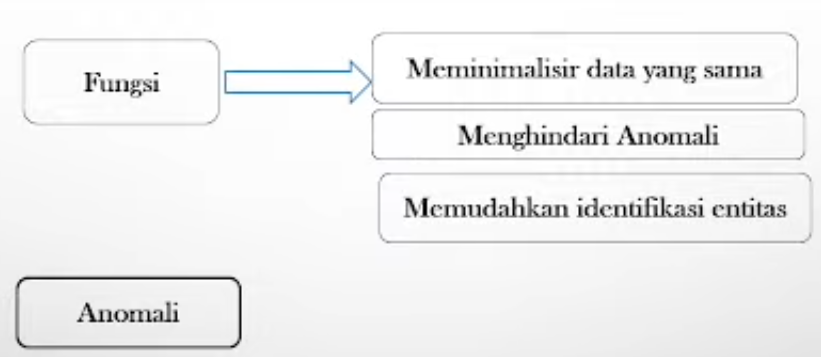
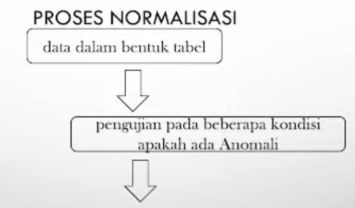

# Normalisasi Tabel

## Definisi Normalisasi

- Normalisasi merupakan sebuah teknik dalam logical desain sebuah basis data, teknik penglompokan atribut dari suatu relasi sehingga membentuk struktur relasi yang baik (tanpa redudansi).
- Proses normalisasi adalah proses pengelompokan data elemen menjadi tabel-tabel yang menunjukkan _entity_ dan _relasinya_.
- Normalisasi adalah proses perancangan sebuah database yang bertujuan untuk menormalkan database yang _unormal_ atau tidak normal (dalam sebuah entitas masih terdapat _field_ atau baris yang _redundant_).
- 
- 

## Tahapan Normalisasi

- Bentuk Tidak Normal
  - Menghilangkan atribut bernilai ganda / multi value
- Bentuk Normal Pertama (1NF)
  - Menghilangkan dependensi parsial
- Bentuk Normal Kedua (2NF)

## Anomali Insert

- Bila terdapat pemasok baru, data cukup dimasukan dalam relasi pemasok.
- Jika terdekat barang baru, data cukup dimasukan dalam relasi barang.

## Dependensi (Ketergantungan)

- Dependensi merupakan konsep yang mendasari normalisasi dependensi menjelaskan nilai suatu atribut yang menentukan nilai atribut lainnya.
- Jenis Dependensi antara lain:
  - Dependensi Fungsional.
  - Dependensi Sepenuhnya.
  - Dependensi Parsial.
  - Dependensi Total.
  - Dependensi Transitif.

### Dependensi Parsial

Suatu atribut **Y** dikatakan memiliki dependensi parisal terhadap **X** apabila memenuhi dua kondisi berikut:

1. **Y** adalah atribut non kunci primer dan **X** adalah kunci primer.
2. **Y** memiliki dependensi terhadap bagian dari **X** (tetapi tidak terhadap keseluruhan dari **X**)

Pada relasi `DOSEN_PENDIDIKAN` mempunyai kunci primer berupa `{No_Dosen, Pendidikan}`.

Atribut `Jenis_Kelamin` yang memiliki dependensi terhadap `No_Dosen` (bagian dari kunci primer) memiliki dependensi parsial.

### Dependensi Total

- Suatu atribut **Y** dikatakan memiliki dependensi total terhadap **X** jika memenuhi 2 kondisi berikut:

1. **Y** memiliki dependensi fungsional terhadap **X**.
2. **X** mempunyai dependensi fungsional terhadap **Y**.

Dependensi Total dinyatakan dengan notasi:

**X** <--> **Y**

Pada relasi Pemasok, tampak bahwa:

`Kode_Pemasok` -> `Nama_Pemasok`
`Nama_Pemasok` -> `Kode_Pemasok`

##
