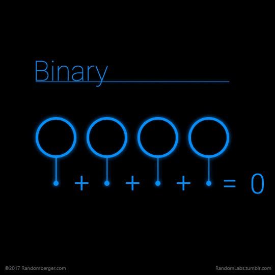

# Timbangan Digital berbasis ATMEGA16

## Timbangan Manual

1. Timbangan manual, yaitu jenis timbangan yang bekerja secara mekanis dengan sistem pegas.
2. Biasanya timbangan jenis ini menggunakan indikator berupa jarum sebagai penunjuk ukuran massa yang telah terskala.

## Timbangan Digital

1. Alat digital dibuat agar mudah dioperasikan degnan merubah alat manual menjadi digital.
2. Timbangan digital, yaitu jenis timbangan yang bekerja secara elektronis.

### Timbangan Yang bekerja Secara Elektronis

Timbangan bekerja bila lempengan atas mendapatkan input tekanan, tekanan ini akan menekan pegas dan bersamaan dengan itu akan menurunkan posisi tuas potensiometer yang terpasang secara vertical.

Nilai hambatan yang terdapat pada potensiometer geser (50K) akan membuat nilai tegangan pada pin ADC(0) berubah variatif antara 0 sampai 5 Volt.

### Potensio Meter

- Potensio Meter adalah sebuah jenis resistor yang mebatur sebuah tahanan / hambatan secara liner.
- Salah satu kelemahan utama dari potensiometer slider adalah slot terbuka rentan terhadap kotaminasi dari debu.
  - Penutup slot dapat digunakan untuk memindahkan efek kontaminasi trek resistif.

- Potensiometer sebagai pembagi tegangan akan menghasilkan variable tegangan dari input `Vin` dibagi menjadi tegangan `V1` dan tegangan `V2` yang sebanding dengan posisi wiper di sepanjang trek.
- Nilai `I` (arus) akan sama disemua posisi wiper di sepanjang trek.

## ATMEGA16 Pins

1. VCC (pin 10) masukan catudaya 5V.
2. GND (pin 11, 31) merupakan **_pin Ground_**.
3. _Port A_ (pin 33 s/d 40) merupakan _pin input/output_ dua arah dan _pin_ masukan ADC.
4. _Port B_ (pin 1 s/d 8) merupakan _pin input/output_ dua arah dan _pin_ fungsi khusus.
5. _Port B_ (pin 22 s/d 29) merupakan _pin input/output_ dua arah dan pin fungsi khusus.
6. _Port D(pin 14 s/d 21)_ merupakan pin input/output dua arah dan pin fungsi khusus
7. _RESET_ (pin 9) untuk me-reset mikrokontroler.
8. _XTAL1_ dan XTAL2 (pin 12, 13)
9. _AVCC_ (bin 30) merupakan pin masukan tegangan untuk ADC.
10. _AREF_ (pin 32) merupakan pin masukan tegangan referensi ADC.

### Cara kerja ADC (Analog to Digital Convertion)

- Analog To Digital Converter (ADC) adalah pengubah input analog menjadi kode-kode digital.
- ADC banyak digunakan sebagai komunikasi digital dan rangkaian pengukuran.
- ADC digunakan sebagai perantara antara sensor analog yang berinteraksi dengan microcontroller pengolah data digital seperti aplikasi timbangan digital.

### Diagram Blok Timbangan Digital berbasis ATMEGA16

1. Sebagai inputan berat, wadah timbangan telah dipasang sensor _potensiometer geser_ yang besar resistensinya akan berubah sesuai dengan pergeseran dikarenakan tekanan yang diterima oleh wadah timbangan diatasnya.
2. Perubahan besar resistansi akan menghubah nilai tegangan yang masuk ke mikrokontroler.
3. Besaran ini akan diolah oleh ADC dalam ATMEGA16 yang mengkonversi nilai analog ke digital dan akan diolah sesuai program yang direncanakan.
4. Berat benda terukur akan ditampilkan di LCD.

### Timbangan Digital berbasis ATMEGA16 (flowchart)

### Timbangan Digital berbasis ATMEGA16 (Sourcecode)

[`main.c`](./src/main.c)
