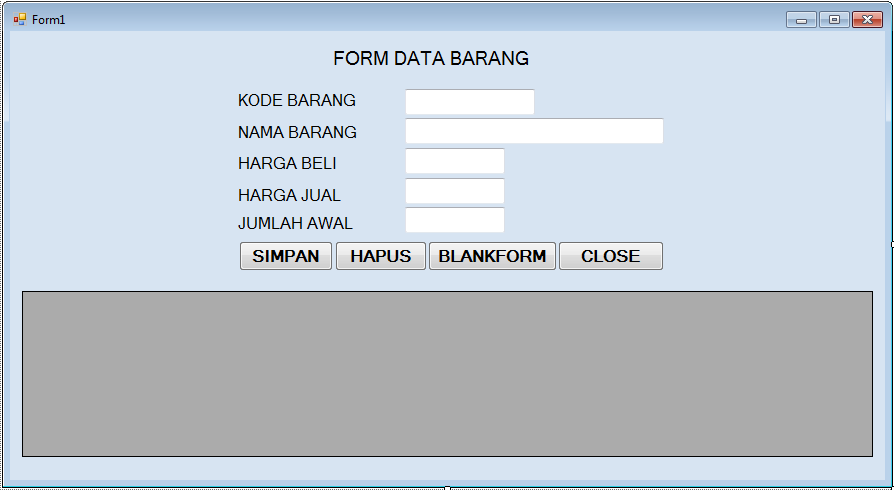
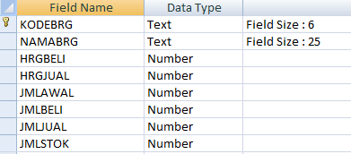

# FORM DATA BARANG

1. Buat Folder `PEMROGRAMAN JARINGAN`.
2. Aktifkan Program Visual Basic .Net.
3. Klik **menu File** => **New Project**.
4. Ketik `PRINTV` pada Kotak Name.
5. Klik Tombol **Ok**.
6. Klik tempat kosong pada area Form.
7. Klik **Propertie Name**.
8. Ketik **FORMBARANG**.
9. Klik **Menu File** => **Save All**
10. Klik Tombol **Browse**.
11. Tentukan folder lokasi penyimpanan file proyek (`PEMROGRAMAN JARINGAN`).
12. Klik Tombol **Select Folder**.
13. Klik Tombol **Save**.
14. Buat Desain Form Barang dibawah ini:
    - 
15. Buat database MS Access `DBINV.MDB` pada folder `PEMROGRAMAN JARINGAN\PRINTV\PRINTV\BIN\DEBUG`.
16. Buat struktur tabel berikut:
    - 
17. Simpan tabel dengan nama **BARANG**.
18. Tutup Program MS Access.
19. Kembali ke Form Barang.
20. ## Ketik kode program dibawah ini:
    - [`main.vb`](./src/main.vb)
