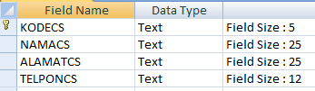
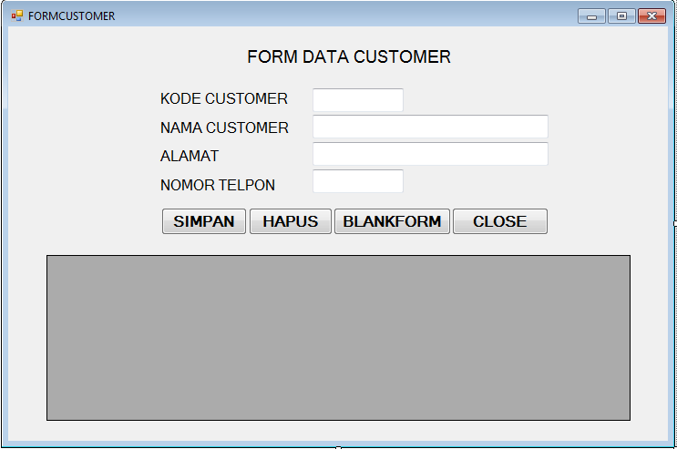

# Form Data Customer

1. Buka data `DBINV.mdb`.
2. Buat struktur tabel berikut:
   - 
3. Simpan tabel dengan nama Customer.
4. Tutup program MS Access.
5. Double klik file `printv.sln` untuk membuka prjcet inventory.
6. Klik menu **Project** => **Add windows Form** untuk menambahkan form baru.
7. Ketik nama form `FORMCUSTOMER`.
8. Klik tombol **Add**.
9. Buat desain **Form Customer** berikut:
   - 
10. Ketik kode program:
    - [`main.vb`](./src/main.vb)

##
