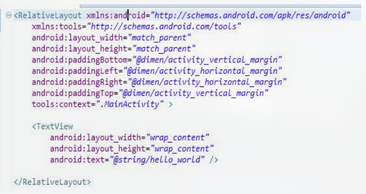
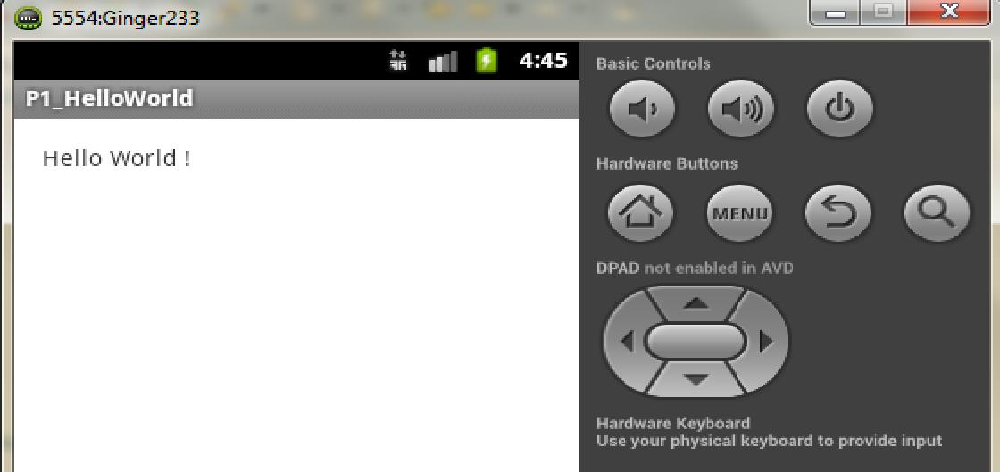
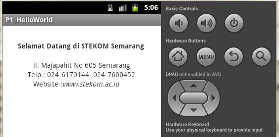

# Pertemuan 4

**Penerapan Pada AVD (Emulator Android)**

## Mengenal View

Layout pada android ada TextView, Button and lain-lain.
TextView, Button dan kawan-kawannya itu kalau diandroid disebut sebagai **View**, View ini adalah komponen-komponen yang membentuk user interface pada aplikasi android.

1. Buat Android Application Project => Application Name dan Projet name = HelloWorld
2. Minimum SDK = Android 2.2 Froyo.
3. Target dan Compile = Android 2.33 Gingerbread.
4. Activitty Name (.Java) = MainActivity.kt
5. Layout (XML) = main_activity.xml

## Fungsi Teks pada Android

Membuat program "Hello World"

Hasil Program:

Tugas: Edit Project HelloWorld, menjadi seperti berikut!

## Tugas

Lengkapi data NPM, Nama, Kelas

kirim ke email
