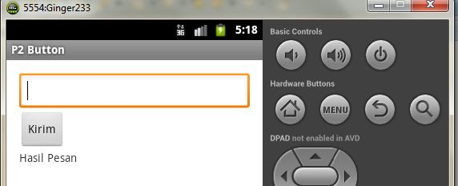

# Pertemuan 5 (Fungsi Button dan Instalasi Device Android)

## Fungsi Button pada Android

1. Buat Android Application Project => Application Name dan Project nam = P2_Button
2. Minimum SDK = Android 2.2 Froyo
3. Target dan Compile = Android 2.33 Gingerbread.
4. Activity Name (.java) = MainActivity.java
5. Layout (XML) = main_actifity.xml

## Procedure Button dengan `OnClick` : <u>KlikKirimPesan</u>

## Edit Cara 2 dengan Edit XML dan tambahkan pada event `OnCreate`

## Tugas: Desain dan Run hasil Aplikasi seperti berikut

