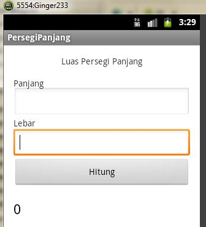

# Pertemuan 6 (Aplikasi Sederhana Hitung Luas dan Menghubungkan Activity)

## Menerapkan fungsi `EditText` dan `Button`

1. Buat Android **Application Project** => **Application Name** dan **Project name** = **BangunDatar**
2. Minimum SDK = **Android 2.2 Froyo**.
3. Target dan compile = **Android 2.33 Gingerbread**.
4. Activity Name (.java) = **PersegiPanjang.java**.
5. Layout (xml) = **persegipanjang.xml**.

---

[`activity_luas.xml`](./src/layout/activity_luas.xml)

---

[`LuasActivity.java`](./src/java/LuasActivity.java)
