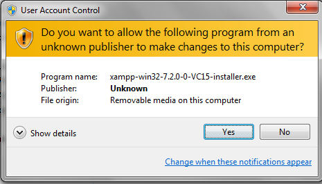
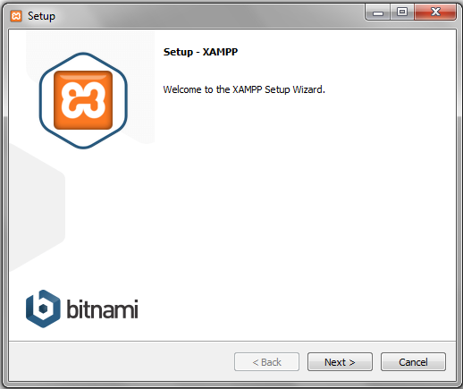
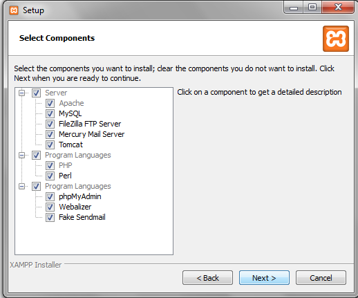
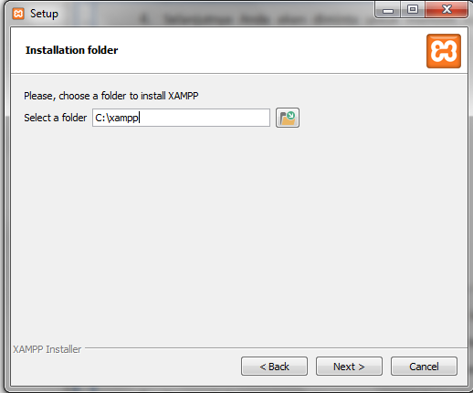
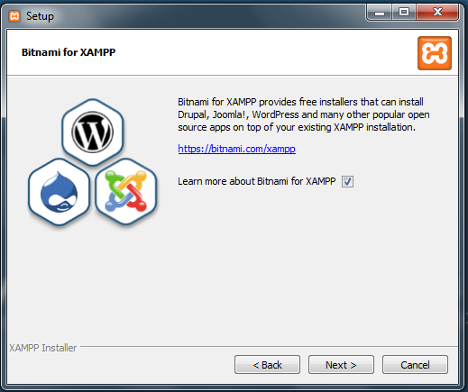
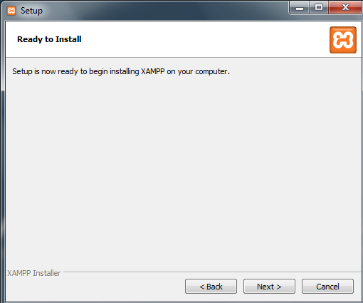
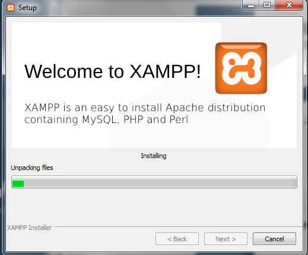

# Pengenalan dan Persiapan

## Pemrograman Web

Tidak sama seperti pemrograman pada komputer lokal (Visual Basic, Foxpro, dbs), pemrograman web berkaitan dengan format dokumen yang digunakan di internet.
Secara umum ada 2 macam pemrograman di internet:

### Client Side Programming

- Pada pemrograman jenis ini program di download oleh pengunjung dan dijalankan pada komputer pengunjung.
- Kerugian: jika ukuran program terlalu besar maka waktu yang diperlukan untuk membuka halaman web lebih lama, dan client dapat dengan mudah melihat / menyalin source code program (lebih mudah diserang hacker).
- Contoh program: HTML, JavaScript.

### Server Side Programming

- Bahasa pemrograman web yang pengolahannya dilakukan di komputer server dan
  hasil pengolahannya kirimkan ke komputer pengunjung dalam bentuk bahasa html,
  sehingga pengunjung tidak mengetahui Script yang telah ditulis oleh pembuatnya.
- Ukuran program relatif dapat lebih besar karena pengunjung tidak perlu men –
  download programnya, tetapi hanya hasil pengolahannya.
- Contoh pemprograman : **PHP**, ASP

## Pengertian PHP

- Pada awalnya PHP adalah singkatan dari _"Personal Home Page Tools"_. Selanjutnya
  diganti menjadi FI (_"Forms Interpreter"_). Sejak versi 3.0, nama bahasa ini diubah
  menjadi _"PHP: Hypertext Prepocessor"_ dengan singkatannya "**PHP**".
- PHP merupakan bahasa server-side scripting yang menyatu dengan HTML untuk
  membuat halaman web yang dinamis (bisa dirubah kontennya dengan mudah tanpa
  mengotak-ngatik banyak scriptnya)
- PHP diciptakan oleh Rasmus Lerdorf (Denmark/Greenland ) pertama kali tahun 1994.

## Kelebihan PHP

- Banyak digunakan oleh programmer berlatar belakang C/C++ karena kemiripan
  syntaxnya.
- _Life Cycle_ yang sangat singkat, sehingga PHP selalu Up To Date mengikuti perkembangan teknologi internet.
- _Cross Platform_, yakni dapat dipakai di hampir semua web server yang ada di pasaran
  (terutama Apache dan Microsoft IIS) dan dijalankan pada berbagai OS (Linux, windows,
  FreeBSD).
- Script tersembunyi dan tidak dapat dilihat menggunakan fasilitas view HTML source yg
  ada pada Web Browser.
- Bersifat open source.

## Tools yang harus di siapkan

Sebelum dimulai, beberapa tools yang harus disiapkan, diantaranya:

1. Aplikasi Web Server
   - XAMPP atau WAMP (salah satu)
2. Editor atau penulisan coding
   - Notepad, Notepad++, Macromedia Dreamweaver, SublimeText
3. APlikasi Browser
   - Mozilla Firefox, Chrome, Internet Explorer.

## Instalasi Tools

### Web Server (XAMPP)

1. Dobel klik file XAMPP yang baru saja And download, klik "YES"
   - 
2. Selanjutnya akan muncul jendela "Setup XAMPP" seperti dibawah ini, klik **next**
   - 
3. Selanjutnya anda akan diminta untuk memilih aplikasi yang mau diinstal. Centang saja semua pilihan dan klik tombol **Next**.
   - 
4. Secara default folder penyimpanan file-file dan folder XAMPP akan diarahkan ke lokasi **C:\xampp**.
   - Klik icon dan tentukan secara manual folder yang ingin digunakan.
   - Jika sudah selesai, lanjutnya dan klik tombol **Next**
   - 
5. Akan muncul jendela Bitnami For Xampp. Klik **Next**.
   - 
6. Ready To install Klik **Next**.
   - 
7. Tunggu beberapa menit hingga proses
   - 
8. Jika sudah selesai muncul jendela seperti dibawah ini, centang _"do you want to start the control now"_

##
