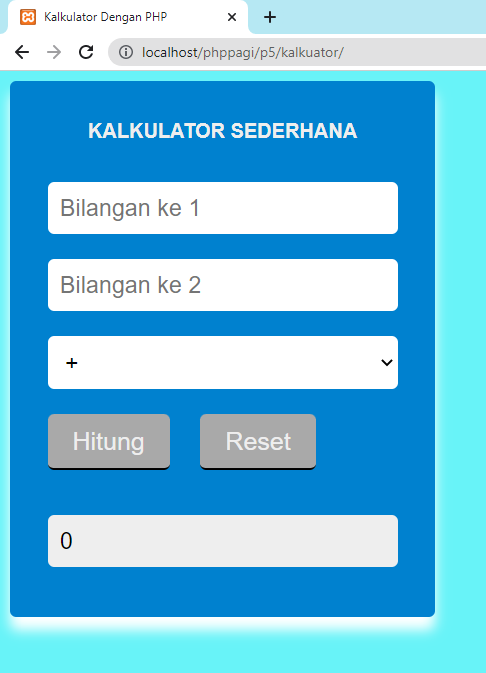
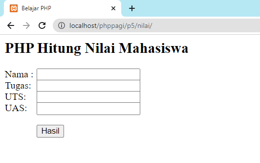

# Projek Sederhana Operator dengan PHP

## Kalkulator

Pada contoh pertama disini akan membuat sebuah aplikasi sederhana yaitu kalkulator dengan Bahasa pemrograman PHP.
Silahkan buat folder "kalkulator" dan buat syntax php dibawah ini:

[**index.php**](./src/kalkulator/index.php)

[**style.css**](./src/kalkulator/style.css)

## Konversi Nilai Huruf

Pada contoh ke 2 akan dibahas mengenai aplikasi sederhana konversi nilai dari angka ke nilai huruf.
Terdapat 4 inputan pada form awal berupa `nama`, `tugas`, `uts`, dan `uas`.
Silahkan buat folder bernama "nilai" dan buat syntax dibsawah ini:

### [**index.php**](./src/nilai/index.php)

### [**output.php**](./src/nilai/ouput.php)

Disini digunakan untuk memproses dan menampilkan hasil yang telah diinputkan pada form sebelumnya (index.php)
