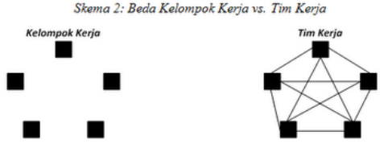

# Kelompok Dan Tim Perilaku Orgaisasi

## Definisi

Kelompok dan Tim adalah dua konsep berbeda.

- Kelompok atau group didefinisikan sebagai dua atau lebih individu yang saling bergantung dan bekerjasama, yang secara bersama berupaya mencapai tujuan.
- Tim kerja merupakan kelompok yang upaya-upaya individunya menghasilkan suatu kinerja yang lebih besar daripada jumlah masukan individual tersebut.

## Kelompok Formal dan Informal

### Kelompok Formal

Kelompok yang dibangun selaku akibat dari pola struktur orgaisasi dan pembagian kerja.
Contohnya, pengelompokan kegiatan-kegiatan pekerjaan yang relatif serupa ke dalam satu kelompok.
Kelompok formal tercipta untuk mencapai tujuan organisasi.
Kelompok ini sangat memperhatikan aspek kegiatan kerja yang terkoordinasi.

---

**Kelompok Perintah** (_Command Group_)

Kelompok perintah (_command group_) ditentukan oleh bagan organisasi dan terdiri atas para bawahan yang melaporkan langsung pada penyelia.
Hubungan otoritas yang ada antara manajer sebuah departemen dengan para penyelianya, atau antara perawat senior dengan bawahan-bawahannya, adalah contoh-contoh sebuah kelompok perintah.

---

**Kelompok Tugas** (_Task Group_)

Sebuah kelompok tugas (_task group_) terdiri atas karyawan-karyawan yang bekerja sama untuk menyelesaikan sebuh tugas atau proyek tertentu.
Sebagai contoh, tugas yang harus dikerjakan para petugas sebuah perusahaan asuransi ketika sebuah klaim diajukan, adalah tugas bersama.
Tugas ini menciptakan situasi dimana beberapa petugas harus saling berkomunikasi dan berkoordinasi dengan yang lain agar kalim tersebut dapat ditangani dengan baik.

### Kelompok Informal

Kelompok informal pembentukannya lebih didasarkan pada hubungan dan persetujuaan infromal di antara para anggota kelompok ketimbang hubungan peran yang telah ditentukan manajemen.
Hubungan informal tersebut dibentuk untuk memuaskan kebutuhan sosial dan psikologis pada anggota kelompok, sehingga tidak mesti berhubungan dengan tugas-tugas organisasi yang harus mereka laksanakan.

---

**Kelompok Minat** (_Interst Group_)

Individu-individu yang bukan merupakan anggota kelompok perintah, tugas, atau tim yang sama mungkin saja memiliki sebuah sasaran bersama.
Contoh kelompok minat (_interst group_) adalah karyawan yang berkumpul untuk menghadapi pihak manajemen guna mendapatkan tunjangan yang lebih baik, dan para pramusaji yang 'bergabung' untuk mendapatkan tips tambahan.
Perhatikan bahwa sasaran kelompok tersebut tidak terkait dengan sasaran organisasi, tapi sangat berhubungan dengan kelompok yang bersangkutan.

---

**Kelompok Pertemanan** (_Friendship Group_)

Banyak kelompok terbentuk karena para anggotanya memiliki suatau kesamaan, misalnya usia, kepercayaan politik, atau latar belakang etnis.
Kelompok pertemanan (_friendship group_) mengembangan interaksi dan komunikasi mereka hingga ke aktivitas di luar pekerjaan.
Misalnya orang yang memiliki hobi yang sama suka bermain badminton, sepak bola, tenis, renang, bergabung menjadi teman persahabatan.

## Jenis-jenis Tim

Tim dapat diklasifikasikan berdasarkan tujuannya.
Terdapat 4 bentuk umum dari tim yang biasa kita tentukan sehari-hari yaitu :

- Tim Problem Solving
- Tim Self Managed Work
- Tim Cross Functional
- Tim Virtual

### Tim Problem Solving

Dalam tim jenis ini, para anggota saling berbagi gagasan dan menawarkan saran seputar proses dan metode kerja seperti apa yang perlu dilakukan agar produktivitas dapat ditingkatkan.
Ini merupakan tim kerja terdiri atas gabungan 8 hingga 10 pekerja dan supervisor yang saling berbagi gagasan wilayah kewenangan dan bertemu secara teratur guna mendiskusikan masalah kualitas pekerjaan mereka. menyelidiki sebab-sebab masalah, dan merekomendasikan penyelesaian.

### Tim Self Managed Work

Tim Problem Solving sudah ada dijalur yang benar, tetapi mereka tidak beranjak jauh dalam hal pelibatan pekerja dalam proses pembuatan keputusan (apalagi implementasi) yang berhubungan dengan suatu pekerjaan.
Kekurangan ini mendorong eksperimen dari tim yang benar-benar otonom yang tidak hanya bercorak problem solving melainkan juga menerapkan penyelesaian dan punya kewenangan penuh atas hasil-hasilnya.

### Tim Cross Functional

Adalah tim lintas departemen yang bertujuan meningkatkan komunikasi dan penelusuran catatan kerja, yang adakan membawa pada peningkatan produktivitas dan kepuasan klien.
Tim ini terdiri atas pekerja-pekerja dari tingkat hirarki yang serupa tetapi beda wilayah perkerjaanya.
Mereka bergabung bersama guna menyelesaikan suatu perkerjaan.

### Tim Virtual

Tim Virtual menggunakan teknologi komputer guna menghubungkan orang-orang yang terpisah secara fisik guna menccapai sasaran bersama.
Teknik tersebut memungkinkan orang saling bekerjasama lewat method online, kendati mereka dipisahkan yuridiksi negara bahkan benua.

## Perbedaan Kelompok dan Tim dalam Konteks pekerjaan

Stephen P.Robbins melakukan pembedaan antara kelompok kerja dengan Tim Kerja berdasarkan 4 variable yaitu: sasaran, sinergi, akuntabilitas, dan keahlian.
Perbedaan dapat dilihat dalam skema-skema berikut.

Berbagi informasi <- Sasaran -> Kinerja kolektif

Netral (kadang negatif) <- Seinergi -> Positif

Individual <- Akuntabilitas -> Individual dan saling lengkapi

Accak dan jarang <- Keahlian -> Saling mengganti

---

Sementara itu, penulis lain seperti **Laurie J.Mullins** membedakan kelompok dan tim berdasarkan 6 variable yaitu: ukuran, seleksi, kepemimpinan, persepsi, gaya, dan semangat .
Taksonomi beda lengkapnya sebagai berikut :

|   Variable   |                   Tim                    |           Kelompok            |
| :----------: | :--------------------------------------: | :---------------------------: |
|    Ukuran    |                 Terbatas                 |        Menium & Besar         |
|   Seleksi    |                 Krusial                  |           Imateral            |
| Kepemimpinan |          Berbagi atau dirotasi           |             Solo              |
|   Persepsi   | Pemahaman pengentahuan saling melengkapi |      Fokus pada pemimpin      |
|     Gaya     |      Peran koordinasi yang terbesar      |   Konvergensi, konformisme    |
|   Semangat   |            Interaksi dinamis             | Kebersamaan mengalahkan musuh |

##
