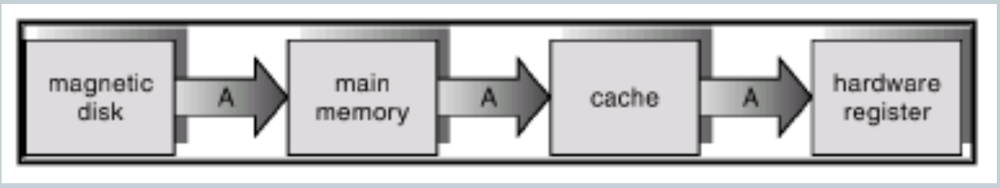

# Pertemuan 8

## Struktur Sistem Komputer

- Operasi Sistem Komputer
- Struktur I/O
- Struktur Storage
- Proteksi Hardware

## Operasi Sistem Komputer [1]

- *CPU device* dan *I/O* dapat beroperasi secara serentak *(concurrent)*

  - Efisiensi pemakaian CPU

- Semua *request* ke *I/O* dikendalikan oleh *I/O systems*:

  - Setiap *device* terdapat *controller* yang mengendalikan *device* tertentu, misalkan *video display* => *disk controller*.
  - Setiap *device controller* memunyai local buffer.

- CPU memindahkan data dari/ke *memory* ke/dari *local buffer*

  - Setelah itu *controller* mengirimkan data dari *buffer* ke *device*.
  
- Bagaimana mekanisme *I/O* supaya *CPU* dapat melakukan *switch* dari satu job ke job lain?

## Operasi Sistem Komputer [2]

- Ilustrasi:

  - Instruksi *CPU* dalam *orde*: mikro-detik.
  - Operasi *read/write* dari *disk*: 10-15 detik.
  - Ratio : CPU ribuah kali lebih cepat operasi I/O
  - Jika *CPU* harus menunggu (idle) sampai data transfer selesai, maka utilitas *CPU* sangat rendah (lebih kecil 1%)

- Solusi:

  - *Concurrent*: *CPU* dapat menjalankan beberapa *I/O device* sekaligus.
  - *CPU* tidak menggnunggu samapi operasi *I/O* selesai tapi melanjutkan tugas yang lain.
  - Bagaimana *CPU* mengetahui *I/O* telah selesai ?

## Programed input / output [1]

- Programed I/O 
  - Maknisme CPU yang bergantung  jawab memindahkan data dari/ke memori ke *controller*
- CPU bertangung jawab untuk jenis operasi I/O 
  - *Transfer* data dari *buffer*
- *Controller* melakukan detil operasi *I/O*
  - Jika telah selesai memberikan informasi ke *CPU* => *flag*
- Bagaimana *CPU* mengetahui operasi telah selesai?
  - Apakah menguji *flag*? Seberapa sering?

## Programed input / output [2]

- *CPU* harus mengetahi jika I/O trlah selesai => *hardware flag (controller)*
- *Polling:CPU* secara periodik menguji *flag (true or false)*
  - Menggunakan instruksi khusus untuk menguji *flag*.
  - Masalah:seberapa sering? "*wasted CPU time!"? Antar *I/O device* beberapa "*speed*"!
- Interrput:
  - Bantuan hardware - melakukan interpsi pada CPU jika *flag* tesebut telah di-set (operasi *I/O* telah selesai).

## Interrput

- Interrput:
  - *CPU* transfer control ke "*interrupt service routine*", => address dari Service routine yang diperlukan untuk device tersebut.
  - Interrput handler menentukan aksi / service yang diperlukan.
- Struktur interrupt harus menyimpan address dari instruksi yang sedang dikerjaan oleh CPU (interrupt).
  - CPU dapat resume ke lokasi tersebut jika service routine telah selesai dikerjakan.
- Selama CPU melakukan service interrupt, maka interrupt selanjutnya tidak akan dilanyani "disabled", karena CPU tidak dapat melayani interrupt (lost).
- Pengoperasian sistem tersebut menggunakan interrupt  driven.

## Interrput Handling

- Hardware dapat membedakan device mana yang melakukan inerupsi
  - Jenis interpsi;
  - Polling
  - Vectored interrupt system.
- Tugas sistem operasi menyimpan status CPU (program counter, register dll)).
  - Jika service routine telah selesai => CPU dapat melakukan intruksi terakhir yang dikerjakan.
  - Sistem operasi akan "load" kembali status CPU tersebut.

## Struktur input / output

- User request I/Operasi:
  - CPU load instruksi ke register controller 
  - Controller menjalankan instruksi.
- Setelah I/O mulai, control kembali ke user program jika operasi I/O telah selesai.
  - Instruksi khusus wait => CPU menunggu sampai ada interrupt berikutnya dari I/O tersebut.
  - Paling banyak hanya mempunyai satu I/O request.
  - Keuntungan CPU mengetahi secara pasti device mana yang mealkukan interrupt (operasi I/O selesai)>
  - Kerugian operasi I/O tidak dapat serentak untuk semua device.
- Pilihan lebih baik *asynchoronus I/O*
- Setelah *I/O* mulai, kendali langsung kembali ke user program tanpa menunggu I/O selesai.
  - CPU dapat menajutkan operasi I/O untuk device yang lain.
  - User program dapat menjalankan program tanpa menunggu atau hharus menunggu sampai I/O selesai.
  - System call - request ke OS untuk operasi I/O dan menunggu sampai I/O selesai.
- Pontensi lebih dari satu device
  - User hanya dapat menggunakan I/O melalui system call.
  - Debice status table membuat informasi untuk setiap I/O device tipe, alamat, status, dll.
  - OS mengatur tabel ini dan mengubah isinya sesuai dengan status device (interrupt).

## Direct Memory Access (DMA)

- Jika I/O devices sangat ("high-speed"), beban cpu menjadi besar harus mengawasi transfer data dari controller ke memory dan sebaliknya.
- Hardware tambahan => DMa controller dapat memindahkan blok data dari buffer langsung ke  memoruy tanpa menggangu CPU.
  - CPU menentukan lokasi memory dan jika DMA controller telah selesai => interrupt ke CPU .
  - Hanya satu interrupt ke CPU untuk sekumpulan data (blok).

## Struktur Storage

- Main Memory
  - Media penyimpanan dimana CPU dapat melakukan akses secara langsung,
- Sedondary storage
  - Tambahan dari main memory yang memiliki kapasitas besar dan bersifat nonvollatile.
- Magnetic disks
  - Metai kertas atau piringan yang terbungkus material magnetik.
  - Permukaan disk terbagi secaralogika dalam *track*, yang masing-masing terbagi lagi dari *sector*.
  - Disk controller menentukan interaksi logika antara device dan komputer.

## Hirarki Storage

- Hirarki sistem storae, diorganisasikan dalam bentuk:
  -  Kecepatan
  -  Biaya
  -  Volatilitas
- Caching
  - Pendupllikasian informasi ke dalam seistem storage yang cepat dapat dilakukan melalui cache pada scondary storage.

## Caching

- Menggunakan memori berkecapatan tinggi untuk menangani akses data saat itu juga (yang terbaru).
- Membutuhkan management cache.
- Caching mengenalkan tingkatan lain dalam hirarki storage, dimana data secara serentak disimpan pada lebih dari satu tingkatan secara konsisten.

## Migrasi Dari Disk Ke Register

