# Quickshort

## Chapter Overview

- You learn about divide-and-conquer.
- You learn about quicksort, an elegant sorting algorithm that's often used in practice. Quickshort uses diveide-and-conquer.

## Divide & Conquer

- D&C can take some time to grasp

## Case Study

- Suppose you're farmer with a plot of land.
- 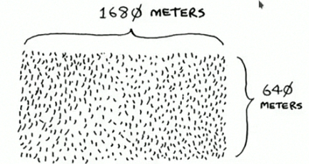
- You want to divide this evenly into square plots.
- You want the plots to be as big as possible.
- So none of these will work.
- 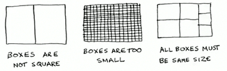
- How do you figure out the largest square size you can use for a plot of land?

## D&C Strategy

- Use the D&C strategy!
- D&C algorithms are recursive algorithms.
- To solve a problem using D&C, there are tow Steps:
  * Figure out the base case. This should be the simplest possible case.
  * Divide or decrease you problem until it becomes the base case.

---

- First, figure out the base case.
- The easiest case would be if one side was a multiple of the other side.
- 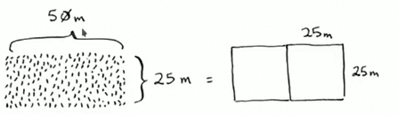
- Suppose one side in 25 meters (m) and the other side is 50 m.
- Then the largest box you can use is 25 m * 25 m.
- You  need two of those boxes to divide up the land.

---

- Now you need to figure out the recursive case.
- According to D&C, with every recursive call, you have to reduce your problem.
- How do you reduce the problem here? Let's start by marking out the bigest boxes you can use.
- 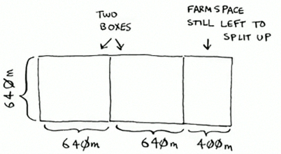
- You can fit 640 x 640 boxes in there, and there's some land still left to be divided

---

- Now here comes the "Aha!" moment.
- There's a farm segment left to divide.
- Why don't you apply the same algorithm to this segment.
- 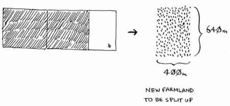

---

- So you started out with a 1680 x 640 farm that needed to be split up.
- But now you need to split up a smaller segment, 640 x 400.
- If you find the bigest box that will work for this size, that will be the biggest box that will work for the entire farm.
- You just reduced the problem from a 1680 x 640 fram to a 640 x 400 farm!

---

- Let's apply the same algorithm again.
- Starting with a 640 x 400m farm, the biggest box you can create is 400 x 400m.
- 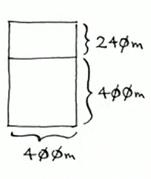

---

- And that leaves you with a smaller segment, 400 x 240m.
- 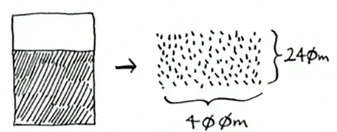
- And you can draw a box on that to get an even smaller segment, 240 x 160m.
- 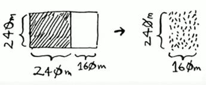

---

- And then you draw a box on that to get an even smaller segment.
- 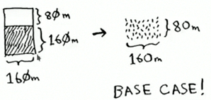
- Hey, you're at the base case: 80 is a factor of 160. If you split up this segment using boxes, you don't have anything left over!
- 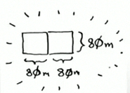

---

- So, for the original farm, the biggest plot size you can use is 80 x 80 m.
- 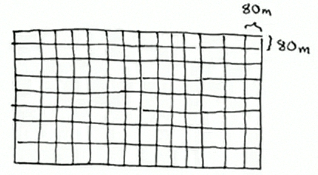

## D&C Recap

- To recap, here's how D&C works:
  * Figure out simple case as the base case.
  * Figure out how to reduce your problem and get to the base case.

## Another D&C Example 

- D&C isn't simple algorithm that you can apply to a problem.
- Instead, it's way to think about a problem. Let's do one more example.
- You're given an array of numbers.
- [2, 4, 6]
- You have to add up all the numbers and return the total.

---

- It's pretty easy to do this with loop"

```python
def sum(arr):
  total = 0
  for x in arr:
    total += x
  return total
print(sum([1, 2, 3, 4])) # 10
```

- But how would you do this with a recursive function ?

---

- **Step 1: Figure Out the base case.**
- What's the simplest array you could get? Think about the simplest case, and then read on.
- If you get an array with 0 or 1 element, that's pretty ease to sum up.
- 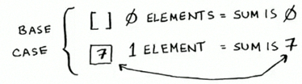
- So that will be the base case.

---

- **Step 2: You need to move closer to an empty array with every recursive call.**
- How do you reduce your problem size ? Here's one way.
- 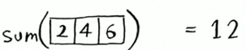
- `sum([2, 4, 6])` = 12
- It's the same as this.
- 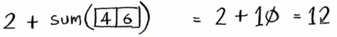
- `2 + sum([4, 6])` = 2 + 10 = 12
- In either case, the result is 12.
- But in the second version, you're passing a *smallest* array into the sum function. That is, you *decrease* the size of your problem!

---

- Your sum function could work like this.
- 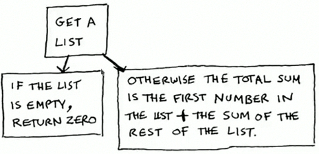

---

- Here it is in action.
- 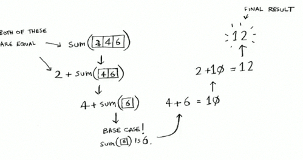

---

- Remember, recursive keeps track of the state.
- 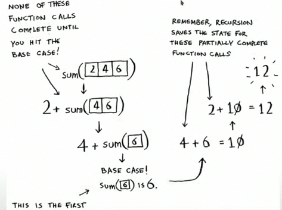

## Sneak peak at functional programming

- "Why would I do this recursively if i can do it easily with loop ?" you may be thinking.
- Well, this is a sneak peek into **functional programming!**
- Functional programming languages like **Haskell** don't have loops, so you have to use recursion to write function like this.
- If you have a good understanding of recursion, functional languages will be easier to learn.

## Note: Euclid's algorithm

- "If you find the biggest box that will work for this size, that will be the biggest box that will work for the entire farm."
- If it's not obvious to you why this statement is true, don't worry. It isn't obvious.
- Unfortunately, the proof for why it works is a llittle too long to include in this boox.
- If you want to understand the proof, look up Euclid's algorithm.
- The Khan academy has a good explanation here

