# Hash Tables

## Chapter Overview

- You learn about hash tables, one of the most useful basc data structures.
- You learn about the internals of hash tables: *implementation, collisions,* and *hash functions*.

## Introduction

- Suppose you work at a grocery store.
- When a custumer buys produce, you have to look up the price in a book.
- If the book is unalphabetized, it can take you a long time to look through every single line for apple. You'd be doing a simple search from chapter 1, where you have to look at every line. Do you remember how long that would take ? *O(n)* time.
- If the book is alphabetized, you could run binary search to find the price of an apple. That would only take *O(log n)* time.

---

- As a reminder, there's a big difference between *O(n)* and *O(log n)* time!
- 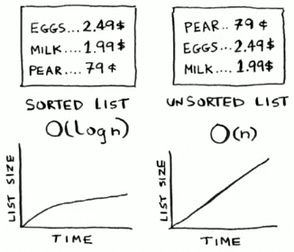
- Suppose you could look through 10 lines of the book per second.
- Here's how long simple search and binary search would take you.
- 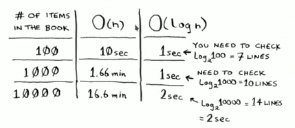

---

- You already know that binary search is darn fast.
- But as a cashier, looking things up in a book is a pain, even if the book is sorted.
- You can feel the customer straming up as you search for itoms in the book.
- what you really need is a buddy who has all the names and prices memorized.
- Then you don't need to look up anything: you ask her, and she tells you the answer instanly.

---

- Your buddy Maggie can give you the price in *O(1)* time for any item, no matter how big the book is.
- She's even faster than binary search.
- 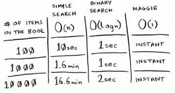

---

- Let's put on our data structure hats.
- You know two data structures so far: arrays and lists (I won't talk about stacks because you can't really "search" for something in a stack).
- You could implement this book as an array.
- 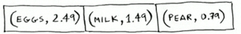

---

- Each item in the array is really two items: one is the name of a kind of produce, and the other is the price.
- If you sort this array by name, you can run binary search on it to find the price of an item.
- so you an find items in *O(log n)* time. But you want to find the price of an item.
- So you can find items in *O(log n)* time. But you want to find items in *O(1)* time.
- That is, you want to make a "Maggie." That's where hash functions come in.

## Hash function

- A hash function is a function where you put in a string 1 and you get back a number.
- 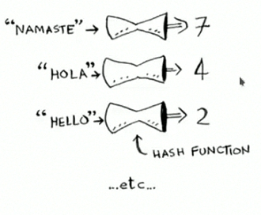

---

- In technical terminology, we'd say that a hash function "maps strings to numbers."
- You might think there's no discernable pattern to what number you get out when you put a string in.
- But there are some requirements for a hash function:
  * **It needs to be consistent.** For example, suppose you put in "apple" and get back "4". Every time you put in "apple", you should get "4" back. Without this, you hash table won't work.
  * **It should map different words to different numbers.** For example, a hash function is no good if it always return "1" for any word you put in. In the base case, every different word should map to a different number.

---

- So a hash function maps strings to numbers. What is that good for ?
- Well, you can use it to make you "Maggie"!
- Start with an empty array:
- 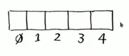

---

- You'll store all of you prices in this array. Let's add the price of an apple.
- Feed "apple" into the hash function.
- 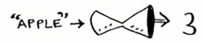
- The hash function outputs "3". So let's store the price of an apple at index 3 in the array.
- 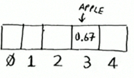

---

- Let's add milk. Feed "milk" into the hash function.
- 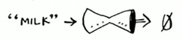
- The hash function says "0". Let's store the price of milk at index 0.
- 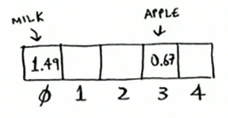

---

- Keep going, and eventually the whole array will be full of prices.
- 
- Now you ask, "Hey, what's the price of an avocado?" You don't need to search for it in the array. Just feed "avocado" into the hash function.
- 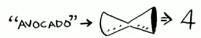
- It tells you that the price is sorted at index 4. And sure enough, there it is.
- 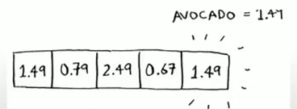

---

The hash function tells you exactly where the price is stored, so you don't have to search at all! This works because:

- **The hash function consistently maps a name to the same index.** Every time you put in "avocado", you'll get the same number back. So you can use it the first time to find where tp store the prince of an avocado, and then you can use it to find where you stored that price.
- **The hash function maps different strings to different indexes.** "Avocado" maps to index 4. "Milk" maps to index 0. Everything maps to a different slot in the array where you can store its price.
- **The hash function knows how big you array is and only returns valid indexes.** So if you array is 5 items, the hash function doesn't return 100; that wouldn't be a valid index in the array.

## Hash function + array = hash table

- Put a hash function and an array together, and you get a data structure callsed a **hash table**.
- A hash table is the first data structure you'll leran that has some extra logic behind it.
- Arrays and lists map straight to memory, but hash tables are smarter. They use a hash function to intelligently figure out where to store elements.
- They're also known as **hash maps**, **maps**, **dictionaries**, and **associative arrays**.
- And hash tables are fast! Hash tables use an array to store the data, so they're equally fast.

---

- You'll probably never have to implement hash tables yourself.
- Any good languague will have an implementation for hash tables.
- Python has hash tables; they're called **dictionaries**.

```python
book = dict()
book['apple'] = 0.67 # An apple const 67 cents.
book['milk']  = 1.49 # Milk cost $1.49.
book['avocado'] = 1.49 
print(book) # {'apple' : 0.67, 'milk': 1.49, 'avocado': 1.49}
print(book['avocado']) # 1.49
```

