# Mengenal Collisions dan Load Factor pada Struktur Data Hash Table

## Collisions

- To understand the performance of hash tables, you first need to understand what collisions are.
- The next two sections cover collisions and performance.
- First, I've been telling you a while lie. I told you that a hash function always maps different keys to different slot in the array.
- 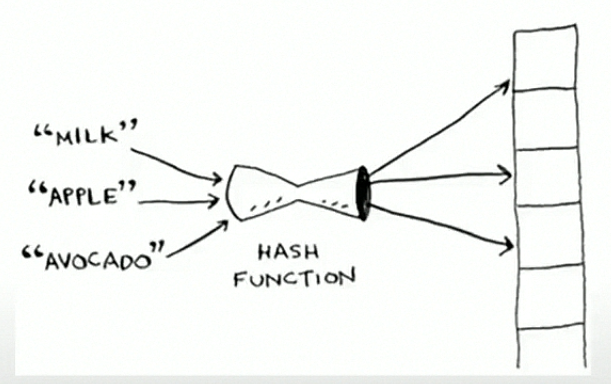

---

- In reality, it's almost impossible to write a hash function that does this.
- Let's take a simple example. Suppose your array contains 26 slots.
- 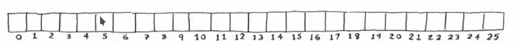
- And your hash function is really simple: it assigns a spot in the array alphabetically.
- 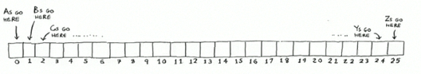

---

- Maybe you can already see the problem. You want to put the price of apples in your hash.
- You get assigned the first slot.
- 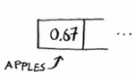
- Then you want to put the price of bananas in the hash. You get assigned then second slot.
- 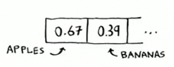
- Everything is going so well! But now you want to put the price of avocados in the your hash. You get assigned the first slot again.
- 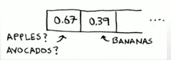

---

- Oh no! Apples have that slot already! What to do?
- This is called **collision**: two keys have been assigned the same slot.This is s problem.
- If you store the price of avocados atu that slot, you'll overwrite the price of apples. Then the next time someone ask for the price of apples, they will get the price of avocados instead!
- Collisions are bad, and you need to work around them.
- There are many different ways to deal with collision.

---

- The simplest one is this: if multiple keys map to the same slot, start a **linked list** at the that slot.
- 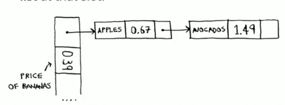
- If you need to know the price of mananas, it's still quick.
- If you need to know the price of apples, it's a little slower. You have to search through this linked list to find "apples".
- If the linked list is small, no big deal - you hace to search through theree of four elements.

---

- But supppose you work at a grocery store where you only sell produce that start with the letter A.
- 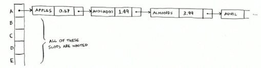
- The entire hash table is totaly empty except for one flot. And that slot has a giant linked list.
- Every single element in this hash table is in the linked list.
- That's as bad as putting everything in a linked list to begin with. It's going to slow down your hash table.

---

- There are two lessons here:
  * Hash function are important.
  * A good hash function will give you very few collisions.

## Performance

- In the avagare case, hash tables take **O(1)** for everything.
- **O(1)** is called **constant time**.
- You haven't seen constant time before. It doesn't mean instant.
- It means the time taken will stay the same, regardiess of how big the hash table is.
- 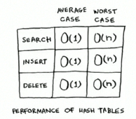

---

- For example, you know that simple search linear time.
- 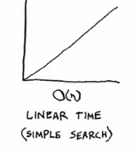
- Binary search is faster - it takes **log** time:
- 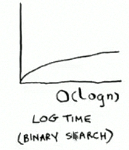
- Looking something up in a hash table takes constant time.
- 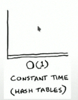

---

- See how it's flat line? That means it doesn't matter wheter your hash table has 1 element of 1 billion elements getting something out of a hash table will take the same amount of time.
- Actually, you've seen sonstant time before. Getting an item out os an array takes constant time. It doesn't maatter how big your array is, it takes the same amount of time to get an element.

---

- In the avagare case, hash tables are really fast.
- In the worst case, a hash table takes **O(n)**, linear time for everything, which is really slow.
- Let's  compare hash tables to arrays and list.
- 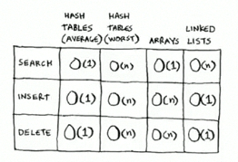

---

- Look at the avagare case for hash tables.
- Hash tables are as fast as arrays at searching (getting a value at an index).
- And they're as fast as linked list at inserts and deletes. It's the best of both worlds!
- But in the worst case, hash tables are slow at all of those.
- So it's important that you don't hit worst-case performance with hash tables.
- And to do that, you need to avoid collisions. To avoid collisions, you need:
  * A low load factor.
  * A good hash function.

## Load Factor

- The load factor of hash table is easy to calculate.
- 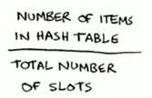
- Hash tables use an array forr storage, so you cont the number of occupied slot in an array.
- For example, this hash table has load factor of 2/5, or 0.4.
- 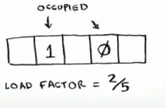

---

- What's the load factor of this hash table?
- 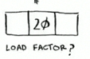
- If you said 1/3, you're right.
- Load factor measures how many empty slots remain in your hash table. 

---

- Suppose you need to store the price of 100 produce items in your hash table, and your hash table has 100 slots.
- In the best case, each item will get it's own slot.
- 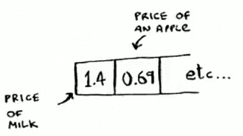
- This hash table has a load factor of 1.
- What if your hah table has only 50 slots?
- Then it has load factor of 2.

---

- There's no way each item will get it's own slot, because there aren't enough slots!
- Having a load factor greater than 1 means you have more items than slots in your array.
- Once the load factor start to grow, you need to add more slots to your hash table. This is called **resizing**.
- For example, suppose you have this hash table that is getting pretty full.

---

- 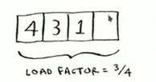
- You need to resize this hash table. First you create a new array that's bigger.
- The rule of thumb is to make an array that is twice the size.
- 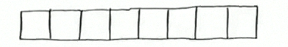
- Now you need to re-innsert all of those items into new hash table using the hash function.
- 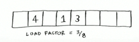
- This new table has a load factor of 3/8. Much better!

---

- When a lower load factor, you'll have fewer collisions, and your table will perform better.
- A good rule of thumb is, resize when you load factor is greater than 0.7.
- You might be thinking. "THis resizing business takkes a lot of time!"
- And you're right. Resizeing is expensive, and you don't want to resize too often.
- But avarage out, hash tables take **O(1)** even with resizing.

## A good hash function

- A good hash function distribute values in the array evenly.
- 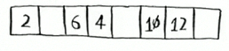
- A bad hash function groups values together and produces a log of collisions.
- 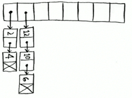

---

- What is a good hash function? That's something you'll never hash to worry about old men (and woman) with big breads sit in dark rooms and worry about that.
- If you're really curious, look up the SHA function (there's a sort description of it in the last chapter).
- You could use that as your hash function.

