# Mengenal Struktur Data Graph & Queue | Algoritma Breadth First Search

## Capter Overview

- You learn how to model a netowork using a new, abstract data structure, **graphs**.
- You learn breadth-first search, an algorithm you can run on graphs to answer questions like, "What's the shortest path to go X?"
- You learn about directed versus undirected graphs.

## Introduction to graphs

- Suppose you're in San Francisco, and you want to go Twin Peaks to the Golden Gate Bridge.
- You want to get there by using bus, with the minimum number of transfers. Here are you options.
- 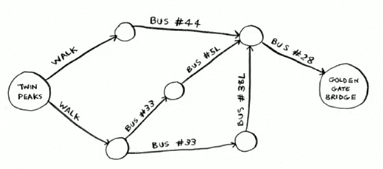

---

- What's your algorithm to find the path with the fewst steps?
- Well, can you get there in one steps? Here are all the place you can get to in one steps.
- 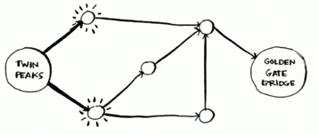
- The bridge isn't highlighted, you can't get there in one step.

---

- Can you get there in two steps?
- 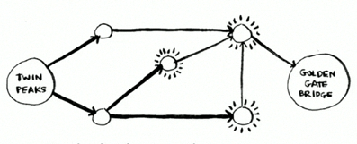
- Again, the bridge isn't there, so you can't get to the bridge in two steps.

---

- What about three steps?
- 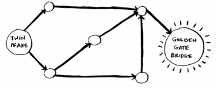
- Aha! Now the Golden Gate Bridge shows up.

---

- So it takes three steps to get from Twin Peaks to the bridge using this route.
- 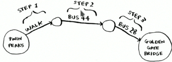
- There are other routes that will get you to the bridge too, but they're longer (four steps).

---

- The algorithm found that the shortest route to the bridge is three steps long. This type of problem is called a *shortest-path problem*.
- The algorithm to solve a shortest-path problem is called *breadth-first search*.
- To figure out how to get from Twin Peaks to the Golden Gate Bridge, there are two steps:
  * Model the problem as a graph.
  * Solve the problem using breadth-first search.

## What is a graph?

- A graph models a set of connections.
- Suppose you and your friends are playing poker.

---

- You want to model who owes whom money.
- Here's  how you could say, "Alex owes Rama money."
- 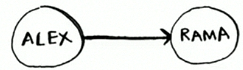
- The full graph could look something like this.
- 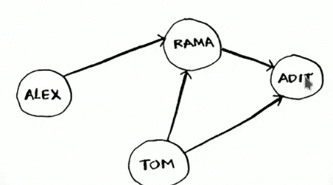
- Alex owes Rama money, Tom owes Adit modey, and so on.

---

- Each graph is made up of *nodes* and *edges*.
- 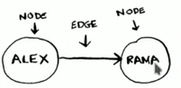
- A node can be directly connected to many other nodes.
- Those nodes are called it's neighbors.
- In this graph, RAma is Alex's neighbor. Adit isn't Alex's neighbor, because they aren't directly connected. But Adit is Rama's and Tom's neighbor.
- Graph are a way to model how different things are connected to one another.

## Breadth-first search

- We looked at a search algorithm in chapter 1 (binary search).
- Breadth-first is a different kind of search algorithm, one that runs on graph.
- It can help answer two types of questions:
  * Question type 1: Is there a path from node A to node B?
  * Question type 2: What is the shortest path from node A to node B?

---

- You already saw breadth-first search once time, when you calculate the shortest route from Twin Peaks to the Golden Gate Bridge.
- That was a question of type 2: "What is the shortest path?"
- Now let's look at the algorithm in more detail. You'll ask a question of type 1: "Is there a path?"
- Suppose you're the proud owner of a mango farm. You're looking for a mango seller who can sell your mangoes. 

---

- Are you connected to a mango seller on Facebook? Well, you can search through your friends.
- 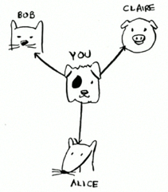

---

- This search is pretty straightforward.
- First, make a list of friends to search.
- 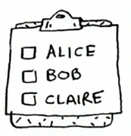
- Now, go to each person in the list and check wheter that person sells mangoes.
- 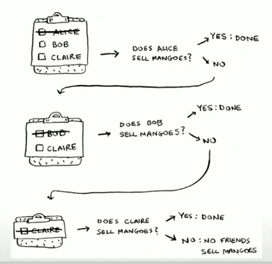

---

- Suppose none of your friends are mango sellers. Now you have to search through your friends friends.
- 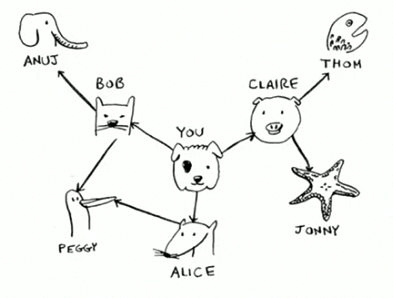

---

- Each time you search for someone from the list, add all of thier friends to the list.
- 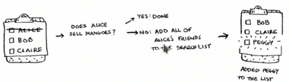
- This way, you not only search your friends, but you search thier friends, too.
- Remember, the goal is to find the one mango seller in your netowork.
- So if Alice isn't a mango seller, you add her friends to the list, too. That means you'll eventually search her friends and then their friends, and so on,
- With this algorithm, you'll search you entire netowork until you come acrosss a mango seller.
- This algorithm is breadth-first search.

## Finding the shortest path

- As a recap, these are two question that breadth-first search can answer for you:
  * Question type 1: Is there a path from node A to node B ? (Is there a mango seller in your netowork?).
  * Question type 2: What is the shortest from node A to node B? (Who is the closest seller?).
- You saw how to answer question 1, now let's try to answer question 2. con you find the closest mango seller?
- For example, your friends are first-degree connections, and their friends are second-degree connections. 

---

- You'd prefer a first-degree connection to a second-degree connection, and a second-degree connection to a thrid-degree connection, and so on.
- So you shouldn't search any second-degree connection before you make sure you don't have first-degree connection who is a mango seller.
- Breadth-first search already does this! The way breadth-first search works, the search radiiates out from the starting point.
- So you'll check first-degree connections before second-degree connections.

---

- Another way to see this is, first-degree connections are added to the search list before second-degree connections.
- You just go down the list and check people to see whether each one is a mango seller.
- 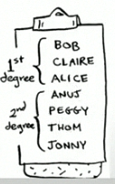

## Queue

- Suppose you and yourfriend are queueing up at the bus stop.
- If you're before him in the queue, you get on the bus first. A queue works the same way.
- Queues are similar to stacks. You can't access random elements in the queue.
- Instead, there are two only operations, *enqueue* and *dequeue*.

---

- 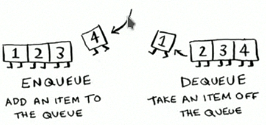
- If you enqueue two items to the list, the first item you added will be dequeue before the second item.
- You can use this for your search list!
- Peaple who are added to the list first will be dequeue and searched first.

---

- The queue is called **FIFO** data structure: *First in, First Out*.
- In contrast, a stack in a **LIFO** data structure: *Last in, First Out*.
- 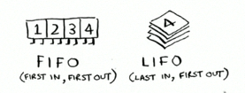

## Implementing the graph

- A graph consists of several nodes. And each node is connectied to neighboring nodes.
- 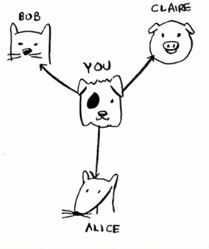

---

- How do you express a relationship like "you -> bob" ?
- Luckily, you know a data structure that lets you express relationship: a *hash table*!
- Remember, a hash table allows you to map a key to a value. In this case, you want to map a node to all of its neighbors.

---

- Here's how you'd write it in Python:

```python
graph = {}
graph['you'] = ['alice', 'bob', 'claire']
```

- Notice tat 'you' is mapping to an array.
- So `graph['you']` will give you an array of all the neighbors of 'you'.

---

- A graph is just a bunch of nodes and ages, so this is all you need to have a graph in Python.
- What about a biger graph, like this one?
- 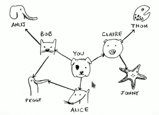

---

- Here it is as Python code:

```python
graph = {}
graph['you'] = ['alice', 'bob', 'clarie']
graph['bob'] = ['anuj', 'peggy']
graph['clarie'] = ['thom', 'jhonny']
graph['anuj'] = []
graph['peggy'] = []
graph['thom'] = []
graph['jhonny'] = []
```

- hash tables have no ordering, so it doesn't matter what order you add key/value pairs in.

---

- Anuj, Peggy, Thom, and Jonny don't have any neighbors.
- Thry have arrows pointing to them, but no arrows from them to someone else.
- This is called *directed graph* the relationship is only one way.
- So Anuj is Bob's neighbors, but Bob isn't Anuj's neighbor.
- An *undirected graph* doesn't have any arrows, and both nodes are each other's neighbors.
- For example, both of these graphs are equal.
- 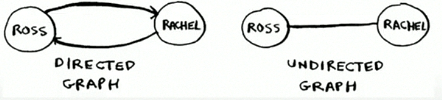

## Running time

- If you search you entire netowork for a mango seller, that means you'll follow each edge (remeber, an edge is the arrow or connection one person to another).
- So the running time is at least **O(number of edge)**.
- You also keep a queue of every person to search.
- Adding one person to the queue takes constant time: **O(1)**. Doing this for every person will take **O(number of peaple)** total.
- Breadth-first search takes **O(number of peaple + number of edges)**, and it's more commonly written as **O(V+E)** (V for number of *vertices*, E for number of *edges*).

## Recap

- Breadth-first search tells you if there's a path from A to B.
- If there's a path, breadth-first search will find the shortest path.
- If you have a problem like "find the shortest X," try modeling your problem as a graph, and use breadth-first search to solve.
- A *directed graph* has arrows, and the relationship follows the direction of the arrow (rama -> adit mmeans "rama owes adit modey").
- *Undirected graphs* don't have arrows, and the relationship goes both ways (ross - rachel means "ross deted rachel and rachel deted ross").
- *Queue* are *FIFO* ( *Frist In, Frist Out*).
- *Stacks* are *LIFO* ( *Last In, Frist Out*).
- You need to check people in the order they were added to the search list, so the search list need to be a queue. Otherwise, you won't get the shortest path.
- Once you check someone, make sure you don't check them again. Otherwise, you might end upp in an infinite loop.

