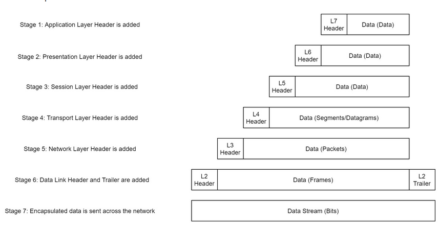
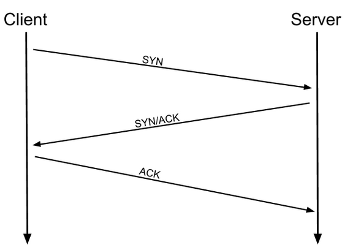
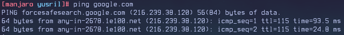
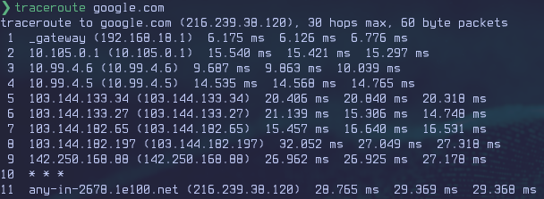
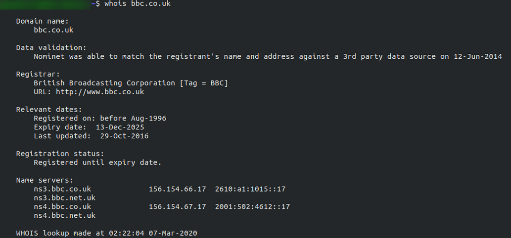
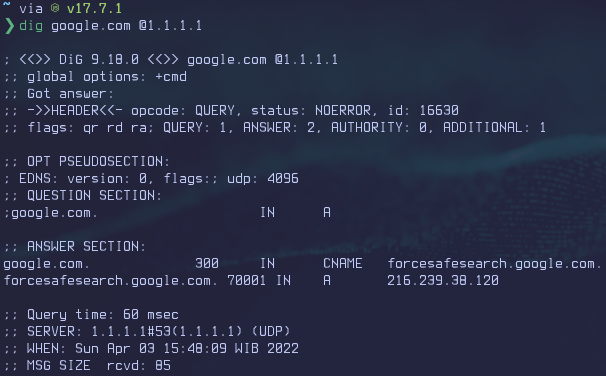
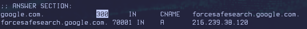

# Intro Networking

## OSI Layer

The OSI (Open System Interconnection) Model is a standardised.

| **OSI**      |
| ------------ |
| Application  |
| Presentation |
| Session      |
| Transport    |
| Network      |
| Data Link    |
| Physical     |

### Layer 7 Application

Providing an interface for them to use in order to transmit data.
When data is given to the application layer, it is passed down into presentation layer.

### Layer 6 Presentation

The Presentation layer receives data from the application layer.
This data in format that the application understands, but it's not necessarily is a standardised format that could be understood by the application layer in the _receiving_ computer.
The presentation layer translates the data into a standardised format, as well as handling any encryption, compression or other transformations to the data.
With this complete, the data is passed down to the session layer.

### Layer 5 Session

When the session layer receives the correctly formatted data from the presentation layer, it looks to see if it can set up a connection with the other computer across the network.
If it can't then it sends back an error and the process goes no further.
If session _can_ be established then it's the job of the session layer to maintain it, as well as co-operate with the session layer of the remote computer in other to synchronise communications.
The session layer is particularly important as the session that it creates is unique to the communication in question.
This is What allows you to make multiple request to different endpoints simultaneously without all the data getting mixed up (think about opening two tabs in a web browser at the same time)!
When the session layer has successfully logged a connection between the host and remoter computer the data is passed down to Layer 4:the transport Layer.

### Layer 4 Transport

The transport layer is very interesting layer that serves numerous important functions.
Its first purpose is to choose the protocol over the data is to be transmitted.
The two most common protocols in the transport layer are **TCP** (Transmit Control Protocol) and **UDP** (User Datagram Protocol); with TCP the transmission is _connection-based_ which means that a connection between the computers is established and maintained for the duration of the request.
This allow for a reliable transmission, as the connection can be used to ensure that packets _all_ get to the right place.
A TCP connection allows the two computers to remain in constant communication to ensure that the data is sent at an acceptable speed, and that any lost data is re-sent.
With UDP, the opposite is true;packets of data are essentially thrown at the receiving computer -- if it can't keep up the that's _its_ problem (this is why a video transmission over something like Skype can be pixelated if the connection is bad).
What this means is that would usually be chosen for situation where accuracy is favoured over speed (e.g. file transfer, or loading a webpage), and UDP would be used is situation where speed is more important (e.g. video streaming).

With a protocol selected, the transport layer then divides the transmission up into bite-sized pieces (over TCP there are called _segments_, over UDP they're called _datagrams_), which makes it easier to transmit the massage successfully.

### Layer 3 Network

The network layer is responsible for location the destination of your request. For example, the internet is a huge network; when you want to request information from a webpage, it's the network layer that takes the IP address for the page and figures out the best route to take.
At this stage we're working with what is refereed to as _Logical_ addressing (i.e. IP address) which are still software controlled.
Logical addresses are used to provide order to networks, categorising them and allowing us to properly sort them.
Currently the most common from of logical addressing is the IP Version 4 format, which you'll likely already be familiar with (i.e. 192.168.1.1 is a common address for a home router).

### Layer 2 Data Link

The data link layer focuses on the _physical_ addressing of the transmission.
It receives a packet from the network layer (that includes the IP address for the remote computer) and in the physical (MAC) address of the receiving endpoint.
Inside every network enabled computer is a Network Interface Card (NIC) which comes with a unique MAC (Media Access Control) address to identify it.

MAC addresses are set by the manufacturer and literally burnt into the card; they can't be changed -- although they _can_ be spoofed.
When information is sent across a network, it's actually the physical address that is used to identify where exactly to send the information.

Additionally, it's also the job of the data link layer to present the data in a format suitable for transmission.

The data link layer also serves an important function when it receives data, as it checks the receives information to make sure that it hasn't been corrupted during transmission, which could well happen when the data is transmitted by layer 1:the physical layer.

### Layer 1 Physical

The physical layer is right down to the hardware of the computer.
This is where the electrical pulses that make up data transfer over a network are sent and received.
It's the job of the physical layer to convert the binary data of the transmission into signals and transmit them across the network, as well as receiving incoming signals and converting them back into binary data.

## Encapsulation

As the data is passed down each layer of the model, more information containing details specific to the layer in question is added on to the start of the transmission.
As an example, the header added by the Network Layer would include things like the source and destination IP addresses, and the header added by the Transport Layer would include (amongst other things) information specific to the protocol being used.
The data link layer also adds a piece on at the _end_ of the transmission, which is used to verify that the data has not been corrupted on transmission; this also has the added bonus of increased security, as the data can't be intercepted and tampered with without breaking the railer.
This whole process is referred to as _encapsulation_; the process by which data can be sent from one computer to another.



Notice that the encapsulation data is given a different name at different steps of the process.
In layers 7,6,5, the data is simply referred as a data. In the transport layer the encapsulated data is refereed to as a segment or a datagram (depending on whether TCP or UDP has been selected as a transmission protocol).
At the Network Layer, the data is refereed to as a packet.
When the packet gets passed down to the Data Link layer it becomes a frame, and by the time it's transmitted across a network the frame has bee broken down into bits.

When the message is received by the second computer, it reverses the process -- starting at the physical layer and working up until it reaches the application layer, stripping off the added information as it goes.
This is refereed to as -- _de-encapsulation_.
As such you can think of the layers of the OSI model as existing inside every computer with network capabilities.
Whilst it's not actually as clear cut in practice, computers all follow the same process of encapsulation to send data and de-encapsulation upon receiving it.

The processes of encapsulation and de-encapsulation are very important -- not least because of their practical use, but also because they give as a standardised method for sending data.
This means that all transmission will consistently follow the same methodology, allowing any networking enabled device to send a request to any other reachable device and be sure that it will be understood -- regardless of whether they are from the same manufacturer; use the same operating system; or any other factors.

## The TCP/IP Model

The TCP/IP model, in many ways, very similar to the OSI model. It's a few years older, and serves as the basis for real-world networking.
The TCP/IP model consist of four layer:Application, Transport, Internet and Network Interface.
Between them, these cover the same range of function as the seven layers of the OSI Model.

| **TCP/IP**        |
| ----------------- |
| Application       |
| Transport         |
| Internet          |
| Network Interface |

**Note**: _Some recent sources split the TCP/IP model into five layers into Data Link and Physical layers (as with the OSI model). This is accepted and well-known; however, it is not officially defined (unlike the original four layers which are defined in RFC1122). It's up to you which version you use - both are generally considered valid._

You would be justified in asking why we bother with the OSI model if it's not actually used for anything in the real-world.
The answer to that question is quite simply that the OSI model (due to being less condensed and more rigid than the TCP/IP model) tends to be easier for learning the initial theory of networking.

The two models match up something like this.

| OSI          | TCP/IP            |
| ------------ | ----------------- |
| Application  | Application       |
| Presentation | Application       |
| Session      | Application       |
| Transport    | Transport         |
| Network      | Internet          |
| Data Link    | Network Interface |
| Physical     | Network Interface |

The processes of encapsulation and de-encapsulation work in exactly the same way the TCP/IP model as they do with the OSI model.
At each layer of the TCP/IP model a header is added during encapsulation, and removed during de-encapsulation.

---

Now let's get down to the practical side of things.

A layered model is great as a visual aid -- it shows us the general process of how data can be encapsulated and sent across a network, but how does it actually happen ?

When we talk about TCP/IP, it's all well and good to think about a table with four layers in it, but we're actually talking about a suite of protocols -- sets of rules that define how an action is to be carried out.
TCP/IP takes its name from the two most important of these: the **Transmission Control Protocol** (which we touched upon earlier in the OSI model) that controls the flow of data between two endpoints, and the **Internet Protocol**, which controls how packets are addressed and sent.
There are many more protocols that make up the TCP/IP suite; we will cover some of these in later tasks.
For now tough, let's talk about TCP.

As mentioned earlier, TCP is a _connection-based_ protocol.
In other words, before you send any data via TCP, you must first form a stable connection between the two computers.
The process of forming this connection is called the _three-way handshake_.

When you attempt to make a connection, you computer first sends a special request to the remote server indicating that it wants to initialise a connection.
This request contains something called _SYN_ (short for _synchronise_) bit, which essentially makes first contact in starting the connection process.
The server will then respond with a packet contain the SYN bit, as well as another "acknowledgement" bit, called _ACK_.
Finally, your computer will sends a packet that contains the ACK bit by itself, confirming that the connection has been setup successfully.
With the three-way handshake successfully completed, data can be reliably transmitted between the two computers.
Any data that is lost or corrupted on transmission is re-sent, thus leading to a connection which appears to be lossless.



History:

It's important to understand exactly why the TCP/IP and OSI models were originally created.
To begin with there was no standardisation -- different manufacturers followed their own methodologies, and consequently systems made by different manufacturers were completely incompatible when it came to networking.
The TCP/IP model was introduced by the American DoD in 1982 to provide a standard -- something for all of the different manufacturers to follow.
This sorted out the inconsistency problems.
Later the OSI model was also introduced by the International Organisation for Standardisation (ISO); however, it's mainly used as a more comprehensive guide for learning, as the TCP/IP model is still the standard upon which modern networking is based.

## Networking Tools

### Ping

At this stage, hopefully all of the theory has made sense and you now understand the basic models behind computer networking.
For the rest of the room we're going to be taking a look at some of the command line networking tools that we can use in practical applications.
Many of these tools do work on other operating systems, but for the sake of simplicity, I'm going to assume that you're running Linux for the rest of this room.
The first tool that we're going to look at will be the `ping` command.

---

The ping command is used when we want to test whether a connection to a remote resource is possible.
Usually this will be a website on the internet, but it could also be for a computer on your home network if you want to check if it's configured correctly
Ping works using the ICMP protocol, which is one of the slightly less well-known TCP/IP protocols that were mentioned earlier.
The ICMP protocol works on the Network layer of the OSI Model, and thus the Internet layer of the TCP/IP model.
The basic syntax for ping is `ping <target>`.
In this example we are using ping to test whether a network connection to Google is possible:



Notice that the ping command actually returned the IP address for the Google server that it connected to, rather than the URL that was requested.
This is a handy secondary application for ping, as it can be used to determine the IP address of the server hosting a website.
One of the big advantages of ping is that it's pretty much ubiquitous to any network enabled device.
All operating systems support it out of the box, and even most embedded devices can use ping!

### Traceroute

The logical follow-up to the ping command is 'traceroute'.
Traceroute can be used to map the path your request takes as it heads to the target machine.

The internet is made up of many, many different servers and end-points, all networked up to each other.
This means that, in order to get to the content you actually want, you first need to go through a bunch of other servers.
Traceroute allows you to see each of these connections -- it allows you to see every intermediate step between your computer and the resource that you requested.
The basic syntax for traceroute on Linux is this: `traceroute <destination>`.

By default, the Windows traceroute utility (`tracert`) operates using the same ICMP protocol that ping utilises, and the Unix equivalent operates over UDP.
This can be altered with switches in both instances.



You can see that it took 13 hops to get from my router (`_gateway`) to the Google server at 216.58.205.46

### Whois

Domain Names -- the unsung saviours of the internet.

Can you imagine how it would feel to remember the IP address of every website you want to visit? Horrible thought.

Fortunately, we've got domains.

We'll talk a little bit more about how this works in the next task, but for now suffice to know that a domain translates into an IP address so that we don't need to remember it (e.g. you can type tryhackme.com, rather than the TryHackMe IP address).
Domains are leased out by companies called Domain Registrars.
If you want a domain, you go and register with a registrar, then lease the domain for a certain length of time.

Enter Whois.

Whois essentially allows you to query who a domain name is registered to.
In Europe personal details are redacted; however, elsewhere you can potentially get a great deal of information from a whois search.

There is a [web version](https://www.whois.com/whois/) of the whois tool if you're particularly adverse to the command line. Either way, let's get started!

(_Note: You may need to install whois before using it. On Debian based systems this can be done with_ `sudo apt update && sudo apt-get install whois`)

Whois lookups are very easy to perform.
Just use `whois <domain>` to get a list of available information about the domain registration:



### Dig

We talked about domains in the previous task -- now lets talk about how they work.

Ever wondered how a URL gets converted into an IP address that your computer can understand? The answer is a TCP/IP protocol called DNS (Domain Name System).

At the most basic level, DNS allows us to ask a special server to give us the IP address of the website we're trying to access.
For example, if we made a request to www.google.com, our computer would first send a request to a special DNS server (which your computer already knows how to find).
The server would then go looking for the IP address for Google and send it back to us. Our computer could then send the request to the IP of the Google server.

---

Let's break this down a bit.

You make a request to a website.
The first thing that your computer does is check its local cache to see if it's already got an IP address stored for the website; if it does, great. If not, it goes to the next stage of the process.

Assuming the address hasn't already been found, your computer will then send a request to what's known as a _recursive_ DNS server.
These will automatically be known to the router on your network.
Many Internet Service Providers (ISPs) maintain their own recursive servers, but companies such as Google and OpenDNS also control recursive servers.
This is how your computer automatically knows where to send the request for information: details for a recursive DNS server are stored in your router.
This server will also maintain a cache of results for popular domains; however, if the website you've requested isn't stored in the cache, the recursive server will pass the request on to a _root name server_.

Before 2004 there were precisely 13 root name DNS servers in the world.
These days there are many more; however, they are still accessible using the same 13 IP addresses assigned to the original servers (balanced so that you get the closest server when you make a request).
The root name servers essentially keep track of the DNS servers in the next level down, choosing an appropriate one to redirect your request to.
These lower level servers are called _Top-Level Domain_ servers.

Top-Level Domain (TLD) servers are split up into extensions. So, for example, if you were searching for tryhackme.com your request would be redirected to a TLD server that handled `.com` domains.
If you were searching for bbc.co.uk your request would be redirected to a TLD server that handles `.co.uk` domains.
As with root name servers, TLD serves keep track of the next level down:_Authoritative name servers_,
When a TLD server receives you request for information, the server passed it down to an appropriate Authoritative name server,

Authoritative name servers are used to store DNS records for domains directly.
In other words, every domain in the world will have its DNS records stored on an Authoritative name server somewhere or another; they are the source of the information.
When your request reaches the authoritative name server for the domain you're querying, it will send the relevant information back to you, allowing your computer to connect to the IP address behind the domain you requested.

---

When you visit a website in your web browser this all happens automatically, but we can also do it manually with a tool called `dig`.
Like ping and traceroute, dig should be installed automatically on Linux systems.

Dig allows us to manually query recursive DNS servers of our choice for information about domains:

```
dig <domain> @<dns-server-ip>
```

It is a very useful tool for network troubleshooting.



This is a _lot_ of information. We're currently most interested in the `ANSWER` section for this room;however, taking the time to learn what the rest of this means is a very good idea.
In summary, that information us that we set it one query and successfully (i.e. No Errors) received one full answer -- which, as expected, contains the IP address for the domain name that we queried.

Another interested piece of information that dig gives us is the TTL (Time To Live) of the queried DNS records.
As mentioned previously, when your computer queries a domain name, it stored the results in its local cache.
The TTL of the record tells your computer when to stop considering the record as being valid -- i.e. when it should request the data again, rather than relying on the cache copy.

The TTL can be found in the second column of the answer section:


It's important to remember that TTL (in the context of DNS caching) is measured in _seconds_, so the record in the example will expire in two minutes and thirty seven seconds.
