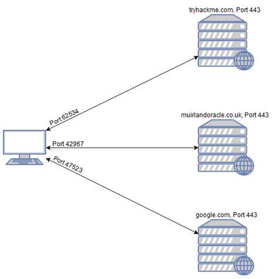
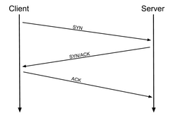
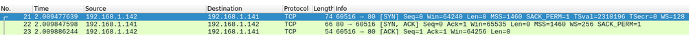
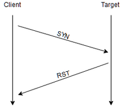
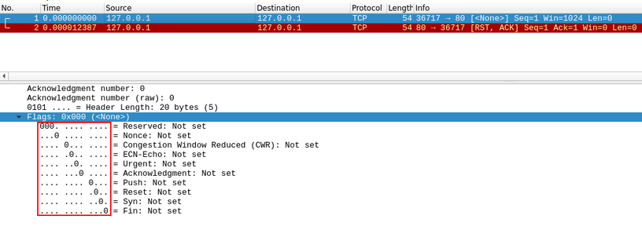
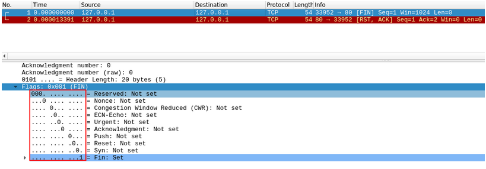
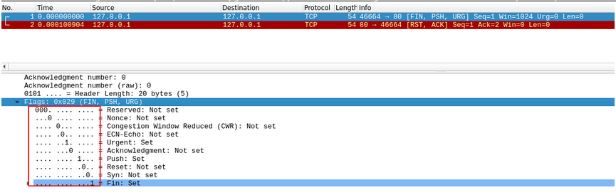
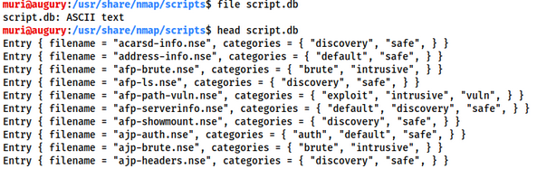
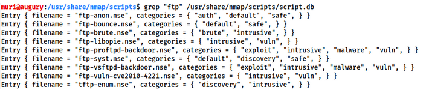
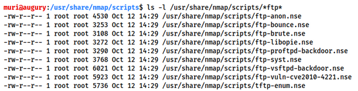

# Nmap

## Introduction

When it comes to hacking, knowledge is power.
The more knowledge you have about a target system or network, the more options you have available.
This makes it imperative that proper enumeration is carried out before any exploitation attempts are made.

Say we have been given an IP (or multiple IP addresses) to perform a security audit on.
Before we do anything else, we need to get an idea of the "landscape" we are attacking.
What is means is that we need to establish which services are running on the targets.
For example, perhaps one of them is running a webserver, and another is acting as a Windows Active Directory Domain Controller.
The first stage in establish this "map" of the landscape is something called port scanning.
When a computer runs a network service, it opens a networking construct called a "port" to receive the connection.
Ports are necessary for making multiple network requests or which tab is loading which web page.
This is done by establishing connections to the remote web servers using different ports on your local machine.
Equally, if you want a server to be able to run more than one service (for example, perhaps you want your web server to run both HTTP and HTTPS versions of the site), then you need some way to direct the traffic to the appropriate service.
Once again, ports are the solution to this.
Networking connections are made between two ports - an open port listening on the server and a randomly selected port on your own computer.
For example, when you connect to a web page, your computer may open port 49534 to connect to the server's port 443.



As in the previous example, the diagram shows what happens when you connect to numerous websites at the same time.
Your computer opens up a different, high-numbered port (at random), which is used for all its communications with the remote server.

Every computer has a total of 65535 available ports; however, many of these are registered as standard port.
For example, a HTTP Web Service can nearlyy always be found on port 80 of the server.
A HTTPS Web Service can be found on port 443.
Windows NETBIOS can be found on port 139 and SMB can be found on port 445.
It is important to note; nowever, that especially in a CTF setting, it is not unheard of for even these standard ports to be altered, making it even more imperative that we perform appropriate enumeration on the target.

If we don't no know which of these ports a server has open, then we do not have to hope of successfully attacking the target;thus, it is crucial that we begin any attack with a port scan.
This can be accomplished in a variety of ways – usually using a tool called nmap, which is the focus of this room.
Nmap can be used to perform many different kinds of port scan – the most common of these will be introduced in upcoming tasks; however, the basic theory is this: nmap will connect to each port of the target in turn.
Depending on how the port responds, it can be determined as being open, closed, or filtered (usually by a firewall).
Once we know which ports are open, we can then look at enumerating which services are running on each port – either manually, or more commonly using nmap.

So, why nmap? The short answer is that it's currently the industry standard for a reason: no other port scanning tool comes close to matching its functionality (although some newcomers are now matching it for speed).
It is an extremely powerful tool – made even more powerful by its scripting engine which can be used to scan for vulnerabilities, and in some cases even perform the exploit directly! Once again, this will be covered more in upcoming tasks.

## Nmap Switches

Like most pentesting tools, nmap is run from the terminal.
There are versions available for both Windows and Linux. For this room we will assume that you are using Linux; however, the switches should be identical.

Nmap can be accessed by typing `nmap` into the terminal command line, followed by some of the "switches" (command arguments which tell a program to do different things) we will be covering below.

All you'll need for this is the help menu for nmap (accessed with `nmap -h`) and/or the nmap man page (access with `man nmap`).
For each answer, include all parts of the switch unless otherwise specified. This includes the hyphen at the start (`-`).

## Overview (Scan Types)

When port scanning with Nmap, there are there are three basic scan types. These are:

- TCP Connect Scans (`-sT`)
- SYN "Half-open" Scans (`-sS`)
- UDP Scans (`-sU`)

Additionally there are several less common port scan types, some of which we will also cover (albeit in less detail). These are:

- TCP Null Scans (`-sN`)
- TCP FIN Scans (`-sF`)
- TCP Xmas Scans (`-sX`)

Most of these (with the exception of UDP scans) are used for very similar purposes, however, the way that they work differs between each scan.
This means that, whilst one of the first three scans are likely to be your go-to in most situations, it's worth bearing in mind that other scan types exist.

## TCP Connect Scans

To understand TCP Connect Scans (`-sT`), it's important that you're comfortable with the _TCP three-way handshake_
If this term is new to you then completing [Introductory Networking](https://tryhackme.com/room/introtonetworking) before continuing would be advisable.

As a brief recap, the three-way handshake consist of three stages.
First the connecting terminal (our attacking machine, in this instance) sends a TCP request to the target server with the SYN flag set.
The server then acknowledges this packet with a TCP response containing the SYN flag, as well as the ACK flag.
Finally, our terminal completes completes the handshake by sending a TCP request with the ACK flag set.





This is one of the fundamental principles of TCP/IP networking, but how does it relate to Nmap?

Well, as the name suggests, a TCP Connect scan works by performing the three-way handshake with each target port in turn.
In other words, Nmap tries to connect to each specified TCP port, and determines whether the service is open by the response it receives.

---

For example, if a port is closed, [RFC 739](https://tools.ietf.org/html/rfc793) state that:

> _... If the connection does not exist (CLOSED) then a reset a is sent in response to any incoming segment except another reset. In particular, SYNs addressed to a non-existent connection are rejected by this means."_

In other words, if Nmap sends a TCP request with the _SYN_ flag set to a **closed** port, the target server will respond with a TCP packet with the _RST_ (Reset) flag set.
By this response, Nmap can establish that the port is closed



If, however, the request is sent to an _open_ port, the target will respond with a TCP packet with the SYN/ACK flag set.
Nmap then marks this port as being _open_ (and completes the handshake by sending a TCP packet with ACK set).

---

This is all well and good, however, there is a third possibility.

What if the port is open, but hidden behind a firewall?

Many firewalls are configured to simply **drop** incoming packets.
Nmap sends a TCP SYN request, and receives nothing back.
This indicates that the port is being protected by a firewall and thus the port is considered to be _filtered_.

That said, it is very easy to configure a firewall to respond with a RST TCP packet.
For example, in IPtables for Linux, a simple version of the command would be as follows:

```
IPtables -I INPUT -p tcp --dport <port> -j REJECT --reject-with  tcp-reset
```

This can make it extremely difficult (if not impossible) to get an accurate reading to the target(s).

## SYN Scans

As with TCP scans, SYN scans (`-sS`) are used to scan the TCP port-range of a target or targets;however, the two scan types work slightly differently.
SYN scans are sometimes referred to as "_Half-open_"scan, or "_Stealth_"scans.

Where TCP scans perform a full three-way handshake with the target, SYN scans sends back a RST TCP packet after receiving a SYN/ACK from the server (this prevents the server from repeatedly trying to make the request). In other words, the sequence for scanning an **open** port looks like this:

## UDP scans

Unlike TCP, UDP connections are _stateless_.
This means that, rather than initiating a connection with a back-and-forth "handshake", UDP connections rely on sending packets to a target port and essentially hoping that they make it.
This makes UDP superb for connections which rely on speed over quality (e.g. video sharing), but the lack of of acknowledgement makes UDP significantly more difficult (and muc slower) to scan.
The switch for an Nmap UDP scan is (`-su`)

When a packet is sent to an open UDP port, there be no response.
When this happens, Nmap refers to the port as being `open|filtered`.
In other words, it suspects that the port is open, but it could be firewalled.
It it gets a UDP response (which is very unusual), then the port is marked as _open_.
More commonly there is no response, in which case the request is sent a second time as a double-check.
If there is still no response that the port is marked _open/filtered_ and Nmap moves on.

When a packet is sent to a _closed_ UDP port, the target should respond with an ICMP (ping) packet containing a message that the port is unreachable.
This clearly identifies closed ports, which Nmap marks as such and moves on.

---

Due to this difficulty in identifying whether a UDP port is actually open, UDP scans tend to be incredibly slow is comparison to the various TCP scans (in the region of 20 minutes to scan the first 1000 ports, with a good connection).
For this reason it's usually good practice to run an Nmap with `--top-ports <number>` enabled.
For example, scanning with `nmap -sU --top-ports 20 <target>`.
Will scan the top 20 most commonly used UDP ports, resulting in a mush more acceptable scan time.

---

When scanning UDP ports, Nmap usually sends completely empty requests - just raw UDP packets.
That said, for ports which are usually occupied by well-known services, it will instead send a protocol-specific payload which is more likely to elicit a response from which a more accurate result can be drawn.

## NULL, FIN, and Xmas

NULL, FIN and Xmas TCP port scans are less commonly used than any of the others we've covered already, so we will not go into a huge amount of depth here.
All three are interlinked and are used primarily as they tend to be even stealthier, relatively speaking, than a SYN "stealth" scan. Beginning with NULL scans:

- As the name suggests, NULL scans (`-sN`) are when the TCP request is sent with no flags set at all. As per the RFC, the target host should respond with a RST if the port is closed \
  
- FIN scans (`-sF`) work in an almost identical fashion; however, instead of sending a completely empty packet, a request is sent with the FIN flag (usually used to gracefully close an active connection). Once again, Nmap expects a RST if the port is closed.\
  
- As with the other two scans in this class, Xmas scans (`-sX`)send a malformed TCP packet and expects a RST response for closed ports. It's referred to as an xmas scan as the flags that it sets (PSH, URG and FIN) give it the appearance of a blinking christmas tree when viewed as a packet capture in Wireshark.\
  

The expected response for _open_ ports with these scans is also identical, and is very similar to that of a UDP scan.
If the port is open then there is no response to the malformed packet. Unfortunately (as with open UDP ports), that is _also_ an expected behaviour if the port is protected by a firewall, so NULL, FIN and Xmas scans will only ever identify ports as being _open/filtered, closed,_ or _filtered_.

It's also worth noting that while RFC 793 mandates that network hosts respond to malformed packets with a RST TCP packet for closed ports, and don't respond at all for open ports; this is not always the case in practice.
In particular Microsoft Windows (and a lot of Cisco network devices) are known to respond with a RST to any malformed TCP packet -- regardless of whether the port is actually open or not.
This results in all ports showing up as being closed.

That said, the goal here is, of course, firewall evasion.
Many firewalls are configured to drop incoming TCP packets to blocked ports which have the SYN flag set (thus blocking new connection initiation requests).
By sending requests which do not contain the SYN flag, we effectively bypass this kind of firewall.
Whilst this is good in theory, most modern IDS solutions are savvy to these scan types, so don't rely on them to be 100% effective when dealing with modern systems.

## ICMP Network Scanning

On first connection to a target network in a black box assignment, our first objective is to obtain a "map" of the network structure -- or, in other words, we want to see which IP addresses contain active hosts, and which do not.

One way to do this is by using Nmap to perform a so called "ping sweep".
This is exactly as the name suggests: Nmap sends an ICMP packet to each possible IP address for the specified network.
When it receives a response, it marks the IP address that responded as being alive.
For reasons we'll see in a later task, this is not always accurate; however, it can provide something of a baseline and thus is worth covering.

To perform a ping sweep, we use the `-sn` switch in conjunction with IP ranges which can be specified with either a hyphen (`-`) or CIDR notation. i.e we could scan the `192.168.0.x` network using:

- `nmap -sn 192.168.0.1-254`
- `nmap -sn 192.168.0.0/24`

The `-sn` switch tells Nmap not to scan any ports -- forcing it to rely primarily on ICMP echo packets (or ARP request on a local network, if run with sudo or directly as root user) to identify targets.
In addition to the ICMP echo requests, the `-sn` switch will also cause nmap to send a TCP SYN packet to port 443 of the target, as well as a TCP ACK (or TCP SYN if not run as sudo) packet to port 80 of the target.

## Overview (NSE Scripts)

The Nmap Scripting Engine (NSE) is an incredibly powerful addition to nmap, extending its functionality quite considerably.
NSES Scripts are written in the _Lua Programming Language_, and can be used to do a variety of things;from scanning for vulnerabilities, to automating exploits for them.
The NSE is particularly useful reconnaissance, however, it is well worth bearing in mind how extensive the script library is.

There are many categories available. Some useful categories inculde:

- `safe`:- Won't affect the target
- `vuln`:- Scan for vulnerabilities
- `intrucsive`:- Not safe: likely to affect the target
- `exploit`:- Attempt to exploit a vulnerability
- `auth`:- Attempt to bypass authentication for running services (e.g. Log into an FTP server anonymously)
- `brute`:- Attempt to bruteforce credentials for running services
- `discovery`:- Attempt to query running services for further information about the network (e.g query an SNMP server).

A more exhaustive list can be found [here](https://nmap.org/book/nse-usage.html).

## Working with the NSE

In Task 3 we looked very briefly at the `--script` switch for activating NSE script from the `vuln` category using `--script=vuln`.
It should come as no surprise that the other categories work in exactly the same way.
If the command `--script=safe` is run, then any applicable safe scripts will be run against the target (Note: only scripts which the target an active service will be activated)

---

To run a specific script, we would use `--script=<script-name>`, e.g. `--script=http-fileupload-exploiter`.

Multiple scripts can be run simultaneously in the fashion by separating then by a coma. For example `--script=smb-enum-users,smb-enum-shares`.

Some script require arguments (for example, credentials, if they're exploiting an authenticated vulnerability).
These can be given with the `--script-args` Nmap switch.
An example of this would be with the `http-put` script (used to upload files using the PUT method).
This takes two arguments:the URL to upload the file to, and the file's location on disk. For example:

```
nmap -p 80 --script http-put --script-args http-put.url='/dav/shell.php',http-put.file='./shell.php'
```

Note that the arguments are separated by comas, and connected to the corresponding script with periods (i.e `<script-name>.<argument>`).
A full list of scripts and their corresponding arguments (along with example use cases) can be found [here](https://nmap.org/nsedoc/).

## Searching for Scripts

Ok, so we know how to use the scripts in Nmap, but we don't yet know how to _find_ these scripts.

We have two options for this, which should ideally be used in conjunction with each other.
The first is the page on the [Nmap websites](https://nmap.org/nsedoc/) (mentioned in the previous task) which contains a list of all official scripts.
The second is the local storage on your attacking machine.
Nmap stores its scripts on Linux at `/usr/share/nmap/scripts/`.
All of the NSE scripts are stored in this directory by default -- this is where Nmap looks for scripts when you specify them.

There are two ways to search for installed scripts.
One is by using the `/usr/share/nmap/scripts/script.db` file.
Despite the extension, this isn't actually a database so much as a formatted text file containing filenames and categories for each available script.



Nmap uses this file to keep track of (and utilise) scripts for the scripting engine;however,we can also _grep_ through it to look for script. For example:

```
grep "ftp" /usr/share/nmap/scripts/script.db
```



The second way to search is quite simply to use the `ls` command. For example, we could get the same results as in the previous screenshot by using

```
ls -l /usr/share/nmap/scripts/*ftp*
```



_Note the use of asterisks_ (`*`) on either side of the search term.

The same techniques can also be used to search for categories of script. For example:

```
grep "safe" /usr/share/nmap/scripts/script.db
```


---

<u>_Installing New Scripts_</u>

We mentioned previously that the Nmap website contains a list of scripts, so, what happens if one of these is missing in the `scripts` directory locally ?
A standard `sudo apt update && sudo apt install nmap` should fix this;however, it's also possible to install the scripts manually by downloading the script from Nmap (`sudo wget -o /usr/share/nmap/scripts/<script-name>.nse`).
This must then be followed up with `nmap --script-updatedb`, which updates the `script.db` file to contain the newly downloaded script.

It's worth noting that you would require the same "updatedb" command if you were to make your own NSE script and add it into Nmap - a more than manageable task some basic knowledge of Lua!

## Firewall Evasion

We have already seen some techniques for bypassing firewalls (think stealth scans, along with NULL, FIN, and Xmas scans);however, there is another very common firewall configuration which it's imperative we know to bypass.

Your typical Windows host will, with its default firewall, block all ICMP packets.
The presents a problem: not only do we often use _ping_ to manually establish the activity of target, Nmap does the same thing by default.
This means that Nmap will register a host this firewall configuration as dead and not bother scanning it at all.

So, we neet a way to get around this configuration.
Fortunately Nmap provides an potion for this `-Pn`, which tells nmap not bother pinging the host before scanning it.
This means that nmap will always treat the target host(s) as being alive, effectively bypassing the ICMP block;however, it comes at the price of potentially taking a very long time to complete the scan (if the host is dead then nmap will still be checking the double checking every specified port).

It's worth noting that if you're already directly on the local network, nmap can also use ARP request to determine host activity

---

There are a variety other switches which nmap considers useful for firewall evasion.
We will not go through these in detail, however, they can be found [here](https://nmap.org/book/man-bypass-firewalls-ids.html)

The following switches are of particular note:

- `-f` Used to fragment the packets (i.e. split them into smaller pieces) making it less likely that packets will be detected by a firewall or IDS.
- An alternative to `-f`, but providing more control over the size of the packets : `--mtu <number>`, accepts a maximum transmission unit size to use for the packets sent. This _must_ be a multiple of 8.
- `--scan-delay <time>ms` used to add a delay between packets sent. This is very useful if the network is unstable, but also for evading any time-based firewall/IDS triggers which may be in place.
- `--badsum` this is used to generate in invalid checksum for packets. Any real TCP/IP stack would drop this packet, however, firewall may potentially respond automatically, without bothering to check the checksum of the packet. As such, this switch can be userd to determine the presence of a firewwall/IDS.

