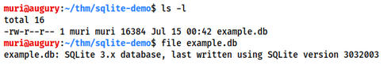
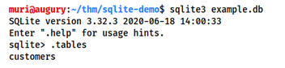
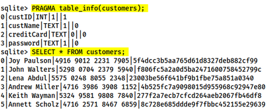
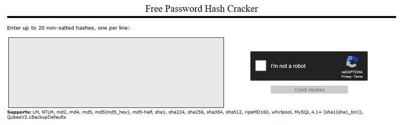
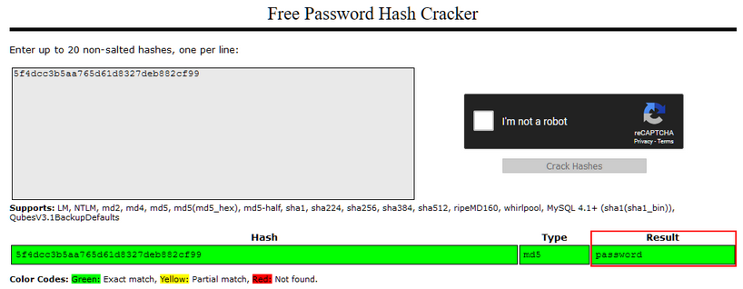
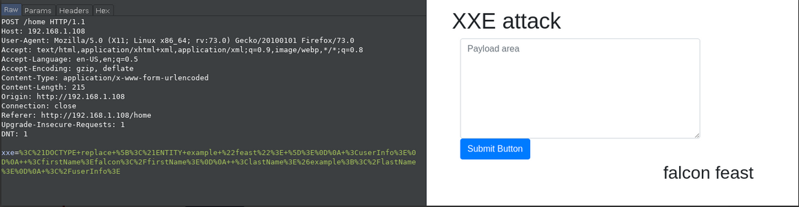
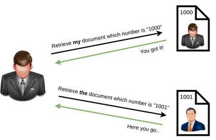

# OWASP

This room breaks each OWASP topic down and includes details on what the vulnerability is, how it occurs and how you can exploit it.
You will put the theory into practice completing supporting challenges.

1. Injection
2. Broken Authentication
3. Sensitive Data Exposure
4. XML External Entity
5. Broken Access Control
6. Security Misconfiguration
7. Cross-site Scripting
8. Insecure Deserialization
9. Components with Known Vulnerability
10. Insufficent Logging & Monitoring

## [Severity 1] Injection

Injection flaws are very common in application today.
These flaws occur because user controlled input is interpreted by these technologies.
Some common examples include:

- SQL Injection: This occurs when user controlled input is passed to SQL queries. As a result, an attacker can pass in SQL queries to manipulate the outcome of such queries
- Command Injection: This occurs when user input is passed to system commands. As a result, an attacker is able to execute arbitrary system commands on application servers.

If an attacker is able to successfully pas input that in interpreted correctly, they would be able to do the following:

- Access, Modify and Delete information in a database when this input is passed into database queries. This would mean that an attacker can steal sensitive information such as personal details and credentials.
- Execute arbitrary system commands on a server that would allow an attacker to gain access to users' systems. This would enable them to steam sensitive data and carry out more attacks against infrastructure linked to the server on which the commands is executed.

The main defence for preventing injection attacks is ensuring that user controlled input is not interpreted as queries or commands. There are different ways of doing this:

- Using an allow list: when input is sent to the server, this input is compared to a list of safe input or characters. If the input is marked as safe, then it is processed. Otherwise, it is rejected and the application throws an error.
- Stripping input: If the input contains dangerous characters, these characters are removed before they are processed.

Dangerous characters or input is classified as any input that can change how the underlying data is processed. Instead of manually constructing allow lists or even just stripping input, there are various libraries that perform these actions for you.

## [Severity 1] Os Command Injection

Command Injection occurs when server-side code (like PHP) in a web application makes a system call on the hosting machine.
It is a web vulnerability that allows an attacker to take advantage of that made system call to execute operating system commands on the server.
Sometimes this won't always end in something malicious, like a `whoami` or just reading of files.
That isn't too bad.
But the thing about command injection is opens up many options for the attacker.
The worst thing they could do would be to spawn a reverse shell to become the user that the web server is running as.
A simple `;nc -e /bin/bash` is all that's needed and they own your server; *some variant of netcat don't support the -e option.* 
You can use a list of [these](https://github.com/swisskyrepo/PayloadsAllTheThings/blob/master/Methodology%20and%20Resources/Reverse%20Shell%20Cheatsheet.md) reverse shells as an alternative.

Once the attacker has a foolt hold on the web server, they can start the usual enumeration of your systems and start looking for ways to pivot around.
Now that we know what command injection is, we'll start going into the different types and how to test for them.

## [Severity 1] Command Injection Practical 

**What is Active Command Injection** 

Blind command injection occurs when the system command made to the server does not return the response to the in the HTML document.
Active command injection will return the response to the user.

Let's consider a scenatio: EvilCorp has started development on a web based shell but has accidentally left is exposed to the internet.
It's nowhere near finished but contains the same command injection vulnerability as before!
But this time, the response from the system call can be seen on the page!
They'll never learn!

Just like before, let's look at the cample code from `evilshell.php` and go over what it's doing and why it makes it active command injection.
See if you can figure it out.
I'll go over it below just as before.

**EvilShell (evilshell.php) Code Example**

```php
<?php
if (isset($_GET['commandString'])) {
  $command_string = $_GET['commandString'];

  try{
    passthru($command_string):
  } catch (Error $error) {
    echo "<p class=mt-3><b>$error</b></p>";
  }
}
?>
```

In pseudocode, the above 

1. Checking if parameter "commandString" is set.
2. If it is, then the variable `$command_string` gets what was passed into the input field.
3. The program then goes into a try block to execute the function `passthru($command_string)`. You can read the docs on `passthru()` on [PHP's website](https://www.php.net/manual/en/function.passthru.php), but in general, it is executing what gets entered into the input then passing the output directly back to the browser.
4. If the try does not succeed, output the error to page. Generally this won't output anything because you can't output stderr but PHP doesn't let you have a try without a catch.

**Ways to Detect Active Command Injection** 

We know that active command injection occurs when you can see the response from the system call.
In the above code, the function `passthru()` is actually what's doing all of the work here.
It's passing the response directly to the document so you can see the fruits of your labor right there.
Since we know that, we can go over some useful commands to try to enumerate the machine a bit further.
The function call here to `passthru()` may not always be what's happening behind the scenes, but I felt it was the easiest and least complicated ways demonstrate the vulnerability.

**Commands to try** 

**Linux**

- `whoami`
- `id`
- `ifconfig` or `ip addr`
- `uname -a`
- `ps -ef`

**Windows** 

- `whoami`
- `ver`
- `ipconfig`
- `tasklist`
- `netstat -an`

## [Severity 2] Broken Authentication

Authentication and session management components of modern web applications.
Authentication allows users to gain access to we applications by verifying theirs identities.
The most common from of authentication is using a username and password mechanism.
A user would enter these credentials, the server would verify them.
If they are correct, the server would then provide the users' browser with a session cookie.
A session cookie is needed because web servers use HTTP(S) to communicate which is stateless.
Attaching session cookie means that the server will know who is sending what data.
The server can then keep track of users' actions.

If an attacker is able to find flaws in an authentication mechanism, they would then successfully gain to other users' account.
This would allow the attacker to access sensitive data (depending on the purpose of the application).
Some common flaws in authentication mechanisms include:

- Brute force attacks: If a web application uses usernames and passwords, an attacker is able to launch brute force attacks that allow them to guess the username and password using multiple authentication attempts.
- Use of week credentials: web applications should set strong password policies. If applications allow users to set password such as 'password1' or common passwords, then an attacker is able to easily guess them and access user accounts. They can do this without brute forcing and without multiple attempts.
- Weak Session Cookies: Session cookies are how the server keeps track of users. If session cookies contain predictable values, an attacker can set their own session cookies and access users' accounts.

There can be various mitigation for authentication mechanisms depending on the exact flaw:

- To avoid password guessing attacks, ensure the application enforces a strong password policy.
- To avoid brute force, ensure that the application enforces an automatic lockout after a certain number of attempts. This would prevent an attacker from launching more brute force attacks.
- Implement Multi Factor Authentication - If a user has multiple methods of authentication, for example, using username and passwords and reciving a code on their mobile device, then it would be dificult for an attacker to get access to both credentials to get access to their account.

## [Severity 2] Broken Authentication Practical

For this example, we'll be looking at a logic flaw within the authentication mechanism.

A log of times what happens is that developers forgets to sanitize the input (username & password) given by the user in the code of their application, which can make them vulnerable to attacks like SQL injection.
However, we are going to focus on a vulnerability that happens because of a developer's mistake but is very easy to exploit i.e re-registration of an existing user.

Let's understand this with the help of example, say there is an existing user with the name **admin** and now we want to get access to their account so what we can do is try to re-register that username but with slight modification.
We are going to enter "admin" (notice the space in the starting).
Now when you enter that in the username field and enter other required information like email id or password and submit that data.
It will actually register a new user but that user will have the same right as normal admin.
That new user will also be able to see all the content presented under the user **admin**.

To see this action go to `http://10.10.63.240:8888` and try to register a user name **darren**, you'll see that user already exist so then try to register a user "darren" and you'll see that you are now logged in will be able to see the content present only in Darren's account which our case is the flag that you need to retrieve.

## [Severity 3] Sensitive Data Exposure (introduction)

When a web application accidentally divulges sensitive data, we refer to it as "Sensitive Data Exposure".
This is often data directly linked to customers (e.g. names, data-of-birth, financial information, etc), but could also be more technical information, such as usernames and passwords.
At more complex levels this often involvs techniques such as a "Man in The Middle Attack", whereby the attacker would force user connections through a device which they control, then take advantage of week encryption on any transmitted data to gain access to the intercepted information (if the data is even encrypted in the first place ...).
Of course, many examples are mush simpler, and vulnerability
Indeed, in some cases, the sensitive data can be found directly on the web server itself ... 

The web application in this box contains one such vulnerability.
Deploy the machine, then read through the supporting material in the following tasks as the box boots up.

## [Severity 3] Sensitive Data Exposure (Supporting Material 1)

The most common way to store a large amount of data in a format that is easily accessible from many location at once is in a database.
This is obviously perfect for something like a web application, as there may be many users interacting with the website at any one time.
Database engines usually follow the Structured Query Language (SQL) syntax; however, alternative formats (such as NoSQL) are rising in popularity.

In the production environment it is comon to see data bases set up on dedicated servers, running a database service such as MySQL or MariaDB; however, databases can also be stored as file.
These databases are referred to as "flat-file" databases, as they are stored as a single file on the computer.
This is mush easier that setting up a full database, and so could potentially be seen in smaller web applications.
Accessing a database server is outwith the scope of today's task, so let's focus instead on flat-file databases.

As mentioned previously, flat-file databases are stored as a file on the disk of a computer.
Usually this would not be a problem for a web apps, but what happens if the database is stored underneath the root directory of the website (i.e. in one of the files that a user connecting to the website is able to access)?
Well, we can download it and query it on our own machine, with full access to everything in the database.
Sensitive Data Exposure indeed!

That is a big hint for the challenge, so let's briefly cover some of the syntax we would use to query a flat-file database.

The most common (and simple) format of flat-file database is an *sqlite* database.
These can be interacted with in most programming languages, and have a dedicated client for querying them on the command line.
This client is called "*sqlite3*", and is installed by default on Kali.

Let's suppose we have successfully managed to download a database:

 

We can see that there is an SQlite database in the current folder.

To access it we use : `sqlite3 <database-name>`:

 

From here we can see the tables in the database by using the `.tables` commands:

 

At this point we can dump all of the data from the table, but we won't necessarily know what each column means unless we look at the table information.
First let's use `PRAGMA table_info(customers);` to see the table information, then we'll use `SELECT * FROM customers;` to dump the information from the tbale:

 

We can see from the table information are four columns: custID, sustName, creditCard and password.
You may notice that this matches up with the results. Take the first row:

```
0|Joy Paulson|44916 9012 2231 7905|5f4dcc3b5aa765d61d8327deb882cf99
```

We have the  custID (0), the custName (Joy Paulson), the creditCard (4916 9012 2231 7905) and a password hash (5f4dcc3b5aa765d61d8327deb882cf99).

In the next task we'll look at cracking this hash.

## [Severity 3] Sensitive Data Exposure (Supporting Material 2)

In the previous task we saw how to query an SQLite database for sensitive data.
We found a collection of password hashes, one for each user.
In this task we will briefly cover how to crack these.

When it comes to hash cracking, Kali comes pre-installed with various tools - if you know to use these then feel free to do so; however, they are outwith the scope of the material.

Instead we will be using the online tool: [Crackstation](https://crackstation.net/).
This website is extremely good at cracking week password hashes.
For more complicated hashed we would need more sophisticated tool; however, all of the crackable password hashes used in today's challenge are week MD5 hashes, which Crackstation should handle very nice indeed.

When we navigate to the website we are met with the following interface:

  

Let's try pasting in the password hash for Joy Paulson which we found the previous task (`5f4dcc3b5aa765d61d8327deb882cf99`).
We solve the Captcha, then click the "Crack Hashes" button:

 

We see that the hash successfully broken, and that the user's password was "password" - how secure!

It's worth noting that Crackstation works using a massive wordlist.
If the password is not the wordlist then Crackstation will not be able to break the hash.

The challenge is guided, so if Crackstation fails to break a hash in today's box you can assume that the hash has been specifically designed to not be crackable.

## [Severity 4] XML External Entity

An XML External Entity (XXE) attack is a vulnerability that abuses features of XML parses/data.
It often allows an attacker to interact with any backend of external systems that the application it self can access and can allow the attacker to read the file on that system.
They can also cause Denial of Service (DoS) attack or could use XXE to perform Server-Side Request Forgery (SSRF) including the web application to make requests to other application.
XXE nay even enable port scanning and lead to remote code execution.

There are two types of XXE attacks: in-band and out-of-band (OOB-XXE).

1. An in-band XXE attack in the one in which the attacker can receive an immediate response to the XXE payload.
2. out-of-band XXE attacks (also called blind XXE), there is no immediate response from the web application and attacker has to reflect the output of their XXE payload to some other file or their own server.

## [Severity 4] XML External Entity - eXtensible Markup Language

Before we move on to learn about XXE exploitation we'll have to understand XML properly.

**What is XML?** 

XML (eXtensible Markup Language) is a markup language that defines a set of rules of encoding documents in a format that is bot human-readable and machine-readable.
It is a markup language used storing and transporting data.

**Why we use XML?** 

1. XML is platform-independent and programming language independent, thus it can be used on any system and supports the technology change when tat happens.
2. The data stored and transported using XML can be changed at any point in time without affecting the data presentation.
3. XML allows validation using DTD and Schema. This validation ensures that the XML document is free from any syntax error.
4. XML simplifies data sharing between various systems because of its platform-independent nature. XML data doesn't require any conversion when transferred between different systems.

**Syntax** 

Every XML document mostly starts with what is known as XML Prolog.

```xml
</?xml version="1.0" encoding="UTF-8">
```

Above the line is called XML prolog and it specified the XML version and the encoding used in the XML document.
This line is not compulsory to use but it is consider a good practice to put that line in all your XML document.

Every XML document must contain a 'ROOT' element. For example:

```xml
</?xml version="1.0" encoding="UTF-8">
<mail>
  <to>falcon</to>
  <from>feast</from>
  <subject>About XXE</subject>
  <text>Teach about XXE</text>
</mail>
```

In the above the `<mail>` is the ROOT element of that document and `<to>`, `<from>`, `<subject>`, `<text>` are the children elements.
If the XML document doesn't have any root elements then it would be considered `wrong` or `invalid` XML doc.

Like HTML we can use attributes in XML too. The syntax  for having attributes is also very similar to HTML. For example:

```xml
<text category="message">You need to learn about XXE</text>
```

In the above example `category` is the attributes name and `message` is the attribute value.

## [Severity 4] XML External Entity - DTD

Before we move on to start learning about XXE we'll have to understand what is DTD in XML.

DTD stands for Document Type Definition. A DTD defines the structure and the legal elements and attributes of an XML document.

Let us try to understand this with the help of an example.
Say we have a file named `note.dtd` with the following content:

```xml
<!DOCTYPE note [ <!ELEMENT note (to,from,heading,body)> <!ELEMENT to (#PCDATA)> <!ELEMENT from (#PCDATA)> <!ELEMENT heading (#PCDATA)> <!ELEMENT body (#PCDATA)> ]>
```

Now we can use this DTD to validate the information of some XML document and make sure that the XML file conforms to the rules of that DTD. Ex: Below is given an XML document that uses `note.dtd`.

```xml
<?xml version="1.0" encoding="UTF-8"?>
<!DOCTYPE note SYSTEM "note.dtd">
<note>
    <to>falcon</to>
    <from>feast</from>
    <heading>hacking</heading>
    <body>XXE attack</body>
</note>
```

So now let's understand how that DTD validates the XML. Here's what all those terms used in `note.dtd` mean.

- `!DOCTYPE` note - Defines a root element of the document named note.
- `!ELEMENT` note - Defines that the note element must contain the elements: "to,from,heading,body".
- `!ELEMENT` to - Defines the `to` element to be of type `#PCDATA`.
- `!ELEMENT` from - Defines the `from` element to be of type `#PCDATA`
- `!ELEMENT` heading - Defines `heading` element to be of type `#PCDATA`
- `!ELEMENT` body - Defines the body `element` to be of type `#PCDATA`

**NOTE**: #PCDATA means parseable character data.

## [Severity 4] XML External Entity - XXE Payload

Now we'll see some XXE payload and see how they are working.

1. The first payload we'll see is very simple. If you've read the previous task properly then you'll understand this payload very easily.

```xml
<!DOCTYPE replace [<!ENTITY name "feast"> ]>
  <userInfo>
    <firstName>falcon</firstName>
    <lastName>&name;</lastName>
  </userInfo>
```

As we can see we are defining a `ENTITY` called `named` and assigning it value `feast`. Later we are using that ENTITY in our code.

2. We can also use XXE to read some file from the system by defining an ENTITY and having it use the SYSTEM keyword.

```xml
<?xml version="1.0"?>
<!DOCTYPE root [<!ENTITY read SYSTEM 'file:///etc/passwd'>]>
<root>&read;</root>
```

Here again, we are defining an ENTITY with the name `read` but the difference is that we are sitting it value to `SYSTEM` and path of the file.

If we use this payload then a website vulnerable to XXE(normally) would display the content of the file `/etc/passwd`.

In a similar manner, we can use this kind of payload to read other files but a log of times you can fail to read files in this manner or the reason for failure could be the file you are trying to read.

## [Severity 4] XML External Entity - Exploiting

Now let us see some payloads in action. The payload that I'll be using is the one we say in previous task.

1. Let's see how the website would look if we'll try to use the payload for displaying the name.

 

On the left side, we can see the brup request that was sent with the URL encoded payload and on the right side we can see that payload was able to successfully display name `falcon feast`.

2. Now let's try to read the `/etc/passwd`

## [Severity 5] Broken Access Control

<p style="align:center;"> Websites have pages that are protected from regular visitors, for example only the site's admin user should be able to access a page to manage other users. If a website visitor is able to access the protected page/pages that they are not authorised to view, the access controls are broken.</p>

A regular visitor being able to access protected pages, can lead to the following:
- Being able to view sensitive information.
- Accessing unauthorized functionality.

OWASP have a listed a few attack scenarios demonstrating access control weakness:

**Scenario #1**: The application uses unverified data in a SQL call that is accessing account information:

```sql
pstmt.setString(1,request.getParameter("acct"));
ResultSet results = pstmt.executeQuery();
```

An attacker simply modifies the 'acct' parameter in the browser to send whatever account number they want. If not properly verified, the attacker can access any user's account.

http://example.ccom/app/accountInfo?acct=notmyacct

**Scenario #2**: An attacker simply force browser to target URLs. Admin rights are required for access to the admin page. 

```
http://exmaple.com/app/getappinfo
http://exmaple.com/app/admin_getappinfo
```

If an unauthenticated user can access either page, it’s a flaw. If a non-admin can access the admin page, this is a flaw (reference to scenarios).

To put simply, broken access control allows attackers to bypass authorization which can allow them to view sensitive data or perform tasks as if they were a privileged user.

## [Severity 5] Broken Access Control (IDOR Challenge)

 

IDOR, or insecure Direct Object Refrence, is the act of exploiting a misconfiguration in the way user input is handled, to access resources you wouldn't ordinarily be able to access. IDOR is a type of access control vulnerability.

For example, let's say we're logging into our bank account, and after correctly authenticating ourselves, we get taken to a URL like this `https://example.com/bank?account_number=1234`.
On that page we can see all our important bank details, and a user would do whatever they needed to do and move along their way thinking nothing is wrong.

There is however a potentially huge problem here, a hacker may be able to change the `account_number` parameter to something else like 1234, and if the site is incorrectly configuration, then he would have access to some else's bank information.

## [Severity 6] Security Misconfiguration

**Security Misconfiguration** 

Security Misconfiguration are distinct from the other Top 10 vulnerability, because they occur when security could have been configured properly but was not.

Security misconfiguration include:

- Poorly configured permission on cloud services, like S3 buckets.
- Having unnecessary features enabled, like services, pages, accounts or privileges.
- Default accounts with unchanged passwords.
- Error messages that are overly detailed and allow an attacker to find out more about the system.
- Not using [HTTP security headers](https://owasp.org/www-project-secure-headers/), or revealing too much detail in the Server: HTTP header.

This vulnerability can often lead to more vulnerabilities, such as default credentials giving you access to sensitive data, XXE or command injection on admin pages.

For more info, I recommend having a look at the [OWASP top 10 entry for Security Misconfiguration](https://owasp.org/www-project-top-ten/OWASP_Top_Ten_2017/Top_10-2017_A6-Security_Misconfiguration) 

**Default Passwords** 

Specifically, this VM focusses on default passwords.
These are a specific example of a security misconfiguration.
You could, and should, change any default passwords but people often don't.

It's particularly common in embedded and Internet of Thing devices, and much of the time the owners don't change these passwords.

It's easy imagine the risk of default credentials from an attacker's point of view.
Being able to gain access to admin dashboards, services designed from system administrators or manufacturers, or even network infrastructure could be incredibly useful in attacking a business.
From data exposure to easy RCE, the effects of default credentials can be severe.

In October 2016, Dyn (a DNS provider) was taken offline by one of the most memorable DDoS attacks of the past 10 years.
The flood of traffic came mostly from Internet of Thing  and networking devices like routers and modems, infected by the Mirai malware.

How did the malware take over the systems?
Default passwords. The malware had a list of 63 username/password pairs, and attempted to log in to exposed telnet services.

The DDOs attack was notable because it took many large websites and services offline. Amazon, Twitter, Netflix, Github, Xbox Live, PlayStation Network, and many more services went offline for several hours in 3 waves of DDoS attacks on Dyn.

**Practical example** 

This VM showcases a `Security Misconfiguration`, as part of the OWASP Top 10 Vulnerabilities list.

## [Severity 7] Cross-site Scripting

**XSS Explained** 

Cross-site scripting, also known as XSS is a security vulnerability typically found in web applications. It's a type of injection which can allow an attacker to execute malicious scrips and have it execute on a victim's machine.

A web application is vulnerable to XSS if it uses unsantized user input. XSS is possible in JavaScript, VBScript, Flash and CSS.
There are three main types of cross-site scripting:

1. **Stored XSS** the most dangerous type of XSS. This is where a malicious string originates from the website’s database. This often happens when a website allows user input that is not sanitised (remove the "bad parts" of a user input) when inserted into the database.
2. **Reflected XSS** the malicious payload is part of the victims request to the website. The website includes this payload in response back to the user. TO summarise, an attacker needs to trick a victim into clicking a URL to execute their malicious payload. 
3. **DOM-Based XSS** DOM stands for Document Object Model and is a programming interface for HTML and XML documents. It represents the page so that programs can change the documents structure, style and content. A web page is a document and this document and this document can be either displayed in the browser window or as the HTML source.

For more XSS explanations and exercises, check out the [XSS room](https://tryhackme.com/room/xss).

---

**XSS Payloads** 

Remember, cross-site scripting is a vulnerability that can be exploited to execute malicious JavaScript on victim's machine. Check out some common payloads types used:

- Popup's `<script>alret("Hello World")</script>` - Create a Hello World message popup on a users browser.
- Writing HTML `document.write` - Override the website's HTML to add your own (essentially defacing the entire page).
- XSS Keylogger `http://www.xss-payload.com/payloads/scripts/simplekeylogger.js.html` - You can log all keystrokes of a user, capturing their password and other sensitive information they type into the webpage.
- Port scanning `http://www.xss-payload.com/payloads/script/portscanapi.js.html` - A mini local port scanner (more information on this is covered in the TryHackMe XSS room).

XSS-Payload.com `http://www.xss-payload.com/` is a website that has XSS related Payloads, Tools, Documentation and more. You can download XSS payloads that take snapshots from a webcam or even get a more capable port and network scanner.


