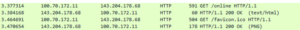
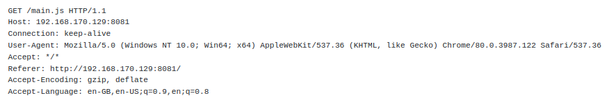
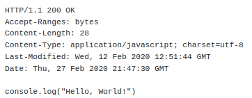

# Web Fundamentals

## Introduction and Objectives

This room is designed as a *basic* intro to how the web works.

We'll cover HTTP request and response, web server, cookies and then put them all to use in a mini Capture the Flag at the end.

## How do we load website

<u>**Finding the server**</u>

Initially, a DNS request is made.
DNS is like a giant phone book that takes a URL (Like [https://tryhackme.com/](https://tryhackme.com)) and turns it into IP address.
This means that people don't have to remember IP address for their favourite website.

The IP address uniquely identifies each internet connected device, like a web server or your computer.
These are formed of 4 group of numbers, each 0-255 (x.x.x.x) and called an octet.
An example shown below is 100.70.172.11.

<u>**Loading some content**</u>
 
One the browser knows the server's IP address, it can ask the server for the web page.
This done with a HTTP GET request.
GET is an example of HTTP verb, which are the different types of request (More on these later).
The server will respond to the GET request with the web page content.
If the web page is loading extra resource, like JavaScript, Images, or CSS files, those will be retrieved in separate GET requests.

Wireshark showing the HTTP requests that load a website (neverssl.com)

For most websites now, these requests will use HTTPS.
HTTPS is a secure (encrypted) version of HTTP, it works in more or less the same way.
This uses TLS 1.3 (normally) encryption in order to communicate without:

- Other parties being able to read the data.
- Other parties being able to modify the data.

Imagine if someone could modify a request to your bank to send money to your friend. That'd be disastrous!

A web servier is software could that receives and respond to HTTP(S) request.
Popular example are Apache, Nginx and Microsoft's ISS.
By default, HTTP runs on port 80 and HTTPS runs on port 443, Many CTFs are based around websites, so it's useful to know that if port 80 is open, there's likely a web server listening that you can attack and exploit.

The actual content of the web page is normally a combination of HTML, CSS and JavaScript.
HTML defines the structure of the page, and the content.
CSS allows you to change how the page looks and mak it look fancy.
JavaScript is a programming language that runs in the browser and allows you to make pages interactive or load extra content.

## More HTTP - verbs and request formats

**Requests** 

There are 9 different HTTP "verbs", also known as method.
Each one has a different function.
We've mentioned GET request already, these are used retrieve content.

POST requests are used to send data to a web server, like adding a comment or performing a login.

A HTTP request can be broken down into parts.
The first line is a verb and a path for the server such as 

 

The next section is headers, which give the web server more information about your request.
Importantly, cookies are sent in the request headers, more on those letter.

Finally, body of the request.
For the POST requests, this is the content that's sent to the server.
For GET requests, a body is allowed but will mostly be ignored by the server.

Here's an example for e GET request retrieving a simple JS file:

From the headers, you can tell what I performed the request from (Chrome version 80, from Windows 10).
This is useful for forensics and analysing packet capture.

**Responses**

The server should reply with a response. The response follows a similar structure to the request, but the first line describes the status rather than a verb and a path.\
The status will normally be a code, you've probably already familiar with 404:Not Found.

A basic breakdown of the status codes is:

- 100-199: Information.
- 200-299: Successes  (200 OK is the "normal" response for a GET)>
- 300-399: Redirects (the information you want is elsewhere).
- 400-499: Client errors (You did something wrong, like asking for something that doesn't exist).
- 500-599: Server errors (The server tried, but something went wrong on their side).

You can find more information about these [here](https://developer.mozilla.org/en-US/docs/Web/HTTP/Status) 

Response headers can be very important. They can often tell you something about the web server sending them, or give you cookies that may prove useful later on.

The response will also have a body. For GET requests, this is normally web content or information such as JSON. For POST requests, it may be a status message or similar.

Here's a response to the GET request shown above:

 

## Cookies, tasty

**What are cookies?** 

Cookies are small bit of data that are store in your browser.
**Each browser will store them separately, so cookies in Chrome won't be available in Forefox**.
They have a huge number of uses, but the most commonly are either session management or advertising (tracking  cookies).
Cookies are normally sent with every HTTP request made to a server.

**Why Cookies?** 

Because HTTP is stateless (Each request is independent and no state is tracked internally), cookies are used to keep track of this.
They allow sites to keep track of data like what items you have in your shopping cart, who you are, what you've done on the website and more.

Cookies can be broken down into several parts.
Cookies have a name, a value an expiry date and a path.
The name identifies the cookie, the value is where data is stored, the expiry date is when the browser will get rid of the cookie automatically and the path determines what requests the cookie will be sent with.
Cookies are normally only sent with requests to the site that set them (Weird things happen with advertising/tracking).

The server is normally what sets cookies, and these came in the response headers ("Set-Cookie"). Alternatively, these can be set from JavaScript inside your browser.

**Using cookies** 

When you log in to a web application, normally you are given a Session Token.
This allows the web server to identify your requests from someone else's.
Stealing someone else's session token can often allow you to impersonate them.

**Manipulating cookies** 

Using your browser's developer tools, you can view and modify cookies.
In Firefox, you can open the dev tools with F12.
In the Storage tab, you can see cookies that the website has set.
There's also a "+" button to allow you to create your own cookies which will come in handy in a minute.
You can modify all cookies that you can in this panel, as well as adding more.

**Alternatives - useful to know** 

Slowly, for some uses, LocalStorage and SessionStorage are used instead.
This has a similar functionality but isn't sent with HTTP requests by default.
These are HTML5 features. 

**More on cookies** 

[Cookies](https://developer.mozilla.org/en-US/docs/Web/HTTP/Cookies)

## Mini CTF

Time to put what you've learnt to use!

**Making HTTP requests** 

You can make HTTP requests in many ways, including without browsers!
For CTFs, you'll something need to use cURL or a programming language as this allows you to automate repetitive tasks.

**Intro to cURL** 

By default, cURL will perform GET requests on whatever URL you supply it, such as:

curl [https://tryhackme.com](https://tryhackme.com) 

This would retrieve the main page for tryhackme with a GET request.
Using command line flags for cURL, we can do a lot more than just GET content.
The-X flag allows us to specify the request type, eg-X POST.
You can specify the data to POST with - data, which will default to plain the data.
It's worth mentioning cURL does not store cookies, and you have to manually specify any cookies and values that you would like to send with your request.
If you want to send cookies from cURL, you can look up how to do this.

Remember, cookies are not shared between different browsers (I'm counting cURL as a browser here).

**Tasks** 

There's a web server running on http://10.10.128.47:8081. Connect to it and get the flags!

- GET request. Make a GET request to the web server with path /ctf/get
- POST request. Make a POST request with the body "flag_plese" to /ctf/post
- Get a cookie. Make a GET request to /ctf/getcookie and check the cookie the server gives you.
- Set a cookie. Set a cookie with name "flagpls" and value "flagpls" in your devtools (or with curl!) and make a GET request to /ctf/sendcookie

